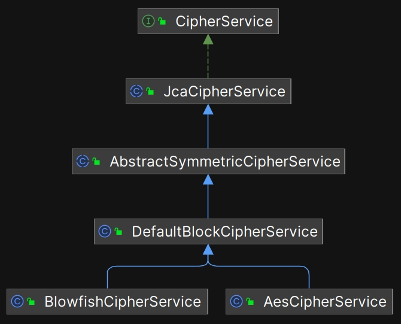

# 加密与解密

在安全领域，加密和解密是不可或缺的工具，在 Shiro 中，相关的代码位于以下 3 个 jar 包中：

1. shiro-crypto-cipher-xxx.jar: 提供加密和解密服务，支持常见的算法。
2. shiro-crypto-hash-xxx.jar: 专门提供 hash（散列）相关的算法，这个包中没有其它内容。
3. shiro-crypto-core-xxx.jar: 这个包中关于加密和解密的内容与 cipher 包一模一样，因为 cipher 这个包是后来才独立出来的，为了保持版本兼容性， Shiro 没有删除 core 包中原有的类，并且在发布后续版本的时候，会同时发布到 core 包。

加密和解密本身是一个庞大且专业领域，底层依赖于各种复杂的数学算法。在这个领域，很多算法涉及到国安问题，例如，美国国家安全局（NSA）参与制定了 AES(Advanced Encryption Standard) 和 SHA(Secure Hash Algorithm) 加密算法的标准。很明显，这些内容远远超出了本书的篇幅。因此，本书不对这些算法本身进行详细的解析，而是重点探讨 Shiro 是如何封装这些算法，并且整合到框架中的。

本章将讨论以下话题：

1. Shiro 封装的加密解密服务工具 CipherService
2. Shiro 为什么不直接使用 JDK 内置的加密工具？
3. 开发者如何使用 CipherService

## 10.1 CipherService

Shiro 把加密和解密操作封装成了服务，叫做 CipherService ，它是 cipher 包中的核心接口， CipherService 相关的继承结构如下图所示：



以下是每个类的功能描述（读者浏览即可，无需记忆）：

| 类名 | 功能描述 |
| --- | --- |
| `CipherService` | 最顶层的接口，定义加密和解密服务的基础功能，这个接口中定义的方法非常简单，只有两个： encrypt（加密） 和 decrypt（解密） 。 |
| `JcaCipherService` | 抽象类，实现了 `CipherService` 接口，基于 Java Cryptography Architecture (JCA) 实现，JCA 是提供对称加密支持的通用框架，此框架从 JDK 1.1 开始提供。 |
| `AbstractSymmetricCipherService` | 抽象实现类，继承自 `JcaCipherService`，用于简化对称加密算法的实现。 |
| `DefaultBlockCipherService` | 继承自 `AbstractSymmetricCipherService`，用于实现块加密模式的默认加密服务，支持加密算法分组模式的实现。 |
| `BlowfishCipherService` | 实现了 Blowfish 加密算法的服务，提供了 Blowfish 算法的加解密操作支持。Blowfish 是一种快速、高效的对称分组加密算法，由密码学家 Bruce Schneier 于 1993 年设计。 |
| `AesCipherService` | 实现 AES 加密算法的服务。AES（Advanced Encryption Standard，高级加密标准）是一种对称分组加密算法，由美国国家标准与技术研究院（NIST）于 2001 年发布，取代了较老的 DES（Data Encryption Standard）算法。AES 被认为是目前最安全、最有效的对称加密算法之一，并被广泛应用于各种安全应用场景。 |

CipherService 接口的定义非常简单，只有两个方法： `encrypt` 和 `decrypt` ，一个用来加密，一个用来解密。


在 Shiro 框架内部，`AbstractRememberMeManager` 中用到了 `CipherService` ，其中的关键代码如下（已省略无关代码）：

```java

/**
 * 实现“记住我”功能的管理器，内部通过读写 cookie 来实现记住用户的功能。
 * 由于 cookie 会被浏览器保存到客户端，所以对保存的信息需要进行加密处理。
 */
public AbstractRememberMeManager() {
    //...

    //注意这里，默认使用 AES 算法
    AesCipherService cipherService = new AesCipherService();
    this.cipherService = cipherService;
    setCipherKey(cipherService.generateNewKey().getEncoded());
}

protected byte[] encrypt(byte[] serialized) {
    byte[] value = serialized;
    CipherService cipherService = getCipherService();
    if (cipherService != null) {
        //调用 cipherService 进行加密操作
        ByteSource byteSource = cipherService.encrypt(serialized, getEncryptionCipherKey());
        value = byteSource.getBytes();
    }
    return value;
}

protected byte[] decrypt(byte[] encrypted) {
    byte[] serialized = encrypted;
    CipherService cipherService = getCipherService();
    if (cipherService != null) {
        //调用 cipherService 进行解密操作
        ByteSource byteSource = cipherService.decrypt(encrypted, getDecryptionCipherKey());
        serialized = byteSource.getBytes();
    }
    return serialized;
}
```

## 10.2 Shiro 为什么不直接使用 JDK 内置的加密工具？

JDK 从 v1.0 开始就内置了加密和解密工具，在 JDK v1.1 中又进一步做了升级，目前，这些工具都位于 javax.crypto 这个包中。

既然如此，为什么 Shiro 还要封装一套自己的 CipherService 呢？主要是为了方便开发者使用，虽然 JDK 已经内置了加密和解密工具类，但是这些 API 接口设计得比较复杂，以下举例进行对比：

| 特性 | Shiro CipherService | JDK Cipher |
| --- | --- | --- |
| **状态管理** | 无状态，每次调用独立 <br> `String encrypted = cipherService.encrypt("data", key);` | 保留状态，需手动管理状态 <br> ` Cipher cipher = Cipher.getInstance("AES"); cipher.init(Cipher.ENCRYPT_MODE, key); byte[] encrypted = cipher.doFinal("data".getBytes());` |
| **线程安全** | 线程安全 <br> `ExecutorService executor = Executors.newFixedThreadPool(10);` <br> `executor.submit(() -> cipherService.encrypt("data", key));` | 线程不安全，需要开发者自己处理多线程问题 <br> `ExecutorService executor = Executors.newFixedThreadPool(10);` <br> `executor.submit(() -> { cipher.init(Cipher.ENCRYPT_MODE, key); cipher.doFinal("data".getBytes()); });` |
| **操作方式** | 单一操作，简单的加密和解密调用 <br> `String decrypted = cipherService.decrypt(encryptedData, key);` | 支持分块处理，需管理加密/解密的状态 <br> `byte[] output = new byte[64]; int bytesRead = cipher.update(input, 0, input.length, output);` |
| **类型安全** | 针对不同算法有具体实现 <br> `AesCipherService aesCipherService = new AesCipherService();` | 只有一个通用的 Cipher 类 <br> `Cipher cipher = Cipher.getInstance("AES");` |
| **构造方式** | 简单，直接使用默认构造函数 <br> `new AesCipherService();` | 复杂，需通过字符串参数的工厂方法进行创建 <br> `Cipher cipher = Cipher.getInstance("AES/ECB/PKCS5Padding");` |
| **使用复杂度** | 易于理解和使用 <br> `String encrypted = cipherService.encrypt("data", key);` | 对初学者不够友好，理解难度较高 <br> `Cipher cipher = Cipher.getInstance("AES"); cipher.init(Cipher.ENCRYPT_MODE, key);` |
| **应用场景** | 适合大多数开发者的快速加密/解密需求 <br> `String encrypted = cipherService.encrypt("sensitiveData", key);` | 适合需要更灵活控制和分块处理的高级用例 <br> `byte[] output = new byte[64]; int bytesRead = cipher.update(input, 0, input.length, output);` |

总之，使用 CipherService 可以让开发者更轻松地进行加密和解密，而无需深入掌握底层的复杂细节。

## 10.3 开发者如何使用 CipherService？

**Shiro 中的 cipher 和 hash 这两个 jar 包是完全独立的，不依赖 Shiro 中的其它组件，这就意味着这两个 jar 包可以单独使用，如果 Java 开发者需要使用轻便的加密和解密服务，可以独立引入这两个 jar 包。**

以下用一个最常见的例子来说明 CipherService 的用法，在用户登录后，为了保护用户身份信息，常常会进行加密操作，示例代码如下：

```java
import org.apache.shiro.crypto.AesCipherService;
import org.apache.shiro.crypto.KeySource;
import org.apache.shiro.crypto.SimpleKeySource;
import org.apache.shiro.crypto.CipherService;

public class CipherServiceExample {
    public static void main(String[] args) {
        // 创建一个 CipherService 实例
        CipherService cipherService = new AesCipherService();

        // 定义要加密的数据
        String originalData = "Hello, World!";

        // 生成一个随机密钥（可以使用安全的方式生成密钥）
        byte[] key = cipherService.generateNewKey(128).getEncoded();

        // 加密数据
        byte[] encryptedData = cipherService.encrypt(originalData.getBytes(), key).getBytes();

        // 打印加密后的数据（以十六进制显示）
        System.out.println("Encrypted Data: " + bytesToHex(encryptedData));

        // 解密数据
        byte[] decryptedData = cipherService.decrypt(encryptedData, key).getBytes();

        // 打印解密后的数据
        System.out.println("Decrypted Data: " + new String(decryptedData));
    }

    // 辅助方法：将字节数组转换为十六进制字符串
    private static String bytesToHex(byte[] bytes) {
        StringBuilder hexString = new StringBuilder();
        for (byte b : bytes) {
            String hex = Integer.toHexString(0xFF & b);
            if (hex.length() == 1) {
                hexString.append('0');
            }
            hexString.append(hex);
        }
        return hexString.toString();
    }
}
```

Shiro 允许开发者配置自己的加密和解密算法，例如，在 AuthorizingRealm 的构造方法中，可以指定 CredentialsMatcher :

```java
public AuthorizingRealm(CacheManager cacheManager, CredentialsMatcher matcher) {
    super();

    //...

    //如果开发者传入了 matcher ，则使用开发者配置的 matcher 。
    if (matcher != null) setCredentialsMatcher(matcher);

}
```

在 ShiroConfig.java 中，开发者可以为自定义的 Realm 指定加密和解密算法，示例代码如下：

```java
// 创建自定义 Realm 实现（需要实现 Realm 接口）
MyRealm myRealm = new MyRealm();

// 设置密码匹配器
SimpleCredentialsMatcher matcher = new SimpleCredentialsMatcher();
matcher.setCipherService(cipherService);

// 配置密钥
matcher.setKey(secretKey.getEncoded());

myRealm.setCredentialsMatcher(matcher);
```

在使用 Shiro 框架的过程中，更常见的操作是在 ShiroConfig.java 中，给 CookieRememberMeManager 配置“加盐”：

```java
public CookieRememberMeManager rememberMeManager() {
    CookieRememberMeManager cookieRememberMeManager = new CookieRememberMeManager();
    cookieRememberMeManager.setCookie(rememberMeCookie());

    // 注意：密钥需要先手动生成好，存储到安全的地方，例如：数据库、配置文件等
    // 然后这里用代码去读取生成好的密钥。
    cookieRememberMeManager.setCipherKey(Base64.decode("fCq+/xW488hMTCD+cmJ3aQ=="));

    //实际项目中，应该这样编写：封装一个 getCipherKey() 方法去读取预先生成好的密钥
    //cookieRememberMeManager.setCipherKey(getCipherKey());

    return cookieRememberMeManager;
}
```

## 10.4 本章小结

Shiro 作为一款安全框架，提供了必不可少的加密和解密功能。它封装了一个 CipherService，帮助开发者更好地处理项目中的加密和解密需求。在 Shiro 中，与加密和解密相关的代码主要位于 cipher 和 hash 这两个独立的 jar 包中。这两个 jar 包不依赖于 Shiro 的其他组件，意味着 Java 开发者可以根据需要单独引入这两个 jar 包，从而获得轻便的加密和解密服务。对于加密和解密底层的概念和算法，推荐读者阅读相关的专业书籍。

## 资源链接

- Apache Shiro 在 github 上的官方仓库： https://github.com/apache/shiro
- Apache Shiro 官方网站：https://shiro.apache.org/
- 本书实例项目：https://gitee.com/mumu-osc/nicefish-spring-boot
- 本书文字稿：https://gitee.com/mumu-osc/apache-shiro-source-code-explaination

## 版权声明

本书基于 [**CC BY-NC-ND 4.0 许可协议**](https://creativecommons.org/licenses/by-nc-nd/4.0/deed.en)发布，自由转载-非商用-非衍生-保持署名。

**版权归大漠穷秋所有 © 2024 ，侵权必究。**
