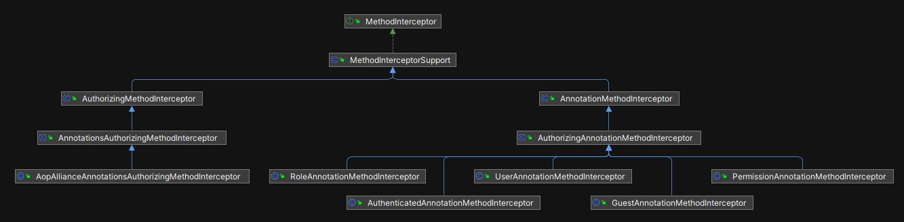

TODO:【题图】

# Shiro 对 Spring 的支持

`Shiro` 的第一个版本发布于 2004 年， `Spring` 项目起源于 2002 年，在 `Shiro` 最初的版本中没有与 `Spring` 相关的内容。后来，随着 `Spring` 的流行，从 2010 年开始， `Shiro` 开始提供对 `Spring` 的支持，推出了一个独立的 jar 包，名为 `shiro-spring`。从 2018 年开始， `Shiro` 在 v1.4 中开始增强对 `SpringBoot` 的支持。

在本章中，我们先解释整合的步骤，然后再对运行机制和源码进行分析，内容结构如下：

- Shiro 与 SpringBoot 的整合步骤
- 运行机制和源码分析

## 11.1 Shiro 与 SpringBoot 的整合步骤

### 11.1.1 添加项目依赖

首先，需要在 SpringBoot 项目的 `pom.xml` 文件中添加 Shiro 的相关依赖。以下是 Maven 的依赖配置：

```xml
<dependencies>
    <!-- SpringBoot 相关的依赖，这里省略 -->

    <!-- Shiro 相关的依赖 -->
    <!-- 注意：由于 shiro-spring-boot-starter 与 SpringBoot 之间存在版本依赖，这里还是采用 Shiro 1.12 版本的配置方式-->
    <dependency>
        <groupId>org.apache.shiro</groupId>
        <artifactId>shiro-spring</artifactId>
        <classifier>jakarta</classifier>
        <version>${shiro.version}</version>
        <exclusions>
            <exclusion>
                <groupId>org.apache.shiro</groupId>
                <artifactId>shiro-core</artifactId>
            </exclusion>
            <exclusion>
                <groupId>org.apache.shiro</groupId>
                <artifactId>shiro-web</artifactId>
            </exclusion>
        </exclusions>
    </dependency>
    <dependency>
        <groupId>org.apache.shiro</groupId>
        <artifactId>shiro-core</artifactId>
        <classifier>jakarta</classifier>
        <version>${shiro.version}</version>
    </dependency>
    <dependency>
        <groupId>org.apache.shiro</groupId>
        <artifactId>shiro-web</artifactId>
        <classifier>jakarta</classifier>
        <version>${shiro.version}</version>
        <exclusions>
            <exclusion>
                <groupId>org.apache.shiro</groupId>
                <artifactId>shiro-core</artifactId>
            </exclusion>
        </exclusions>
    </dependency>
    <dependency>
        <groupId>org.apache.shiro</groupId>
        <artifactId>shiro-ehcache</artifactId>
        <version>${shiro.version}</version>
    </dependency>
</dependencies>
```

这是常见的 Maven 配置文件，不作解释。**有一个点需要注意： Shiro 的版本与 SpringBoot 的版本之间存在兼容性问题，如果读者使用了最新的 SpringBoot 版本，或者使用了 shiro-spring-boot-starter ，需要自己修改配置并测试兼容性。**

### 11.1.2 编写 ShiroConfig.java 文件

在 SpringBoot 中，Shiro 的配置通常使用 Java 配置类来实现，示例代码如下：

```java
@Configuration
public class ShiroConfig {
    //...

    //这里配置一堆 Shiro 相关的 Bean
}
```

这是常见的 Spring 配置类，不作解释。

### 11.1.3 实现自定义 Realm

如前所述，`Realm` 是 Shiro 的核心组件之一，用于从数据源中获取用户的认证和授权信息，以下是自定义 `NiceFishMySQLRealm` 示例：

```java
package com.nicefish.rbac.shiro.realm;

import com.nicefish.rbac.jpa.entity.UserEntity;
import com.nicefish.rbac.service.IUserService;
import com.nicefish.rbac.shiro.util.NiceFishSecurityUtils;
import org.apache.shiro.authc.*;
import org.apache.shiro.authz.AuthorizationInfo;
import org.apache.shiro.authz.SimpleAuthorizationInfo;
import org.apache.shiro.realm.AuthorizingRealm;
import org.apache.shiro.subject.PrincipalCollection;
import org.slf4j.Logger;
import org.slf4j.LoggerFactory;
import org.springframework.beans.factory.annotation.Autowired;

import java.util.Set;

public class NiceFishMySQLRealm extends AuthorizingRealm {
    private static final Logger logger = LoggerFactory.getLogger(NiceFishMySQLRealm.class);

    @Autowired
    private IUserService userService;

    @Override
    protected AuthenticationInfo doGetAuthenticationInfo(AuthenticationToken token) throws AuthenticationException {
        UsernamePasswordToken usernamePasswordToken = (UsernamePasswordToken) token;
        String username = usernamePasswordToken.getUsername();
        String password = usernamePasswordToken.getPassword()!=null?new String(usernamePasswordToken.getPassword()):"";

        UserEntity userEntity;
        try {
            userEntity = userService.checkUser(username, password);
            logger.debug("UserName>"+username);
            logger.debug("Password>"+password);
        }catch (Exception e) {
            logger.error(username + "登录失败{}", e.getMessage());
            throw new AuthenticationException(e.getMessage(), e);
        }

        SimpleAuthenticationInfo info = new SimpleAuthenticationInfo(userEntity, password, getName());
        return info;
    }

    @Override
    protected AuthorizationInfo doGetAuthorizationInfo(PrincipalCollection principals) {
        Integer userId= NiceFishSecurityUtils.getUserId();

        Set<String> permStrs=this.userService.getPermStringsByUserId(userId);
        logger.debug(permStrs.toString());

        SimpleAuthorizationInfo info = new SimpleAuthorizationInfo();
        info.setStringPermissions(permStrs);
        return info;
    }
}
```

在 ShiroConfig.java 中配置 `NiceFishMySQLRealm` ，暴露给 Spring 容器：

```java
@Bean
public NiceFishMySQLRealm nicefishRbacRealm() {
    NiceFishMySQLRealm niceFishMySQLRealm = new NiceFishMySQLRealm();
    niceFishMySQLRealm.setCachingEnabled(true);
    niceFishMySQLRealm.setAuthenticationCachingEnabled(true);
    niceFishMySQLRealm.setAuthenticationCacheName("authenticationCache");
    niceFishMySQLRealm.setAuthorizationCachingEnabled(true);
    niceFishMySQLRealm.setAuthorizationCacheName("authorizationCache");
    return niceFishMySQLRealm;
}
```

### 11.1.4 配置过滤器

在 ShiroConfig.java 中配置过滤器示例代码如下：

```java
@Bean
public ShiroFilterFactoryBean shiroFilterFactoryBean(SecurityManager securityManager) {
    ShiroFilterFactoryBean shiroFilterFactoryBean = new ShiroFilterFactoryBean();
    shiroFilterFactoryBean.setSecurityManager(securityManager);
    shiroFilterFactoryBean.setLoginUrl(loginUrl);
    shiroFilterFactoryBean.setUnauthorizedUrl(unauthorizedUrl);

    Map<String, Filter> filters = new LinkedHashMap<String, Filter>();
    filters.put("captchaValidateFilter", captchaValidateFilter());
    shiroFilterFactoryBean.setFilters(filters);

    //所有静态资源交给Nginx管理，这里只配置与 shiro 相关的过滤器。
    LinkedHashMap<String, String> filterChainDefinitionMap = new LinkedHashMap<>();
    filterChainDefinitionMap.put("/nicefish/cms/post/write-post", "captchaValidateFilter");
    filterChainDefinitionMap.put("/nicefish/cms/post/update-post", "captchaValidateFilter");
    filterChainDefinitionMap.put("/nicefish/cms/comment/write-comment", "captchaValidateFilter");
    filterChainDefinitionMap.put("/nicefish/auth/user/register", "anon,captchaValidateFilter");
    filterChainDefinitionMap.put("/nicefish/auth/shiro/login", "anon,captchaValidateFilter");
    filterChainDefinitionMap.put("/**", "anon");

    shiroFilterFactoryBean.setFilterChainDefinitionMap(filterChainDefinitionMap);
    return shiroFilterFactoryBean;
}
```

`ShiroFilterFactoryBean` 是 Shiro 与 Spring 集成的核心类之一，它的主要功能是把自定义的 Filter 插入到 Spring 的过滤器链中，从而拦截到符合配置项的请求，转发给 Shiro 处理。

## 11.2 运行机制和源码分析

TODO:补充一张 request 处理流程图

接下来，我们来解析运行机制和源代码，重点讨论以下 4 个最关键的主题：

- ShiroConfig.java 配置文件与 Bean 的生命周期管理
- SpringShiroFilter 在运行时过滤请求
- 注解扫描与方法拦截
- Session 的处理

### 11.2.1 ShiroConfig.java 配置文件与 Bean 的生命周期管理

在早期的版本中，开发者必须使用 XML 文件来配置 Shiro 。从 Spring 4.x 版本（2013 年左右）开始，使用 Java 代码编写配置文件逐渐成为主流，取代了大量的 XML 配置。这一趋势在 SpringBoot 推出之后（2014 年）得到了广泛普及。

Shiro 从 1.3 版本（2016 年）开始正式支持使用 Java 文件进行配置，而不再依赖 XML 或 .ini 文件配置。随着 Shiro 1.4 版本的发布，Shiro 进一步加强了对 SpringBoot 的支持，提供了 shiro-spring-boot-starter ，并改进了 @Configuration 注解的支持，使得在 SpringBoot 环境中配置 Shiro 更加方便，示例代码如下：

```java
@Configuration
public class ShiroConfig {
  //...

  @Bean
  //...

  //...
}
```

@Configuration 是 Spring 提供的注解，当 Spring 容器启动时，会扫描此注解，如果在其中发现了 @Bean 进行装饰的实例， Spring 就会自动管理这些实例的生命周期。

对于 Shiro 来说，需要把以下组件暴露给 Spring 容器进行管理： Realm、SecurityManager、ShiroFilterFactoryBean、CookieRememberMeManager、SessionDAO、EventBus、EhCacheManager 。

### 11.2.2 SpringShiroFilter 在运行时过滤请求

按照职责划分， Shiro 在整个系统中只处理与权限相关的请求。所以 Shiro 定义了自己的 Filter 用来过滤请求，类名是 SpringShiroFilter 。同时，为了配置方便， Shiro 定义了一个工厂类叫做 ShiroFilterFactoryBean ，这个类会辅助创建 SpringShiroFilter 的实例，在上面增加一些自定义的配置，代码示例如下：

```java
@Bean
public ShiroFilterFactoryBean shiroFilterFactoryBean(SecurityManager securityManager) {
    ShiroFilterFactoryBean shiroFilterFactoryBean = new ShiroFilterFactoryBean();
    shiroFilterFactoryBean.setSecurityManager(securityManager);
    shiroFilterFactoryBean.setLoginUrl(loginUrl);
    shiroFilterFactoryBean.setUnauthorizedUrl(unauthorizedUrl);

    Map<String, Filter> filters = new LinkedHashMap<String, Filter>();
    filters.put("captchaValidateFilter", captchaValidateFilter());
    shiroFilterFactoryBean.setFilters(filters);

    //所有静态资源交给Nginx管理，这里只配置与 shiro 相关的过滤器。
    LinkedHashMap<String, String> filterChainDefinitionMap = new LinkedHashMap<>();
    filterChainDefinitionMap.put("/nicefish/cms/post/write-post", "captchaValidateFilter");
    filterChainDefinitionMap.put("/nicefish/cms/post/update-post", "captchaValidateFilter");
    filterChainDefinitionMap.put("/nicefish/cms/comment/write-comment", "captchaValidateFilter");
    filterChainDefinitionMap.put("/nicefish/auth/user/register", "anon,captchaValidateFilter");
    filterChainDefinitionMap.put("/nicefish/auth/shiro/login", "anon,captchaValidateFilter");
    filterChainDefinitionMap.put("/**", "anon");

    shiroFilterFactoryBean.setFilterChainDefinitionMap(filterChainDefinitionMap);
    return shiroFilterFactoryBean;
}
```

当 Spring 容器启动时，会解析这个 Bean ，获得过滤器的实例，并且加入到过滤器链（Filter Chain）中去。在运行时，当请求到来的时候，被匹配到的请求就会转发给 Shiro 处理。

### 11.2.3 注解扫描与方法拦截

当匹配到的请求转发给 Shiro 之后，方法调用链就进入了 Shiro 框架内部，接下来，我们来看 Shiro 是如何进行封装，并与 Spring 进行对接的。

Shiro 自己实现了一套轻量级的 AOP 机制，这一套机制没有 Spring 那么复杂，也不是为了取代 Spring 。在 Shiro 的 AOP 机制中，主要有两个核心的处理流程：注解扫描、方法拦截。这样实现的目的是：

- 方便与 `Spring` 集成：当 `Spring` 启动时， `AuthorizationAttributeSourceAdvisor` 这个类会扫描所有权限注解，对于扫描到的方法， `Spring` 会生成代理对象，并将 `Shiro` 的 `MethodInterceptor` 加入到拦截器链中。当带有权限注解的方法被调用时，代理对象会先调用 `MethodInterceptor` 。在 `MethodInterceptor` 内部会通过 `SecurityManager` 调用相应的权限检查逻辑，如果检查通过，则继续执行方法，否则抛出异常。
- 可以脱离 Spring 框架独立运行，也可以与其它 AOP 框架集成。

我们先来看 Shiro 是如何与 Spring 配合扫描权限注解的。

在 shiro-spring-XXX-jakarta.jar 中，有一个关键的配置类 `ShiroAnnotationProcessorConfiguration` ，它是 Shiro 与 Spring 整合的关键桥梁。`ShiroAnnotationProcessorConfiguration` 的代码非常少，完整列举如下：

```java
package org.apache.shiro.spring.config;


import org.apache.shiro.mgt.SecurityManager;
import org.apache.shiro.spring.security.interceptor.AuthorizationAttributeSourceAdvisor;
import org.springframework.aop.framework.autoproxy.DefaultAdvisorAutoProxyCreator;
import org.springframework.context.annotation.Bean;
import org.springframework.context.annotation.Configuration;
import org.springframework.context.annotation.DependsOn;

/**
 * @since 1.4.0
 */
@Configuration
public class ShiroAnnotationProcessorConfiguration extends AbstractShiroAnnotationProcessorConfiguration{

    @Bean
    @DependsOn("lifecycleBeanPostProcessor")
    protected DefaultAdvisorAutoProxyCreator defaultAdvisorAutoProxyCreator() {
        return super.defaultAdvisorAutoProxyCreator();
    }

    @Bean
    protected AuthorizationAttributeSourceAdvisor authorizationAttributeSourceAdvisor(SecurityManager securityManager) {
        return super.authorizationAttributeSourceAdvisor(securityManager);
    }
}
```

- @Configuration 表示这是一个配置类，Spring 容器启动时，会自动扫描并解析这个配置类中的内容，然后自动管理其中 @Bean 的生命周期。
- 用 @Bean 注解定义了两个 Bean ，显然，这两个 Bean 已经交给 Spring 容器管理了。
- 第一个 Bean 是 `DefaultAdvisorAutoProxyCreator` ，这是 Spring 框架中的一个类，它的作用是自动创建代理类。 @DependsOn("lifecycleBeanPostProcessor")：这个注解表示这个 Bean 的创建依赖于 lifecycleBeanPostProcessor，因为 lifecycleBeanPostProcessor 管理了 Shiro 中一些重要 Bean 的生命周期。
- 第二个 Bean 是 `AuthorizationAttributeSourceAdvisor`，这是 Shiro 自己实现的一个 AOP 顾问类，这个类非常关键，它负责在运行时检查被调用的方法上是否带有权限注解。

`AuthorizationAttributeSourceAdvisor` 的关键源代码如下：

```java
public class AuthorizationAttributeSourceAdvisor extends StaticMethodMatcherPointcutAdvisor {

    private static final Class<? extends Annotation>[] AUTHZ_ANNOTATION_CLASSES =
            new Class[] {
                    RequiresPermissions.class, RequiresRoles.class,
                    RequiresUser.class, RequiresGuest.class, RequiresAuthentication.class
            };

    //这里很关键，在构造函数中直接 new 了一个顾问，并调用 setAdvice 设置给 Spring。
    public AuthorizationAttributeSourceAdvisor() {
        setAdvice(new AopAllianceAnnotationsAuthorizingMethodInterceptor());
    }

    //...

    //这里扫描指定的 Class 上是否存在权限注解。
    private boolean isAuthzAnnotationPresent(Class<?> targetClazz) {
        for( Class<? extends Annotation> annClass : AUTHZ_ANNOTATION_CLASSES ) {
            Annotation a = AnnotationUtils.findAnnotation(targetClazz, annClass);
            if ( a != null ) {
                return true;
            }
        }
        return false;
    }

    //...
}
```

整体上说， Shiro 自己实现了一个方法切点顾问类（Method Pointcut Advisor），通过 @Configuration 和 @Bean 这两个注解，把它暴露给 Spring 去管理，而在顾问类的构造方法中，直接设置了一个方法拦截器，也就是名字很长的 `AopAllianceAnnotationsAuthorizingMethodInterceptor`。在运行时，这个方法拦截器将会拦截所有带有权限注解的方法，先进行权限校验。

那么， `AopAllianceAnnotationsAuthorizingMethodInterceptor` 具体又做了什么呢？我们来看它的关键源代码（已省略无关代码）：

```java
public class AopAllianceAnnotationsAuthorizingMethodInterceptor
        extends AnnotationsAuthorizingMethodInterceptor implements MethodInterceptor {

    public AopAllianceAnnotationsAuthorizingMethodInterceptor() {
        List<AuthorizingAnnotationMethodInterceptor> interceptors =
                new ArrayList<AuthorizingAnnotationMethodInterceptor>(5);

        //use a Spring-specific Annotation resolver - Spring's AnnotationUtils is nicer than the
        //raw JDK resolution process.
        AnnotationResolver resolver = new SpringAnnotationResolver();
        //we can re-use the same resolver instance - it does not retain state:

        //注意这里的拦截器， 把 Shiro 实现的5种注解拦截器全部加入到拦截器中去。
        interceptors.add(new RoleAnnotationMethodInterceptor(resolver));
        interceptors.add(new PermissionAnnotationMethodInterceptor(resolver));
        interceptors.add(new AuthenticatedAnnotationMethodInterceptor(resolver));
        interceptors.add(new UserAnnotationMethodInterceptor(resolver));
        interceptors.add(new GuestAnnotationMethodInterceptor(resolver));

        setMethodInterceptors(interceptors);
    }

}
```

权限注解拦截器相关的继承结构如下：



我们来分析 `PermissionAnnotationMethodInterceptor` 的实现，其它拦截器的实现逻辑类似，在 `PermissionAnnotationMethodInterceptor` 内部，会调用工具类 `PermissionAnnotationHandler`来负责真正的权限检测功能，其中的关键代码如下（已省略无关代码）：

```java
public class PermissionAnnotationHandler extends AuthorizingAnnotationHandler {
    //...

    public void assertAuthorized(Annotation a) throws AuthorizationException {
        if (!(a instanceof RequiresPermissions)) return;

        RequiresPermissions rpAnnotation = (RequiresPermissions) a;
        String[] perms = getAnnotationValue(a);
        Subject subject = getSubject();

        if (perms.length == 1) {
            //检查权限
            subject.checkPermission(perms[0]);
            return;
        }
        if (Logical.AND.equals(rpAnnotation.logical())) {
            //检查权限
            getSubject().checkPermissions(perms);
            return;
        }
        if (Logical.OR.equals(rpAnnotation.logical())) {
            // Avoid processing exceptions unnecessarily - "delay" throwing the exception by calling hasRole first
            boolean hasAtLeastOnePermission = false;
            for (String permission : perms) if (getSubject().isPermitted(permission)) hasAtLeastOnePermission = true;
            // Cause the exception if none of the role match, note that the exception message will be a bit misleading
            if (!hasAtLeastOnePermission) getSubject().checkPermission(perms[0]);

        }
    }
}
```

**也就是说：只要我们在某个方法加上了权限注解， Spring 在启动的时候就会自动创建代理类。然后在运行时，当这个方法被调用的时候，Shiro 中的对应的权限拦截器就会首先被执行，这就是权限注解的运行机制。**

### 11.2.4 Session 的处理

在 ShiroConfig 中，一般还会配置 SessionManager 的实例，并且通过 @Bean 注解暴露给 Spring ，让 Spring 容器去管理它的生命周期，示例代码如下：

```java
@Bean
public DefaultWebSessionManager sessionManager() {
    DefaultWebSessionManager defaultWebSessionMgr = new DefaultWebSessionManager();

    //启用 EhCache 缓存，Shiro 默认不启用
    //启用 EhCache 缓存之后，需要在持久化的 Session 和缓存中的 Session 之间进行数据同步。
    //EhCache 实例配置位于 classpath:ehcache-shiro.xml 文件中，session 默认缓存在 "shiro-activeSessionCache" 实例中。
    //认证、授权、Session，全部使用同一个 EhCache 运行时对象。
    defaultWebSessionMgr.setCacheManager(ehCacheManager());

    defaultWebSessionMgr.setDeleteInvalidSessions(true);
    defaultWebSessionMgr.setGlobalSessionTimeout(timeout);
    defaultWebSessionMgr.setSessionIdUrlRewritingEnabled(false);

    //启用定时调度器，用来清理 Session ，Shiro 默认采用内置的 ExecutorServiceSessionValidationScheduler 进行调度。
    defaultWebSessionMgr.setSessionValidationSchedulerEnabled(true);
    defaultWebSessionMgr.setSessionValidationInterval(validationInterval);

    defaultWebSessionMgr.setSessionDAO(sessionDAO());
    defaultWebSessionMgr.setSessionFactory(sessionFactory());
    return defaultWebSessionMgr;
}
```

在之前的内容中，我们已经知道， SessionManager 的示例最终会被设置给 SecurityManager ，这个动作是由 Spring 的依赖注入机制自动完成的。关于 SessionManager 与 SecurityManager 之间的关系，请翻阅“第三章 身份验证与授权”，这里不再解释。

## 11.3 本章小结

本章详细分析了 Shiro 与 SpringBoot 整合时的运行机制。

## 版权声明

本书基于 [**CC BY-NC-ND 4.0 许可协议**](https://creativecommons.org/licenses/by-nc-nd/4.0/deed.en)发布，自由转载-非商用-非衍生-保持署名。

**版权归大漠穷秋所有 © 2024 ，侵权必究。**
