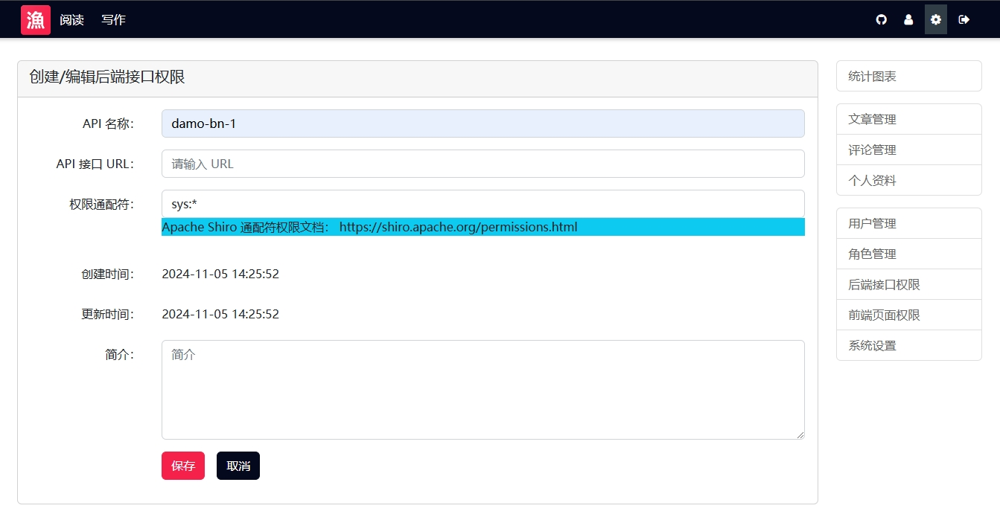

# 12.整合实战：基于 Shiro 框架的 RBAC 权限控制系统

在前面的章节中，我们已经详细分析了 Shiro 的架构和源码。在本章中，我们将会用 Shiro 框架来实现一个完整的 RBAC 权限控制系统。这个系统的整体功能是：让用户可以自定义服务端 API 的权限和前端页面组件的权限。

以下是本章的内容结构：

- RBAC 的基本概念
- 设计物理模型
- 实现 Entity 、 DAO、 Service 与 Controller
- 实现 Realm 和 SessionDAO
- 服务端 API 权限控制
- 前端页面组件的权限控制
- 最终效果与开源项目

## RBAC 的基本概念

RBAC（Role-Based Access Control）是一种权限管理模型，这种设计思想起源于 20 世纪 70 年代，但直到 1992 年 才由 David Ferraiolo 和 Richard Kuhn 在他们的研究论文中正式提出并加以推广。

2001 年，RBAC 被美国国家标准与技术研究院（NIST）标准化，成为一种公认的访问控制模型。经过几十年的发展，RBAC 已广泛应用于企业级系统和信息安全中。

RBAC 模型的核心思想是：用户与角色关联，角色与权限关联，通过角色间接管理用户的权限。这种模型允许管理员通过管理角色而非单个用户权限，来实现更有效的权限控制。

1. **用户（User）**：系统中的个人或实体，可以是实际的人或自动化系统，在 Shiro 中的概念是 Subject 。
2. **角色（Role）**：一组权限的集合。角色被分配给用户，用户通过角色来获得相应的权限，在 Shiro 中也叫 Role 。
3. **权限（Permission）**：对系统资源的访问控制标识，定义了用户能够执行的操作，在 Shiro 中一般会被定义成通配符权限表达式。
4. **资源（Resource）**：系统中需要被保护的对象，如数据库、文件系统、网页等，在 Shiro 中会被定义成 Realm 。

## 设计物理模型

基于 RBAC 的概念，以及 Shiro 框架中的基本组件，我们来设计系统的物理模型。为了获得一个更加真实的业务系统，这个设计中带有一个简单的业务场景：编写和发布文章。整体的物理模型如下图所示：


其中，橙色的表是与 RBAC 相关的核心表，关键的几组关系如下：

- nicefish_rbac_user 表与 nicefish_rbac_role 表是多对多关系，通过 nicefish_rbac_user_role 这张中间表进行关联。
- nicefish_rbac_role 表与资源权限表进行关联，也是多对多的关系。
- 这个系统中有两种资源需要进行保护：服务端 API 、前端页面组件。于是我们定义两张权限表： nicefish_rbac_api（定义服务端接口权限表达式） 与 nicefish_rbac_component（定义前端页面组件的权限表达式）。
- nicefish_rbac_session 表用来持久化会话。

在设计完物理模型之后，可以导出建库脚本，本章描述的内容和示例代码都已经在 MySQL（MariaDB） 数据库上跑通，如果读者需要支持其它数据库，需要自己测试兼容性。

## 实现 Entity 、 DAO、 Service 与 Controller

在设计完物理模型之后，我们就很自然地获得了相关的 Entity 和 DAO ，我们基于 JPA 来实现，整体代码结构如下：


这些都是 JPA 的基本内容，没有什么特殊的写法，这里仅仅展示 UserEntity 的大致代码：

```java
//...

@Entity
@DynamicInsert
@DynamicUpdate
@Table(name = "nicefish_rbac_user")
public class UserEntity implements Serializable {
    @Id
    @GeneratedValue(strategy = GenerationType.IDENTITY)
    @Column(name="user_id", updatable = false)
    private Integer userId;

    @Column(name="user_name",nullable = false,updatable = false)
    private String userName;

    @Column(name="nick_name",nullable = false)
    private String nickName;

    @Column(name="password",nullable = false)
    private String password;

    @Column(name="email")
    private String email;

    @Column(name="cellphone")
    private String cellphone;

    @Column(name="gender",columnDefinition = "int default 0")
    private Integer gender=0;

    @Column(name="city")
    private String city;

    @Column(name="education")
    private String education;

    @Temporal(TemporalType.TIMESTAMP)
    @Column(name="create_time",updatable = false)
    @JsonFormat(shape = JsonFormat.Shape.STRING, pattern = "yyyy-MM-dd HH:mm:ss")
    private Date createTime;

    @Column(name="avatar_url")
    private String avatarURL;

    @Column(name="salt")
    private String salt;

    @Column(name="status",columnDefinition = "int default 0")
    private Integer status=0;

    @Column(name="remark")
    private String remark;

    @JoinTable(
        name="nicefish_rbac_user_role",
        joinColumns={@JoinColumn(name="user_id",referencedColumnName="user_id")},
        inverseJoinColumns={@JoinColumn(name="role_id",referencedColumnName="role_id")}
    )
    @ManyToMany(fetch = FetchType.LAZY)
    private List<RoleEntity> roleEntities;

    //省略所有 getter 和 setter
}
```

在以上代码中， @ManyToMany 是一个关键的处理，在 OO 模型中， UserEntity 和 RoleEntity 互相持有对方的实例，所以这里必须加上 fetch = FetchType.LAZY ，否则在把查询到的 Java 对象转换成 JSON 字符串的时候会出现循环依赖异常。除了采用懒加载之外，开发者还可以定义自己的序列化类，来避免这种循环依赖问题，示例代码如下：

```java
//...

@JoinTable(
        name="nicefish_rbac_role_component",
        joinColumns={@JoinColumn(name="component_id",referencedColumnName="component_id")},
        inverseJoinColumns={@JoinColumn(name="role_id",referencedColumnName="role_id")}
)
@ManyToMany
@JsonSerialize(using = RoleListSerializer.class)
private List<RoleEntity> roleEntities;

//...
```

以上代码中的 RoleListSerializer 是我们自己编写的序列化工具类，它的逻辑如下：

```java
package com.nicefish.rbac.jpautils;

import com.fasterxml.jackson.core.JsonGenerator;
import com.fasterxml.jackson.databind.SerializerProvider;
import com.fasterxml.jackson.databind.ser.std.StdSerializer;
import com.nicefish.rbac.jpa.entity.RoleEntity;

import java.io.IOException;
import java.util.ArrayList;
import java.util.HashMap;
import java.util.List;
import java.util.Map;

public class RoleListSerializer extends StdSerializer<List<RoleEntity>> {
    public RoleListSerializer() {
        this(null);
    }

    protected RoleListSerializer(Class<List<RoleEntity>> t) {
        super(t);
    }

    @Override
    public void serialize(List<RoleEntity> roleEntities, JsonGenerator generator, SerializerProvider provider) throws IOException {
        //注意这里，我们自己组装 Java 对象，避开转换成 JSON 字符串过程中的循环引用问题。
        List<Map> list = new ArrayList<>();
        for (RoleEntity roleEntity : roleEntities) {
            HashMap obj=new HashMap();
            obj.put("roleId",roleEntity.getRoleId());
            obj.put("roleName",roleEntity.getRoleName());
            obj.put("status",roleEntity.getStatus());
            obj.put("remark",roleEntity.getRemark());
            list.add(obj);
        }
        generator.writeObject(list);
    }
}
```

相关的 Repository 是标准的 JPA 注解写法，这里不再展示代码。

编写出 Entity 和 DAO 之后，我们可以很自然地编写出对应的 Service 和 Controller ，例如：根据 userId 查询对应的角色列表、根据 userId 查询对应的权限列表、根据 userId 给用户赋予新的权限表达式，等等。这些都是普通的业务逻辑，基本上都是体力活，这里不再展示代码。

## 实现 Realm 和 SessionDAO

接下来，按照 Shiro 框架的架构，我们需要实现自己的 Realm 和 SessionDAO ，然后在 ShiroConfig.java 中进行配置。

在这个项目中，我们定义了 NiceFishMySQLRealm 和 NiceFishSessionDAO，它们的代码比较简短，完整展示如下：

```java
package com.nicefish.rbac.shiro.realm;

import com.nicefish.rbac.jpa.entity.UserEntity;
import com.nicefish.rbac.service.IUserService;
import com.nicefish.rbac.shiro.util.NiceFishSecurityUtils;
import org.apache.shiro.authc.*;
import org.apache.shiro.authz.AuthorizationInfo;
import org.apache.shiro.authz.SimpleAuthorizationInfo;
import org.apache.shiro.realm.AuthorizingRealm;
import org.apache.shiro.subject.PrincipalCollection;
import org.slf4j.Logger;
import org.slf4j.LoggerFactory;
import org.springframework.beans.factory.annotation.Autowired;

import java.util.Set;

/**
 * NiceFish 操作 MySQL 的 Realm 。
 * @author 大漠穷秋
 */
public class NiceFishMySQLRealm extends AuthorizingRealm {
    private static final Logger logger = LoggerFactory.getLogger(NiceFishMySQLRealm.class);

    @Autowired
    private IUserService userService;

    /**
     * 认证
     * TODO:这里仅实现了简单的用户名+密码的验证方式，需要扩展其它认证方式，例如：扫描二维码、第三方认证。
     */
    @Override
    protected AuthenticationInfo doGetAuthenticationInfo(AuthenticationToken token) throws AuthenticationException {
        UsernamePasswordToken usernamePasswordToken = (UsernamePasswordToken) token;
        String username = usernamePasswordToken.getUsername();
        String password = usernamePasswordToken.getPassword()!=null?new String(usernamePasswordToken.getPassword()):"";

        UserEntity userEntity;
        try {
            userEntity = userService.checkUser(username, password);
            logger.debug("UserName>"+username);
            logger.debug("Password>"+password);
        }catch (Exception e) {
            logger.error(username + "登录失败{}", e.getMessage());
            throw new AuthenticationException(e.getMessage(), e);
        }

        //用户认证成功，返回验证信息实例。
        SimpleAuthenticationInfo info = new SimpleAuthenticationInfo(userEntity, password, getName());
        return info;
    }

    /**
     * 授权
     * NiceFish 采用 Shiro 字符串形式的权限定义，权限不实现成 Java 类。
     * Shiro 权限字符串的匹配模式定义参考 https://shiro.apache.org/java-authorization-guide.html
     */
    @Override
    protected AuthorizationInfo doGetAuthorizationInfo(PrincipalCollection principals) {
        Integer userId= NiceFishSecurityUtils.getUserId();

        //TODO:首先尝试从 Session 中获取角色和权限数据，加快授权操作的速度。
        //同时需要自己扩展 SessionListener 来同步 Session 数据。

        Set<String> permStrs=this.userService.getPermStringsByUserId(userId);
        logger.debug(permStrs.toString());

        SimpleAuthorizationInfo info = new SimpleAuthorizationInfo();
        info.setStringPermissions(permStrs);
        return info;
    }
}
```

```java
package com.nicefish.rbac.shiro.session;

import com.nicefish.rbac.jpa.entity.NiceFishSessionEntity;
import com.nicefish.rbac.service.INiceFishSessionService;
import org.apache.shiro.session.Session;
import org.apache.shiro.session.mgt.SimpleSession;
import org.apache.shiro.session.mgt.eis.EnterpriseCacheSessionDAO;
import org.slf4j.Logger;
import org.slf4j.LoggerFactory;
import org.springframework.beans.factory.annotation.Autowired;
import org.springframework.util.ObjectUtils;

import java.io.Serializable;
import java.util.Date;

/**
 * 扩展 Shiro 内置的 EnterpriseCacheSessionDAO ，操作 MySQL 中的 nicefish_rbac_session 表。
 *
 * 由于 EnterpriseCacheSessionDAO 实现了 CacheManagerAware 接口， Shiro 的 SecurityManager 会自动把
 * CacheManager 缓存实例注入到此类中，所以此类中可以直接操作 cacheManager 缓存实例。
 *
 * 此实现参考了 spring-session-jdbc 的实现，Session 中的所有 attributes 都会被提取出来并存储到 SESSION_DATA 列中，
 * 存储格式是 JSON 字符串。
 *
 * 此实现不会存储 Session 实例序列化之后的二进制数据，因为在跨业务模块共享 Session 时，如果 Session 中包含了
 * 某项目中特有的类，那么其它项目在反序列化时会因为找不到 Java 类而失败。
 *
 * @author 大漠穷秋
 */
public class NiceFishSessionDAO extends EnterpriseCacheSessionDAO {
    private static final Logger logger = LoggerFactory.getLogger(NiceFishSessionDAO.class);

    @Autowired
    private INiceFishSessionService sessionService;

    /**
     * 该方法参数中的 session 实例实际上是由 NiceFishSessionFactory.createSession 提供的。
     * 运行时调用轨迹：
     * SecurityManager -> SessionManager -> SessionFactory.createSession() -> EnterpriseCacheSessionDAO.doCreate(session)
     * @param session
     * @return
     */
    @Override
    protected Serializable doCreate(Session session) {
        Serializable sessionId = super.doCreate(session);

        NiceFishSessionEntity entity = new NiceFishSessionEntity();
        entity.setSessionId((String) sessionId);
        entity.setCreationTime(new Date());
        entity.setLastAccessTime(new Date());
        entity.setTimeout(session.getTimeout());

        //TODO:把用户对应的 Role 和 Permission 存储到 Session 中。

        this.sessionService.saveSession(entity);
        return sessionId;
    }

    /**
     * 从 MySQL 数据库中读取 Session ，父层实现会保证先读取缓存，然后再调用此方法。
     * @param sessionId
     * @return
     */
    @Override
    protected Session doReadSession(Serializable sessionId) {
        //把 entity 上的数据拷贝给 session 实例，TODO: 有更好的工具？
        NiceFishSessionEntity entity = sessionService.findDistinctBySessionId(sessionId.toString());
        if(ObjectUtils.isEmpty(entity)){
            return null;
        }

        SimpleSession session=new SimpleSession();
        session.setId(entity.getSessionId());
        session.setTimeout(entity.getTimeout());
        session.setStartTimestamp(entity.getCreationTime());
        session.setLastAccessTime(entity.getLastAccessTime());
        session.setHost(entity.getHost());
        session.setAttribute("appName",entity.getAppName());
        session.setAttribute("userId",entity.getUserId());
        session.setAttribute("userName",entity.getUserName());
        session.setAttribute("exprityTime",entity.getExpiryTime());
        session.setAttribute("maxInactiveInterval",entity.getMaxInactiveInteval());
        session.setExpired(entity.isExpired());
        session.setAttribute("os",entity.getOs());
        session.setAttribute("browser",entity.getBrowser());
        session.setAttribute("userAgent",entity.getUserAgent());
        session.setAttribute("sessionData",entity.getSessionData());
        return session;
    }

    /**
     * 把 Session 更新到 MySQL 数据库，父层实现会保证先更新缓存，然后再调用此方法。
     * 把 SimpleSession 上的数据拷贝给 entity ，然后借助于 entity 更新数据库记录。
     * TODO: 有更好的工具？
     * @param session 类型实际上是 Shiro 的 SimpleSession
     */
    @Override
    protected void doUpdate(Session session) {
        logger.debug("update session..."+session.toString());

        SimpleSession simpleSession=(SimpleSession)session;//Shiro 顶级 Session 接口中没有定义 isExpired() 方法，这里强转成 SimpleSession
        String sessionId=(String)simpleSession.getId();
        NiceFishSessionEntity entity=this.sessionService.findDistinctBySessionId(sessionId);
        if(ObjectUtils.isEmpty(entity)){
            entity=new NiceFishSessionEntity();
            entity.setSessionId((String)simpleSession.getId());
        }
        entity.setHost(simpleSession.getHost());
        entity.setCreationTime(simpleSession.getStartTimestamp());
        entity.setLastAccessTime(simpleSession.getLastAccessTime());
        entity.setTimeout(simpleSession.getTimeout());
        entity.setExpired(simpleSession.isExpired());
        entity.setAppName((String)simpleSession.getAttribute("appName"));
        entity.setUserId((Integer)simpleSession.getAttribute("userId"));
        entity.setUserName((String)simpleSession.getAttribute("userName"));
        entity.setExpiryTime((Date)simpleSession.getAttribute("exprityTime"));
        entity.setMaxInactiveInteval((Integer)simpleSession.getAttribute("maxInactiveInterval"));
        entity.setOs((String)simpleSession.getAttribute("os"));
        entity.setBrowser((String)simpleSession.getAttribute("browser"));
        entity.setUserAgent((String)simpleSession.getAttribute("userAgent"));
        entity.setSessionData((String)simpleSession.getAttribute("sessionData"));
        this.sessionService.saveSession(entity);
    }

    /**
     * 把 Session 从 MySQL 数据库中删除，父层实现会保证先删除缓存，然后再调用此方法。
     * NiceFish 不进行物理删除，仅仅把标志位设置成过期状态。
     * @param session 类型实际上是 Shiro 的 SimpleSession
     */
    @Override
    protected void doDelete(Session session) {
        logger.debug("delete session..."+session.toString());

        NiceFishSessionEntity entity=this.sessionService.findDistinctBySessionId((String)session.getId());
        entity.setExpired(true);
        this.sessionService.saveSession(entity);
    }
}
```

然后我们在 ShiroConfig.java 中进行配置，关键代码如下：

```java
@Configuration
public class ShiroConfig {
  //...

  @Bean
  public NiceFishMySQLRealm nicefishRbacRealm() {
      NiceFishMySQLRealm niceFishMySQLRealm = new NiceFishMySQLRealm();
      niceFishMySQLRealm.setCachingEnabled(true);
      niceFishMySQLRealm.setAuthenticationCachingEnabled(true);
      niceFishMySQLRealm.setAuthenticationCacheName("authenticationCache");
      niceFishMySQLRealm.setAuthorizationCachingEnabled(true);
      niceFishMySQLRealm.setAuthorizationCacheName("authorizationCache");
      return niceFishMySQLRealm;
  }

  /**
   * 创建自定义的 NiceFishSessionDAO 实例
   * @return
   */
  @Bean
  public NiceFishSessionDAO sessionDAO() {
      NiceFishSessionDAO nfSessionDAO = new NiceFishSessionDAO();
      nfSessionDAO.setActiveSessionsCacheName("shiro-activeSessionCache");
      return nfSessionDAO;
  }

  /**
   * 创建自定义的 NiceFishSessionFactory 实例
   * @return NiceFishSessionFactory
   */
  @Bean
  public NiceFishSessionFactory sessionFactory() {
      NiceFishSessionFactory nfSessionFactory = new NiceFishSessionFactory();
      return nfSessionFactory;
  }

  //...
}
```

这些代码都是 Shiro 框架的基本用法，相关的机制和原理在前面的章节中都已经解释过，这里不再赘述。

## 服务端 API 权限控制

我们用 nicefish_rbac_api 表来维护服务端 API 的权限，以下是一组测试数据供参考：


## 前端页面组件的权限控制

类似地，我们用 nicefish_rbac_component 表来维护前端页面组件的权限，以下是一组测试数据：


前端组件稍有不同：页面可能会带有层级结构，所以我们用 p_id 来构建 tree 形数据结构；另外，前端组件在屏幕上显示的时候可能会有顺序要求，所以多了一个 display_order 列，用来定义组件在屏幕上的排列顺序。

## 最终效果与开源项目

最终，我们就获得了一个完整的项目，可以同时管理服务端 API 和前端页面组件的权限，以下是系统截图：




项目完整的源代码位于 https://gitee.com/mumu-osc/nicefish-spring-boot ，在项目的 README 文档中包含了完整的启动步骤。

## 本章小结

在掌握了 Shiro 的架构，并且通读了它的源代码之后，在这一章中，我们通过一个实际的项目进行了实战，希望本文对你理解和实现 Shiro 的 RBAC 权限控制系统有所帮助。

## 资源链接

- [Apache Shiro 在 github 上的官方仓库：](https://github.com/apache/shiro)
- [Apache Shiro 官方网站：](https://shiro.apache.org/)
- [本书实例项目：](https://gitee.com/mumu-osc/nicefish-spring-boot)
- [本书文字稿：](https://gitee.com/mumu-osc/apache-shiro-source-code-explaination)

## 版权声明

本书基于 [**CC BY-NC-ND 4.0 许可协议**](https://creativecommons.org/licenses/by-nc-nd/4.0/deed.en)发布，自由转载-非商用-非衍生-保持署名。

**版权归大漠穷秋所有 © 2024 ，侵权必究。**
