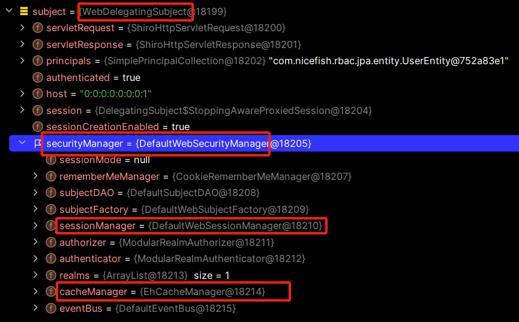

# 最终总结：Shiro 的架构

到此为止，我们已经对 Shiro 框架的方方面面都有了非常深入的理解，在本章中，我们离开具体的代码细节，站在框架设计者的位置，从更宏观的视角来观察 Shiro 的全貌。

在软件工程中，系统设计通常分为两个层次：

- **HLD（High-Level Design，概要设计）**：概要设计侧重于从用户的视角出发，定义系统的整体功能，而不深入技术细节。用户未必掌握专业的技术术语，但他们知道需要实现哪些业务功能。因此，HLD 的目标是为系统的用户和开发团队提供一个清晰的功能概览。
- **LLD（Low-Level Design，详细设计）**：详细设计则注重技术实现，从开发者的角度详细规划系统。它需要考虑技术选型，如编程语言、开发框架、模块划分、数据传递方式等。LLD 为开发人员提供了具体的实现路线图。

在 Shiro 官方文档中，有一篇文章详细描述了其 HLD 和 LLD。本章内容的结构参考了 Shiro 官方的设计说明，做了一些调整和补充，重新绘制了框图。Shiro 作为一个有 20 多年历史的框架，原有文档中的一些技术已经不存在，修改后的图表和描述更符合当代的技术发展趋势，便于开发者更好地理解和使用 Shiro。

## HLD

**Subject**：在教程中我们提到，**Subject** 本质上代表了当前操作用户的安全视角。虽然“用户”通常指的是人，但 **Subject** 可以是任何与系统交互的实体，例如第三方服务、守护进程账户或定时任务等。每一个 **Subject** 实例都会依赖 **SecurityManager**，并与其绑定。当我们与 **Subject** 交互时，实际上这些操作都被转化为对 **SecurityManager** 的安全调用。

**SecurityManager** 是 Shiro 架构的核心，负责协调和管理内部的安全组件。它像一个“保护伞”，整合了与安全相关的工具类和对象，形成一个对象图。尽管 **SecurityManager** 负责背后复杂的安全操作，但开发者在使用 Shiro 时，更多是通过 **Subject API** 进行交互。一旦 **SecurityManager** 和它的组件配置完成，通常无需频繁修改。

简而言之，当我们与 **Subject** 交互时，背后实际上是 **SecurityManager** 在完成安全的操作和管理。下图展示了在运行时，各个实例之间的依赖关系：

**Realm** 在 Shiro 中充当桥梁，连接了 Shiro 和应用程序的安全数据。每当需要进行身份认证（如登录）或授权（访问控制）时，Shiro 都会从配置的一个或多个 **Realm** 中获取数据。可以将 **Realm** 看作是一个专门用于安全的 **DAO（数据访问对象）**，负责处理与数据源的连接，并根据需求提供数据。

在配置 Shiro 时，必须至少指定一个 **Realm** 来处理认证和授权操作。虽然 **SecurityManager** 可以配置多个 **Realm**，但至少需要一个 **Realm** 才能保证系统正常工作。

在后续的学习中，我们会逐步深入分析这些核心类的源码，并详细解读它们的功能与实现。

## LLD

对于这张 LLD 架构图中出现的关键术语， Shiro 官方网站提供了简单的文档，为了方便开发者理解框架本身的设计意图，这里增加一些补充解释。

1. **Subject (org.apache.shiro.subject.Subject)**

   - **官方文档**：Subject 是代表当前与应用程序交互的实体，通常是用户、第三方服务或任务等。每个 Subject 都是一个安全视角，负责与应用程序的安全相关的操作。通过 Subject，开发者可以执行认证、授权、会话管理等操作。
   - **补充解释**：Subject 是与当前与软件交互的实体（用户、第三方服务、定时任务等）的一个安全特定的“视图”。它是 Shiro 框架的核心对象，在代码层面，只要获得了 Subject 实例，就可以进行所有与权限相关的操作。

2. **SecurityManager (org.apache.shiro.mgt.SecurityManager)**

   - **官方文档**：SecurityManager 是 Shiro 的核心组件，负责管理所有安全相关的操作，包括认证、授权、会话管理等。它是一个“伞状”对象，负责协调其管理的组件，确保它们能够协同工作。
   - **补充解释**：SecurityManager 基本上是 Shiro 中管理安全操作的全局对象，它掌握着应用程序中每个用户的视图，进而知道如何为每个用户执行安全操作。

3. **Authenticator (org.apache.shiro.authc.Authenticator)**

   - **官方文档**：Authenticator 是用于处理用户身份验证（登录）的组件。它会从指定的 Realm 中获取用户数据并进行身份验证，确保用户身份的正确性。
   - **补充解释**：Authenticator 负责执行和响应用户认证尝试。当用户尝试登录时，Authenticator 执行相应的逻辑。它知道如何与多个 Realm 协作，验证用户的身份。

4. **Authentication Strategy (org.apache.shiro.authc.pam.AuthenticationStrategy)**

   - **官方文档**：当应用程序配置了多个 Realm 时，Authentication Strategy 定义了多个 Realm 的认证逻辑。如果一个 Realm 成功而其他失败，是否认证成功？是否需要所有 Realm 都成功？这些逻辑都由 Authentication Strategy 来决定。
   - **补充解释**：在涉及多个 Realm 的情况下，Authentication Strategy 是协调认证过程的核心。

5. **Authorizer (org.apache.shiro.authz.Authorizer)**

   - **官方文档**：Authorizer 负责处理授权操作，决定用户是否被允许访问某个资源或执行某个操作。它与 Realm 协作，从后端数据源中获取角色和权限信息，以做出决策。
   - **补充解释**：Authorizer 是决定用户能否执行特定操作的最终机制。它知道如何与多个后端数据源协调，获取用户角色和权限的相关信息。

6. **SessionManager (org.apache.shiro.session.mgt.SessionManager)**

   - **官方文档**：SessionManager 是 Shiro 的会话管理组件，负责创建和管理用户的会话生命周期。它可以在 Web 环境和非 Web 环境中使用，为用户提供一致的会话体验。
   - **补充解释**：SessionManager 能够管理用户的会话，即使没有 web 容器，也可以使用内置的会话管理功能来管理会话，并通过 SessionDAO 将会话数据持久化。

7. **SessionDAO (org.apache.shiro.session.mgt.eis.SessionDAO)**

   - **官方文档**：SessionDAO 是用于持久化会话的组件，执行对会话的 CRUD（创建、读取、更新、删除）操作。它允许会话信息存储在任何支持的持久化存储中，比如数据库。
   - **补充解释**：SessionDAO 的存在使得任何数据源都可以作为 Shiro 的会话持久化基础设施的一部分。

8. **CacheManager (org.apache.shiro.cache.CacheManager)**

   - **官方文档**：CacheManager 是缓存管理器，负责管理和维护 Shiro 各个组件使用的缓存。这有助于减少对外部数据源的频繁访问，提升性能。可以与各种缓存产品集成。
   - **补充解释**：由于 Shiro 在认证、授权、会话管理过程中需要访问后端数据源，因此缓存是提升性能的重要机制。Shiro 支持各种开源和企业级缓存方案。

9. **Cryptography (org.apache.shiro.crypto.cipher.\*)**

   - **官方文档**：Shiro 提供了简化的密码学功能，支持加密、哈希和其他相关操作。开发者可以通过简单的 API 使用加密功能，而无需深入理解底层复杂的 Java 原生加密库。
   - **补充解释**：Shiro 的加密包提供了简单且强大的加密工具，开发者可以轻松实现安全性功能，如数据加密和哈希生成。

10. **Realm (org.apache.shiro.realm.Realm)**

    - **官方文档**：Realm 是 Shiro 与应用程序安全数据的“桥梁”，用于在认证和授权时从外部数据源中获取用户信息。Shiro 可以配置多个 Realm，允许与不同的数据源交互。
    - **补充解释**：Realm 是一个非常重要的组件，用于连接 Shiro 和你的应用程序的数据源（例如数据库、LDAP）。每个 Realm 都可以代表一个数据源，用于认证和授权操作。

11. **JDBC Realm**：

    - **官方文档**：JDBC Realm 是一种通过 JDBC 连接数据库来进行认证和授权的 Realm。它通常用于从关系型数据库中获取用户和权限数据。
    - **补充解释**：通过 JDBC Realm，Shiro 能够方便地与数据库集成，从中获取所需的用户账户信息。

12. **LDAP Realm**：

    - **官方文档**：LDAP Realm 是使用 LDAP 协议来连接 LDAP 服务器，获取用户身份和权限信息的 Realm。通常用于企业级应用中。
    - **补充解释**：LDAP Realm 适用于企业级应用和组织的目录服务，以便从 LDAP 中获取用户相关的认证和授权信息。

13. **Custom Realm**：

    - **官方文档**：Custom Realm 是你可以根据自己的需求自定义的 Realm，它可以连接任何你选择的数据源，提供灵活的认证和授权机制。
    - **补充解释**：通过定制的 Realm，Shiro 可以连接到非标准的存储系统或服务，灵活应对各种特殊的业务需求。

## 发布包的结构

最后，对 Shiro 的发布包做一些说明：

| **JAR 包名称** | **描述** |
| --- | --- |
| **shiro-core-1.12.jar** | Shiro 的核心库，包含了最基本的安全框架功能，如 Subject、SecurityManager、Authenticator、Authorizer 等的实现。 |
| **shiro-config-1.12.jar** | 提供了 Shiro 的配置支持，包括通过 `.ini` 文件配置 SecurityManager、Realm、缓存等功能。 |
| **shiro-ini-1.12.jar** | 提供了 .ini 配置文件的解析支持，简化了通过 .ini 文件配置 Shiro 应用程序的方式。 |
| **shiro-web-1.12.jar** | 用于 Web 应用程序的集成，提供了与 Servlet API 的集成，包括 Web 过滤器、会话管理等功能。 |
| **shiro-session-1.12.jar** | 该模块专门用于处理 Shiro 的会话管理功能，提供了创建、管理和持久化用户会话的能力。 |
| **shiro-cache-1.12.jar** | 提供了缓存的通用接口定义，使得 Shiro 可以与不同的缓存机制集成（如 EhCache、Redis 等）。 |
| **shiro-crypto-1.12.jar** | 提供了加密和哈希功能，包括简单的对称加密、非对称加密、哈希计算（如 MD5、SHA-256）以及密码编码器。 |
| **shiro-crypto-cipher-1.12.jar** | 提供了详细的密码学实现，涵盖加密、解密和哈希计算的核心功能。 |
| **shiro-crypto-core-1.12.jar** | 加密模块核心功能的实现，支持各种加密、解密操作。 |
| **shiro-crypto-hash-1.12.jar** | 专门提供哈希算法的实现，如 MD5、SHA 等。 |
| **shiro-ehcache-1.12.jar** | 集成了 EhCache 作为 Shiro 的缓存机制，用于提升认证、授权以及会话管理的性能。 |
| **shiro-redis-1.12.jar** | 提供了 Redis 与 Shiro 集成的支持，可以将会话和缓存数据存储在 Redis 中，以实现分布式缓存或会话共享。 |
| **shiro-hazelcast-1.12.jar** | 提供了与 Hazelcast 集成的支持，Hazelcast 是一种分布式内存对象存储，用于缓存和会话数据的分布式管理。 |
| **shiro-memcached-1.12.jar** | 提供了与 Memcached 集成的支持，允许将会话和缓存数据存储在 Memcached 中，以实现分布式缓存和会话共享。 |
| **shiro-spring-1.12.jar** | 用于与 Spring 框架集成，提供了与 Spring 依赖注入、事务管理和 AOP 的无缝协作。 |
| **shiro-spring-boot-web-starter-1.12.jar** | 提供了 Shiro 与 Spring Boot 的集成支持，简化了 Spring Boot 项目中的 Shiro 配置。 |
| **shiro-cas-1.12.jar** | 提供了 Shiro 与 CAS（Central Authentication Service，中央认证服务）集成的支持，方便使用 CAS 作为单点登录（SSO）方案。 |
| **shiro-quartz-1.12.jar** | 提供了 Shiro 与 Quartz 调度框架的集成，用于定时任务调度，结合 Shiro 的安全性保证任务执行的权限控制。 |
| **shiro-ldap-1.12.jar** | 用于与 LDAP 服务器集成，从 LDAP 中获取用户身份验证和授权数据，适用于企业应用的用户管理。 |
| **shiro-jdbc-1.12.jar** | 提供了通过 JDBC 集成数据库的支持，从关系型数据库中获取用户和权限信息，用于认证和授权。 |
| **shiro-guice-1.12.jar** | 提供了与 Google Guice 框架的集成，使得 Shiro 可以与 Guice 的依赖注入机制配合使用。 |
| **shiro-event-1.12.jar** | 允许 Shiro 事件的管理，帮助开发者处理和订阅认证、授权和会话相关的事件。 |
| **shiro-async-1.12.jar** | 允许在异步环境中使用 Shiro 的安全功能，尤其适用于现代的异步非阻塞 Web 框架。 |

注意：除了 Shiro 官方发布的 jar 包之外，开源社区也贡献了很多工具包，由读者自己探索研究。

## 资源链接

- Apache Shiro 在 github 上的官方仓库： https://github.com/apache/shiro
- Apache Shiro 官方网站：https://shiro.apache.org/
- 本书实例项目：https://gitee.com/mumu-osc/nicefish-spring-boot
- 本书文字稿：https://gitee.com/mumu-osc/apache-shiro-source-code-explaination

## 版权声明

本书基于 [**CC BY-NC-ND 4.0 许可协议**](https://creativecommons.org/licenses/by-nc-nd/4.0/deed.en)发布，自由转载-非商用-非衍生-保持署名。

**版权归大漠穷秋所有 © 2024 ，侵权必究。**
