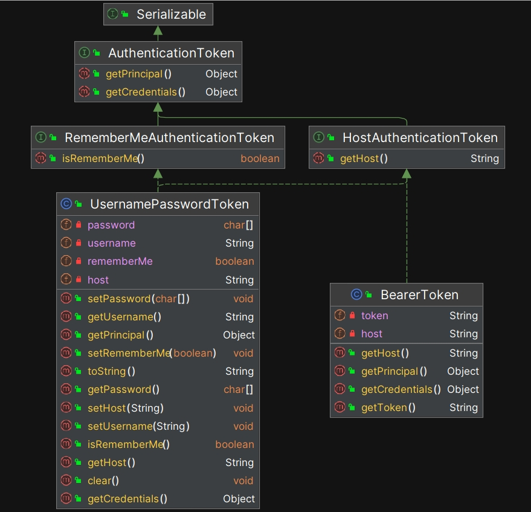

# 主体、身份与凭据

与所有专业领域一样，在安全领域有一些专用的术语，这些术语一直存在，不是 Shiro 发明的， Shiro 只是提供了自己的实现方式。在本章内容中，我们重点解释以下 3 个最关键的术语并分析 Shiro 中的具体实现：

- 主体
- 身份
- 凭据

## 2.1 从最简单的 login 开始

我们从最简单的用户登录开始，在最常见的情况下，系统的用户是人类，只要提供用户名和密码，就可以登录系统。假设我们封装了两个最简单的类`User` 和 `Password` ，下面是两段简化的 Java 伪代码：

1. **User 类：** 表示一个用户，其中包含用户名和密码。

```java
public class User {
    private String username;
    private Password password;

    public User(String username, String password) {
        this.username = username;
        this.password = new Password(password);
    }

    public String getUsername() {
        return username;
    }

    public boolean validatePassword(String inputPassword) {
        return password.isValid(inputPassword);
    }
}
```

2. **Password 类：** 负责管理用户的密码，并提供密码验证功能。

```java
public class Password {
    private String hashedPassword;

    public Password(String plainTextPassword) {
        this.hashedPassword = hashPassword(plainTextPassword);  // 将明文密码进行加密存储
    }

    // 简单的哈希函数示例（仅作演示，实际应使用安全的加密算法）
    private String hashPassword(String plainTextPassword) {
        return Integer.toHexString(plainTextPassword.hashCode());
    }

    // 验证输入密码是否正确
    public boolean isValid(String inputPassword) {
        return this.hashedPassword.equals(hashPassword(inputPassword));
    }
}
```

我们再封装一个 `LoginService` 来模拟用户登录过程：

**LoginService 类：**

```java
public class LoginService {
    private Map<String, User> userDatabase = new HashMap<>();

    public LoginService() {
        // 初始化一些用户信息（此处直接创建用户，实际场景可能从数据库读取）
        userDatabase.put("user_1", new User("user_1", "123456"));
        userDatabase.put("user_2", new User("user_2", "654321"));
    }

    // 登录方法：接收用户名和密码，返回登录结果
    public boolean login(String username, String password) {
        User user = userDatabase.get(username);
        if (user == null) {
            System.out.println("User not found.");
            return false;
        }
        if (user.validatePassword(password)) {
            System.out.println("Login successful! Welcome, " + username);
            return true;
        } else {
            System.out.println("Invalid password.");
            return false;
        }
    }
}
```

**Main 类：** 主程序入口

```java
public class Main {
    public static void main(String[] args) {
        String username = "user_1";
        String password = "123456";

        LoginService loginService = new LoginService();
        boolean isSuccess = loginService.login(username, password);
        if (isSuccess) {
            System.out.println("Access granted.");
        } else {
            System.out.println("Access denied.");
        }
    }
}
```

以上伪代码模拟了用户登录流程，但显然，这个实现过于简陋，不可能成为框架层面的代码。但是，用户登录是所有软件系统必备的功能，我们从 login 开始分析是一个不错的选择。本章将以这份简单的实现为基础，逐步梳理出 Shiro 中的关键概念，最后将其改造成 Shiro 版的 login 实现。

## 2.2 概念抽象

接下来，我们来分析这份简陋的 login 代码存在的问题，并对它进行一些抽象和设计，让它的通用性更好：

- **User 类的命名问题**：虽然在许多系统中，“用户”通常是指人类，但并不是所有的系统访问者都是人类。例如，定时任务也会调用系统中的服务 ，但是它只是系统中的一个进程，而不是“用户” (User)。因此，如果我们直接在框架层面使用 "User" 作为类名显得过于具体，概念上无法涵盖所有的系统使用者。为了适应更广泛的场景，Shiro 使用了 **Subject** 这个单词。**Subject** 的字面意思是“主体”，这一抽象术语能够涵盖各种实体，无论是人类用户、定时器进程，还是第三方调用者，我们都可以称之为“主体”，无论哪种情况都毫无违和的感觉，这就是为什么要做概念抽象的原因之一。在大多数安全框架中，都使用 **Subject** 来称呼系统的使用者。
- **username 的命名问题**：类似地，对于某些非人类使用者，比如定时任务，直接使用 `username` 作为属性名称也是不合适的，因为定时任务没有 `username` 。为了概念层面的准确性、通用性， Shiro 选择了 **Principal** 这个单词作为更高层次的抽象，**Principal** 的音标是 /ˈprɪnsəpəl/，它的本义是“主要的”或“关键的东西”，这里我们翻译成“**身份**”，身份代表了主体“是谁”，或者“是什么”。**那些能够描述主体特征的属性，都可以称之为 `Principal`（身份）。** 对于人类用户，例如：身份证号码、手机号码、userId、userName、email 等，都可以代表“身份”；对于定时任务来说，IP 地址+进程 ID 可以作为它的“身份”。在代码实现层面，Shiro 没有直接抽象出 `Principal` （身份）类，而是封装了一个 **PrincipalCollection** （身份集合）类，很明显，**对于同一个主体，可以拥有多个“身份”，直接设计成集合类型更加合理，而且在代码实现时会带来更多方便。**
- **Password 类的命名问题**：并不是所有的访问者都需要“密码”（Password），例如，定时任务通常只需要一个带有时间限制的令牌（Token）来验证身份。在具体实现上， Token 是一串经过加密计算之后的字符串，一般是 32 个字符、64 个字符，也有用超长的 128 个字符的。同样地， `Password` 这个单词的含义太具体了，不能涵盖各种场景， 我们需要更抽象的概念。安全领域一般使用 **Credential** 这一术语，**Credential** 的音标是 /krɪˈdenʃl/，本意是“凭据”。**对于人类用户，凭据可以是密码、指纹、虹膜、面容等；而对于定时任务，凭据可以是令牌（Token）。** 在具体代码实现层面， Shiro 就直接采用了 **Token**(令牌) 这个单词，而没有封装 **Credential** 类。从英文语法的角度看， **Token(令牌)** 这个单词和 **Credential（凭据）** 在含义上近似，但是 **Token(令牌)** 更强调动态性，也就是说令牌随时可以发生变化，比如定时 5 分钟之后，必须获取新的令牌。而 **Credential（凭据）** 更加强调静态性，也就是长期存储而不变化的凭据。这里的目的不是分析英文的语法，而是希望开发者能够体会，在设计系统时，如何采用合适的概念和术语。

为了对比不同的实现中采用的术语，我们来看如下表格：

| 我们自己的代码     | java.security 中的术语            | Shiro 中的术语                  |
| ------------------ | --------------------------------- | ------------------------------- |
| User（用户）       | Subject（主体）                   | Subject（主体）                 |
| username（用户名） | Principal（身份）                 | PrincipalCollection（身份集）   |
| Password（密码）   | Key（密钥）和 Certificate（证书） | AuthenticationToken（验证令牌） |

虽然我们可以使用不同的单词（术语）来表达相同的含义，**但是对于一个框架来说，保持概念上的通用性、准确性和一致性至关重要。如果概念过于具体或不够清晰，可能会导致理解困难或扩展性受限。** 通过阅读 Shiro 的源代码，开发者能够深刻体会到面向对象设计（OOD: Object Oriented Design）的强大与灵活性。

在 Shiro 框架中，Subject（主体）、 PrincipalCollection（身份集）、 AuthenticationToken（验证令牌）这 3 个核心类之间的依赖关系如下：


- Subject（主体） 的实现类中会持有 1 个 PrincipalCollection（身份集） 实例，这是 has-a 的关系。
- Subject（主体） 的 login 方法会要求一个 AuthenticationToken（验证令牌） 类型的参数。

接下来，我们依次解析以上三个关键概念，以及它们的源代码。

## 2.3 Subject-主体

我们先来看 Subject 相关的实现，以下是整体继承结构：


Shiro 定义了 2 个接口： Subject 和 WebSubject ，还有 2 个具体的实现类： DelegatingSubject 和 WebDelegatingSubject ，以下是这些类型的概要描述（读者概要浏览即可，无需记忆）：

| 类名 | 功能描述 |
| --- | --- |
| `Subject` | Shiro 框架中主体的核心接口，代表用户、系统进程或其他可以与应用程序进行交互的实体。定义了与身份验证、授权、会话和运行时操作相关的方法。 |
| `WebSubject` | 继承自 `Subject` 的子接口，专门用于 Web 环境中定义主体的行为和属性，提供了与 HTTP 请求、会话以及其他 Web 相关上下文的交互功能。 |
| `DelegatingSubject` | `Subject` 的默认实现，提供了一种委托机制，可以将主体的操作委派给其他组件。 |
| `WebDelegatingSubject` | 实现了 `DelegatingSubject` 和 `WebSubject` 接口，提供了适用于 Web 环境的 `Subject` 实现。整合了 `WebSubject` 和 `DelegatingSubject` 的功能，用于在 Web 环境中更好地管理主体的状态和行为，主要是封装了与请求、响应、会话有关的处理机制，毕竟它的类名是以 Web 开头的。 |

接下来我们依次分析这些 interface 和 class 的架构和代码。

### 2.3.1 **Subject 接口解析**

`Subject` 是 Shiro 框架中最顶层的接口，它的设计目标是：定义与主体（例如人类用户）交互的主要操作，如身份验证、授权、会话管理等。以下是 Shiro 中 `Subject` 接口的完整定义，请读者快速浏览一下其中的方法（无需记忆）：


`Subject` 是一个“巨型”接口，其中定义了 32 个方法，以下是各个方法的功能描述（读者概要浏览即可，无需记忆任何内容）：

| 方法 | 返回类型 | 描述 |
| --- | --- | --- |
| `hasRole(String roleIdentifier)` | `boolean` | 检查当前主体是否具有指定的角色。 |
| `hasAllRoles(Collection<String> roles)` | `boolean` | 检查当前主体是否具备所有指定的角色。 |
| `hasRoles(List<String> roleIdentifiers)` | `boolean[]` | 检查当前主体是否具备多个角色，并返回每个角色的检查结果数组。 |
| `checkRole(String role)` | `void` | 验证当前主体是否具备指定角色，若不具备则抛出异常。 |
| `checkRoles(String... roles)` | `void` | 验证当前主体是否具备所有指定角色，若不具备则抛出异常。 |
| `checkRoles(Collection<String> roles)` | `void` | 验证当前主体是否具备所有指定角色，若不具备则抛出异常。 |
| `isPermitted(String permission)` | `boolean` | 检查当前主体是否具备指定的权限标识。 |
| `isPermitted(String... permissions)` | `boolean[]` | 检查当前主体是否具备多个权限，并返回每个权限的检查结果数组。 |
| `isPermitted(List<Permission> permissions)` | `boolean[]` | 检查当前主体是否具备多个权限对象，并返回每个权限的检查结果数组。 |
| `isPermitted(Permission permission)` | `boolean` | 检查当前主体是否具备指定的权限对象。 |
| `isPermittedAll(String... permissions)` | `boolean` | 检查当前主体是否具备所有指定的字符串权限。 |
| `isPermittedAll(Collection<Permission> permissions)` | `boolean` | 检查当前主体是否具备所有指定的权限对象。 |
| `checkPermission(String permission)` | `void` | 验证当前主体是否具备指定的字符串权限，若不具备则抛出异常。 |
| `checkPermission(Permission permission)` | `void` | 验证当前主体是否具备指定权限对象，若不具备则抛出异常。 |
| `checkPermissions(String... permissions)` | `void` | 验证当前主体是否具备所有指定的字符串权限，若不具备则抛出异常。 |
| `checkPermissions(Collection<Permission> permissions)` | `void` | 验证当前主体是否具备所有指定的权限对象，若不具备则抛出异常。 |
| `getSession(boolean create)` | `Session` | 获取与当前主体关联的会话。如果 `create` 为 `true`，则创建新会话。 |
| `getSession()` | `Session` | 获取与当前主体关联的会话，若无会话则创建新会话。 |
| `login(AuthenticationToken token)` | `void` | 使用指定的 `AuthenticationToken` 登录当前主体。 |
| `logout()` | `void` | 注销当前主体，使其不再活跃并从系统中移除。 |
| `getPrincipal()` | `Object` | 获取当前主体的单个身份实例（通常是唯一标识，如 userName 或者 userId）。**请注意返回值的类型是 `Object` ，因为在具体的代码实现层面， Shiro 并没有抽象一个 `Principal` 接口出来。但是，在设计意图层面看，Shiro 希望这里返回的是身份集中的一个元素。** 另外， Shiro 在这里不想进行强类型约束，因为主体的“身份”可以有用很多属性来描述，例如：身份证号码、userId、userName、邮箱、指纹、虹膜、面容，等等，它们都可以描述主体的“身份”。如果这里进行强类型约束，框架的可扩展性就变差了，因为我们不知道将来还会不会出现什么新的技术，可以用来代表主体的“身份”。 |
| `getPrincipals()` | `PrincipalCollection` | 获取当前主体的身份集。 |
| `getPreviousPrincipals()` | `PrincipalCollection` | 获取当前主体的之前身份（当主体代理其他身份时）。 |
| `isAuthenticated()` | `boolean` | 判断当前主体是否已经通过身份验证。 |
| `isRemembered()` | `boolean` | 判断当前主体是否通过“记住我”的方式登录。 |
| `isRunAs()` | `boolean` | 判断当前主体是否为其他主体的身份代理（“冒充”另一身份）。 |
| `runAs(PrincipalCollection principals)` | `void` | 以指定身份代理当前主体，即“冒充”其他主体。 |
| `releaseRunAs()` | `PrincipalCollection` | 释放当前主体的“冒充”身份，恢复原身份。 |
| `associateWith(Runnable runnable)` | `Runnable` | 返回一个新的 `Runnable` 实例，该实例将以当前主体的身份执行。 |
| `associateWith(Callable<V> callable)` | `Callable<V>` | 返回一个新的 `Callable` 实例，该实例将以当前主体的身份执行。 |
| `execute(Runnable runnable)` | `void` | 在当前主体的上下文中执行给定的 `Runnable` 任务。 |
| `execute(Callable<V> callable)` | `<V> V` | 在当前主体的上下文中执行给定的 `Callable` 任务，并返回结果。 |

`Subject` 接口定义的方法数量很多，其中有大量的方法重载，总结起来涉及以下几个层面：

- **身份验证**： 检查主体是否已经登录，这块功能是由 isAuthenticated() 和 isRemembered() 定义的。
- **授权**： 检查主体是否有某种权限访问资源，这块功能是由类似 isPermitted 和 checkPermission 这一系列的方法定义的。
- **角色管理**： 检查主体是否拥有某种角色，这块功能是由类似 hasRole 和 checkRole 这一系列带有单词 "Role" 的方法定义的。
- **会话管理**： 管理主体与系统的会话状态，这块功能是由类似 getSession 这一系列的方法定义的。
- **切换身份**： 允许主体暂时切换到另一个用户的身份进行操作，这块功能是由类似 runAs 这一系列的方法定义的。

根据 Java 语言中 `Interface` 的特性，接口只负责定义方法，不能提供具体实现，所以接下来我们分析 Subject 的具体实现类 `DelegatingSubject` 。

### 2.3.2 **DelegatingSubject 类解析**


如上图， `DelegatingSubject` 是 `Subject` 接口的一个具体实现类。它通过“委托”的方式，将具体的操作（如身份验证、会话管理等）委托给 Shiro 的其他组件进行处理。**身份验证**和**授权**功能会被委托给 `SecurityManager` 进行处理。`DelegatingSubject` 是一个非常重要的实现，因为它通过委托模式简化了代码的实现，同时保持了良好的扩展性。

DelegatingSubject 大多数代码都非常简单，我们重点分析它是如何实现“代理”的，在这个类的源代码中，关键的部分如下：

```java
public class DelegatingSubject implements Subject {
    //...

    protected transient SecurityManager securityManager;

    //...

    //since 1.2
    public DelegatingSubject(PrincipalCollection principals, boolean authenticated, String host,
                             Session session, boolean sessionCreationEnabled, SecurityManager securityManager) {
        if (securityManager == null) {
            throw new IllegalArgumentException("SecurityManager argument cannot be null.");
        }
        this.securityManager = securityManager;

        //...
    }

}
```

我们可以看到，在 `DelegatingSubject` 的构造函数中，必须提供一个 `SecurityManager` 类型的实例，然后与权限校验、角色校验、 login 、 logout 相关的功能都调用 `this.securityManager` 来实现，这就是它的类名中 `Delegating` 的含义，它自己并没有做具体的事务，而是把这些活儿都“代理”出去了。

### 2.3.3 **WebSubject 接口解析**


`WebSubject` 是 `Subject` 的扩展接口，专门用于 Web 环境下的主体管理。由于 Web 应用中主体通常通过 HTTP 请求与系统交互，因此 `WebSubject` 提供了针对 Web 场景的支持。

`WebSubject` 接口的定义如下图所示：


我们可以看到，`WebSubject` 接口扩展的方法定义只有 2 个：

| **方法名**             | **返回类型**      | **描述**                                              |
| ---------------------- | ----------------- | ----------------------------------------------------- |
| `getServletResponse()` | `ServletResponse` | 返回当前 `WebSubject` 关联的 `ServletResponse` 实例。 |
| `getServletRequest()`  | `ServletRequest`  | 返回当前 `WebSubject` 关联的 `ServletRequest` 实例。  |

### 2.3.4 **WebDelegatingSubject 源码解析**


`WebDelegatingSubject` 是 Shiro 提供的另一个具体实现类，它处于继承结构的最下方，既是 `DelegatingSubject` 的子类，又同时实现了 `Subject` 和 `WebSubject` 接口。

`WebDelegatingSubject` 详细的类型定义如下图所示：


`WebDelegatingSubject` 既具备 `DelegatingSubject` 的委托特性，又能适配 Web 环境（主要是处理 Request、 Response 和 Session ）。`WebDelegatingSubject`自身的实现代码非常简短，我们来解释其中关键的部分：

```java
public class WebDelegatingSubject extends DelegatingSubject implements WebSubject {
    //...

    private final ServletRequest servletRequest;
    private final ServletResponse servletResponse;

    //...

    //since 1.2
    public WebDelegatingSubject(PrincipalCollection principals, boolean authenticated,
                                String host, Session session, boolean sessionEnabled,
                                ServletRequest request, ServletResponse response,
                                SecurityManager securityManager) {
        super(principals, authenticated, host, session, sessionEnabled, securityManager);
        this.servletRequest = request;
        this.servletResponse = response;
    }

    public ServletRequest getServletRequest() {
        return servletRequest;
    }

    public ServletResponse getServletResponse() {
        return servletResponse;
    }

    //...

    @Override
    protected SessionContext createSessionContext() {
        WebSessionContext wsc = new DefaultWebSessionContext();
        String host = getHost();
        if (StringUtils.hasText(host)) {
            wsc.setHost(host);
        }
        wsc.setServletRequest(this.servletRequest);
        wsc.setServletResponse(this.servletResponse);
        return wsc;
    }
}
```

- 构造方法：要求传入 `ServletRequest` 和 `ServletResponse` 类型的实例。
- createSessionContext() 方法：用于创建会话的上下文对象。由于 Shiro 自己实现了一套独立的 Session 机制，这套机制可以脱离 web 环境运行，所以设计了一套“会话上下文”机制，用来抽象和封装会话创建过程中所需的环境信息。那么， Shiro 设计的“会话上下文”中具体存储了哪些数据呢？包括：主机 IP 地址、SessionID、Request 实例、Response 实例。

**在实际的业务开发中，开发者一般会直接使用 `WebDelegatingSubject` 这个类**。如果不需要 web 环境，使用它的父类 `DelegatingSubject` 就可以了。但是，`WebDelegatingSubject` 中只引用了 javax 中的两个类：

```java
import javax.servlet.ServletRequest;
import javax.servlet.ServletResponse;
```

而 javax 这个包是内置在 JDK 中的，常见的 JRE 环境中也带有这些 jar 包。所以，即使不需要 web 环境，开发者依然可以引用 `WebDelegatingSubject` 这个类，并不需要进行那么细粒度的控制。

### 2.3.5 WebDelegatingSubject 运行时分析

在运行时， `WebDelegatingSubject` 的实例是由对应的工厂类 `DefaultWebSubjectFactory` 创建的，以下是相关工厂类的继承结构：


工厂模式（Factory Pattern）是创建型设计模式之一，主要用于封装对象的创建过程。在现实世界中，工厂的作用是用来批量生产某种产品。在编程世界，其作用是类似的，当开发者需要某个类的实例时，不需要手动去 new 对象，而是让工厂类去生产。**这样做会带来一系列的好处，其中最大的一个好处就是：工厂可以根据配置动态决定生产哪一个类型的实例，这样在后续增加或者删除某个实现类的时候，不需要大幅度修改现有的代码逻辑。** 关于设计模式方面，有大量专门的书籍，感兴趣的读者可以自行研究。


根据以上依赖关系图，我们来进行运行时分析。

- ShiroConfig.java: 这是 Shiro 框架的配置类，系统启动时， Shiro 会首先执行其中的逻辑：

```java
@Bean
public SecurityManager securityManager(){
    DefaultWebSecurityManager securityManager = new DefaultWebSecurityManager();
    securityManager.setRealm(nicefishRbacRealm());
    securityManager.setRememberMeManager(rememberMeManager());
    securityManager.setSessionManager(sessionManager());
    securityManager.setCacheManager(ehCacheManager());
    return securityManager;
}
```

- new DefaultWebSecurityManager() ： DefaultWebSecurityManager 是 SecurityManager 接口的具体实现类。 SecurityManager 是整个 Shiro 框架的“安全主管”，其中封装了所有核心处理流程，在后续的章节中，我们会详细分析它的源代码。
- DefaultWebSecurityManager 的内部实现：在 DefaultWebSecurityManager 的构造方法中，我们可以看到以下关键代码

```java
public DefaultWebSecurityManager() {
    //...
    setSubjectFactory(new DefaultWebSubjectFactory());
    //...
}
```

- DefaultWebSubjectFactory 的内部实现：

```java
public Subject createSubject(SubjectContext context) {
    //SHIRO-646
    //Check if the existing subject is NOT a WebSubject. If it isn't, then call super.createSubject instead.
    //Creating a WebSubject from a non-web Subject will cause the ServletRequest and ServletResponse to be null, which wil fail when creating a session.
    boolean isNotBasedOnWebSubject = context.getSubject() != null && !(context.getSubject() instanceof WebSubject);
    if (!(context instanceof WebSubjectContext) || isNotBasedOnWebSubject) {
        return super.createSubject(context);
    }
    WebSubjectContext wsc = (WebSubjectContext) context;
    SecurityManager securityManager = wsc.resolveSecurityManager();
    Session session = wsc.resolveSession();
    boolean sessionEnabled = wsc.isSessionCreationEnabled();
    PrincipalCollection principals = wsc.resolvePrincipals();
    boolean authenticated = wsc.resolveAuthenticated();
    String host = wsc.resolveHost();
    ServletRequest request = wsc.resolveServletRequest();
    ServletResponse response = wsc.resolveServletResponse();

    return new WebDelegatingSubject(principals, authenticated, host, session, sessionEnabled,
            request, response, securityManager);
}
```

可以看到， createSubject 方法最终创建了 `WebDelegatingSubject` 类的实例。同时我们可以看到，在调用 new WebDelegatingSubject(...) 时，把 securityManager 实例也传递进去了。在 Shiro 中，与安全相关的所有功能都被整合在 SecurityManager 中，它是“安全主管”，在后续的内容中我们将会分析它的源代码。

## 2.4 PrincipalCollection-身份集合

### 2.4.1 PrincipalCollection 架构与代码分析

接下来，我们来分析 PrincipalCollection （身份集合）的实现，先来看整体继承结构，如下图所示：


除了 JDK 定义的 `Iterable<T>` 和 `Serializable` 接口之外， Shiro 自己封装了 3 个接口和 2 个具体的实现类，它们的功能简要解释如下（读者浏览一遍即可，无需记忆）：

| **名称** | **描述** |
| --- | --- |
| **PrincipalCollection (接口)** | 身份集合，继承自 JDK 定义的 `Iterable<T>` 和 `Serializable` 接口。 |
| **MutablePrincipalCollection (接口)** | 继承自 `PrincipalCollection`，这是一个可变集合接口，允许动态添加或删除身份。 |
| **PrincipalMap (接口)** | 继承自 `PrincipalCollection`，这是一个基于 `Map` 的身份集合接口，使用键值对的方式存储主体身份。 |
| **SimplePrincipalCollection (类)** | 实现了 `MutablePrincipalCollection` 接口，是 Shiro 中一个简单的身份集合实现。 |
| **SimplePrincipalMap (类)** | 实现了 `PrincipalMap` 接口，提供了基于 `Map` 的身份集合实现。 |

其中，顶层的 3 个接口定义非常简单，这里不赘述，我们来重点分析 SimplePrincipalCollection ，它是一个具体的实现类，完整的类型定义如下图所示：


`SimplePrincipalCollection` 的整体代码非常简单，但有一个重要的注意点：**同一个 `SimplePrincipalCollection` 实例中维护了它在多个 Realm 中的身份集合**，相关的代码如下：

```java
//...
private Map<String, Set> realmPrincipals;

//...
protected Collection getPrincipalsLazy(String realmName) {
    if (realmPrincipals == null) {
        realmPrincipals = new LinkedHashMap<String, Set>();
    }
    Set principals = realmPrincipals.get(realmName);
    if (principals == null) {
        principals = new LinkedHashSet();
        realmPrincipals.put(realmName, principals);//以 realmName 作为 key ，身份集合作为 value
    }
    return principals;
}
```

Shiro 这样设计的目的是允许同一个 `Subject` 同时连接多个 `Realm` ，在后续解析 `Realm` 的内容中，我们会解释具体的实现代码。

### 2.4.2 PrincipalCollection 与 Subject 之间的依赖关系

接下来，我们来分析 `PrincipalCollection` 与 `Subject` 之间的依赖关系。


如上图，在 Subject 的实现类 `DelegatingSubject` 中，我们看到它持有了一个 `PrincipalCollection` 类型的实例：

```java
public class DelegatingSubject implements Subject {
    //...

    //这里持有了一个 PrincipalCollection 的实例
    protected PrincipalCollection principals;

    //...
}
```

**也就是说， DelegatingSubject 与 PrincipalCollection 之间存在“has-a”关系。**

那么，Shiro 为什么让主体持有一个“身份集合”，而不是持有单个“身份”实例呢？这是因为 Shiro 希望在运行时主体可以动态切换不同的“身份”。

类比：在 Linux Shell 中，我们可以使用 `su` （Switch User） 命令来切换当前用户的身份，从而让用户拥有不同的权限，例如：

```shell
# 切换当前用户为 root
su root
```

在 Shiro 中， `Subject` 接口定义的 `runAs` 方法也具有相同的设计意图。 `DelegatingSubject` 提供了 `runAs` 方法的具体实现，代码如下：

```java
public void runAs(PrincipalCollection principals) {
    if (!hasPrincipals()) {
        String msg = "This subject does not yet have an identity.  Assuming the identity of another " +
                "Subject is only allowed for Subjects with an existing identity.  Try logging this subject in " +
                "first, or using the " + Subject.Builder.class.getName() + " to build ad hoc Subject instances " +
                "with identities as necessary.";
        throw new IllegalStateException(msg);
    }
    pushIdentity(principals);
}

//...

private void pushIdentity(PrincipalCollection principals) throws NullPointerException {
    if (isEmpty(principals)) {
        String msg = "Specified Subject principals cannot be null or empty for 'run as' functionality.";
        throw new NullPointerException(msg);
    }
    List<PrincipalCollection> stack = getRunAsPrincipalsStack();
    if (stack == null) {
        stack = new CopyOnWriteArrayList<PrincipalCollection>();
    }
    stack.add(0, principals);       //把新的身份集合压入到栈顶
    Session session = getSession(); //主体切换身份之后，会话也需要切换
    session.setAttribute(RUN_AS_PRINCIPALS_SESSION_KEY, stack);
}
```

补充解释：“has-a”关系是一种常见的面向对象编程（OOP）设计原则，描述了实例之间的组合关系。在这种关系中，一个实例包含对另一个实例的引用，从而实现功能的扩展和复用。简而言之，`A has-a B` 意味着类 `A` 拥有类 `B` 的一个实例作为其成员变量。

**这种“has-a”关系是一种强依赖关系，其中持有某个实例的类（例如 `A`）依赖于另一个实例的存在（例如 `B`）。这意味着如果 `B` 类被更改，`A` 类可能会受到影响，因为 `A` 的功能依赖于 `B` 的实现。**

## 2.5 AuthenticationToken-验证令牌

如前文所述， Shiro 没有显式定义 Credentials（凭据） 这个类。 Shiro 采用了 Token 这个单词，这两个单词在含义上近似，但是 Token 更加强调一种动态性。

Token 这个单词本身的含义是“**凭据**”、“**令牌**”，当某个**主体**（Subject）试图登录系统的时候，必须说明自己的身份（Principal），但是这样还不行，还必须提供令牌（Token）来证明这个身份是真实的。


Shiro 中 Token 相关的类继承结构如下图所示：



这些类的功能简要描述如下（读者概要浏览即可，无需记忆）：

| 类名 | 功能描述 |
| --- | --- |
| **AuthenticationToken** | 接口，表示用户身份验证的令牌，包含了与用户身份（principal）和凭据（credentials）相关的信息。 |
| **RememberMeAuthenticationToken** | 接口，增加了“记住我”的功能，用于实现用户登录状态的持久化。 |
| **HostAuthenticationToken** | 接口，增加了与主机信息（host）相关的功能，用于记录登录来源的主机地址。 |
| **UsernamePasswordToken** | 实现类，用于基于用户名和密码的身份验证，常用于系统的标准登录认证。 |
| **BearerToken** | 实现类，通常用于 API 认证或无状态认证。 |

在 Shiro 中，所有令牌实例都是 `AuthenticationToken` 接口的子类。最常用的实现是 `UsernamePasswordToken`，它封装了用户名和密码。在用户尝试登录时，Shiro 将创建一个令牌对象，并使用它来验证用户的凭据。在后续章节中，我们会分析具体的源代码。

## 2.6 Shiro 版的 login

引入 Shiro 框架后，我们可以简化本章一开始的 login 流程。借助 Shiro，登录操作变得极其简单，只需两行代码即可完成：

```java
UsernamePasswordToken token = new UsernamePasswordToken(userName, password, rememberMe);
SecurityUtils.getSubject().login(token);
```

从 Shiro 的角度来看，这段代码的作用是：首先收集主体的关键信息（例如用户名 `userName`）和凭据（密码 `password`），将它们封装成 `UsernamePasswordToken` 类型的令牌，然后通过 `Subject` 的 `login` 方法传递这个令牌，实现登录。

那么，密码的验证究竟是在什么地方处理的呢？当我们调用 `Subject` 的 `login` 方法时，Shiro 会在内部调用 `Subject` 对应 `Realm` 中的 `doGetAuthenticationInfo` 方法来进行密码验证，关键代码示例如下（已省略无关代码）：

```java
public class NiceFishMySQLRealm extends AuthorizingRealm {
    private static final Logger logger = LoggerFactory.getLogger(NiceFishMySQLRealm.class);

    @Autowired
    private IUserService userService;

    @Override
    protected AuthenticationInfo doGetAuthenticationInfo(AuthenticationToken token) throws AuthenticationException {
        UsernamePasswordToken usernamePasswordToken = (UsernamePasswordToken) token;
        String username = usernamePasswordToken.getUsername();
        String password = usernamePasswordToken.getPassword()!=null?new String(usernamePasswordToken.getPassword()):"";

        UserEntity userEntity;
        try {
            userEntity = userService.checkUser(username, password);
            logger.debug("UserName>"+username);
            logger.debug("Password>"+password);
        }catch (Exception e) {
            logger.error(username + "登录失败{}", e.getMessage());
            throw new AuthenticationException(e.getMessage(), e);
        }

        //用户认证成功，返回验证信息实例。
        SimpleAuthenticationInfo info = new SimpleAuthenticationInfo(userEntity, password, getName());
        return info;
    }

    //...
}
```

在后续内容中我们会详细分析 Realm 的设计和实现。

## 2.7 本章小结

在本章中，我们探讨了安全领域中的三个核心概念：**主体**、**身份**和**凭据**，并分析了它们在 Apache Shiro 中的具体实现方式。我们了解到，**主体**代表在系统中执行操作的实体，可以是用户、设备甚至是系统服务。**身份**则是用来标识主体的特征或标记，而**凭据**是用来验证该身份的可信性，如密码或密钥。

通过 Shiro 的灵活设计，开发者可以轻松管理主体的身份验证和权限控制。Shiro 提供了一个通用的安全框架，使得身份验证和授权更加模块化、可扩展，为应用程序的安全性提供了强有力的保障。这些概念的掌握为我们后续在 Shiro 中实现更复杂的安全功能奠定了基础。

## 资源链接

- Apache Shiro 在 github 上的官方仓库： https://github.com/apache/shiro
- Apache Shiro 官方网站：https://shiro.apache.org/
- 本书实例项目：https://gitee.com/mumu-osc/nicefish-spring-boot
- 本书文字稿：https://gitee.com/mumu-osc/apache-shiro-source-code-explaination

## 版权声明

本书基于 [**CC BY-NC-ND 4.0 许可协议**](https://creativecommons.org/licenses/by-nc-nd/4.0/deed.en)发布，自由转载-非商用-非衍生-保持署名。

**版权归大漠穷秋所有 © 2024 ，侵权必究。**
