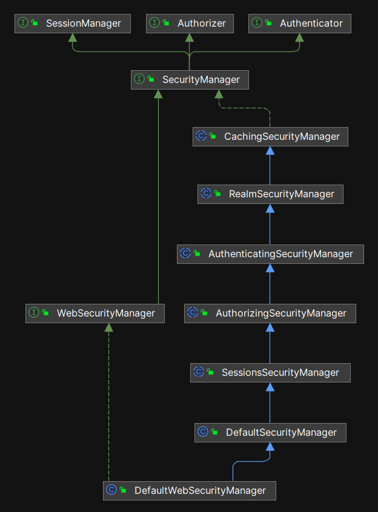

# 3.身份验证与授权

**身份验证**与**授权**是 Shiro 框架最核心的功能，本章分析这两个核心功能的设计和源码实现。

## 3.1 概念模型

**验证**与**授权**是两个不同的概念：**验证仅仅校验你到底是不是你，而授权是检查你有哪些具体的权限。**

- **Authentication** ，音标是 /ɔːˌθen.tɪˈkeɪ.ʃən/ ，这个单词的含义是“**身份验证**”，一般缩写成“**验证**”，也就是检查你到底是不是你。
- **Authorization** ，音标是 /ˌɔːθəraɪˈzeɪʃn/ ，这个单词的含义是“**授权**”，也就是检查你到底有哪些权限。

由于这两个单词都很长，所以在 Shiro 源代码中，Authentication 经常缩写成 authc ，Authorization 经常缩写成 authz 。

## 3.2 安全主管 SecurityManager

### 3.2.1 顶级接口 SecurityManager

城堡里面有很多珍贵的数据，还提供了很多敏感的服务。那么，谁来负责保卫城堡的安全呢？那就是 `SecurityManager` ，它是整个城堡的安全主管。任何试图进入城堡的主体（Subject），都必须经过它的检查，它一般会发出灵魂 3 问：

- 你是谁？
- 你从哪里来？
- 你要去哪里？

“你是谁？”和“你从哪里来？”这两句话的含义是：我需要验证你的 **身份(Principal)** ，你可以通过出示身份证、驾照或用户名来亮明身份。同时，还需提供 **凭据（Credential）** 来证明身份的真实性，空口无凭地说自己是谁肯定是不行的，说话要有证据。

“你要去哪里？”的含义是：你是否获得了授权。我需要检查你的权限（Permission Check），然后才能决定你是否可以前往城堡中的某个房间。


由于城堡的访客非常多，甚至还有一些第三方程序会调用城堡的服务，所以安全团队的规模非常庞大，分工细致。Shiro 设计了一系列的接口和实现类，整体的继承结构如下图：



所有名称为 `XXXSecurityManager` 的类都是 `SecurityManager` 接口的实现类或子接口。这种命名上的一致性可以帮助使用者更好地理解框架的设计意图。顶部的 `SecurityManager` 继承了三个重要接口：**Authenticator（验证器）**、**Authorizer（授权器）**和 **SessionManager（会话管理器）**。显然，`SecurityManager` 集三大核心功能于一身，它既是验证器、授权器，又是会话管理器。

在 Shiro 框架中，`SecurityManager` 是整个安全框架的核心枢纽，所有安全事务都由它管理。也就是说，只要获得了 `SecurityManager` 的实例，就可以执行所有安全相关的操作。

由于 `XXXSecurityManager` 相关的继承结构非常深，而其中大多数接口和实现类的代码都很少，因此我们可以分析位于继承结构底部的 **DefaultWebSecurityManager** 类。根据面向对象的机制，它具备所有上层接口和父类的属性和功能。

- **DefaultSecurityManager**：可以脱离 Web 容器独立运行。
- **DefaultWebSecurityManager**：必须在 Web 环境中运行，毕竟它的类名中就带有 Web 这个关键词。

### 3.2.2 DefaultWebSecurityManager 源码解析

#### 3.2.2.1 运行时分析

我们先进行运行时分析，当我们在 Web 项目中使用 Shiro 框架时，运行时获取的 `SecurityManager` 实例的实际类型就是 `DefaultWebSecurityManager`，如下图所示：


从上图我们可以看到，每一个 subject 实例中都持有（has-a）了一个 securityManager 实例，而 securityManager 实例中又持有了一组重要的工具实例，包括：

- 验证器 authenticator
- 授权器 authorizor
- 会话管理器 sessionManager
- 缓存管理器 cacheManager
- 记住我管理器 rememberMeManager


在框架使用者的角度看，好像 securityManager 负责做了所有事情，而实际上它并没有亲自动手，它把具体的工作全部“外包”给了内部的这一组工具对象。以上这一组工具对象都可以由开发者来具体设置，示例代码如下：

```java
@Bean
public SecurityManager securityManager(){
    DefaultWebSecurityManager securityManager = new DefaultWebSecurityManager();
    securityManager.setRealm(nicefishRbacRealm());
    securityManager.setRememberMeManager(rememberMeManager());
    securityManager.setSessionManager(sessionManager());
    securityManager.setCacheManager(ehCacheManager());
    return securityManager;
}
```

以上代码一般出现在 ShiroConfig.java 中，主要目的就是给 `SecurityManager` 设置关键的助手实例。

#### 3.2.2.2 源码分析

DefaultWebSecurityManager 相关的类型定义如下图所示：


`DefaultWebSecurityManager` 是 `DefaultSecurityManager` 的子类，它的名字里面多了一个 Web 关键词。主要控制逻辑在父类 `DefaultSecurityManager` 中已经全部实现， `DefaultWebSecurityManager` 扩展了对 Web 相关功能的支持。一般来说，与 Web 相关的功能主要是处理 4 个接口： `Request` , `Response` , `Session` , `Cookie` 。

在父类 `DefaultSecurityManager` 中，最关键的方法是 `createSubject`，这是在 Shiro 框架中获得 Subject（主体）实例的唯一渠道，它的关键源代码如下：

```java
//...

public Subject createSubject(SubjectContext subjectContext) {
    //...

    Subject subject = doCreateSubject(context);

    //...

    return subject;
}

//...

protected Subject doCreateSubject(SubjectContext context) {
    return getSubjectFactory().createSubject(context);
}
```

在以上代码中，最终真正干活的是 doCreateSubject 方法，它在内部调用工厂类上的对应方法真正 new 出 Subject 的实例：

```java
public class DefaultWebSubjectFactory extends DefaultSubjectFactory {

    //...

    public Subject createSubject(SubjectContext context) {

        //...

        return new WebDelegatingSubject(principals, authenticated, host, session, sessionEnabled,
                request, response, securityManager);
    }

    //...
}
```

以上是 Subject 实例化的详细过程，那么开发者如何在业务代码中获得创建出来的 Subject 实例呢？

Shiro 提供了一个全局可以使用的工具类 `SecurityUtils` ，通过它可以在运行时获取到 `SecurityManager` 和 `Subject` 的实例。`SecurityUtils` 本身是抽象类，也就是说无法创建这个类的实例，并且它提供的所有工具方法都是静态的，其中最关键的 2 个方法代码如下：

```java
//静态方法，获取 Subject 实例
public static Subject getSubject() {
    Subject subject = ThreadContext.getSubject();
    if (subject == null) {
        subject = (new Subject.Builder()).buildSubject();
        ThreadContext.bind(subject);
    }
    return subject;
}

//静态方法，获取 SecurityManager 实例
public static SecurityManager getSecurityManager() throws UnavailableSecurityManagerException {
    SecurityManager securityManager = ThreadContext.getSecurityManager();
    if (securityManager == null) {
        securityManager = SecurityUtils.securityManager;
    }
    if (securityManager == null) {
        String msg = "No SecurityManager accessible to the calling code, either bound to the " +
                ThreadContext.class.getName() + " or as a vm static singleton.  This is an invalid application " +
                "configuration.";
        throw new UnavailableSecurityManagerException(msg);
    }
    return securityManager;
}
```

在以上代码中，有一个关键的类 `ThreadContext` ，这是 Shiro 框架自己封装的线程上下文类型。`ThreadContext` 确保了每个线程的安全性，因为每个线程都有自己的 Subject 实例。这样，可以确保每个线程对主体的操作都是隔离的，避免了并发环境中的身份和权限混淆。

**注意：如果开发者需要在业务代码中获得 `SecurityManager` 或者 `Subject` 的实例，只能通过 `SecurityUtils` 提供的两个 get 方法来获得。因为 Shiro 在内部对 Subject 进行了线程级别的隔离，从而可以支持多线程并发环境。一旦拿到了 `SecurityManager` 或者 `Subject` 的实例，就可以调用 Shiro 提供的所有功能了，因为 Shiro 把所有核心的方法都封装在这 2 个类型里面。**

所以，站在使用者的角度，业务代码中的方法调用轨迹如下图所示：


接下来，我们重点分析验证器和授权器，其它工具对象在后续章节中独立分析。

## 3.3 身份验证 Authentication

### 3.3.1 身份验证流程

SecurityManager 的身份验证工作是由内部的 authenticator（验证器） 对象完成的，验证的处理流程如下图所示：


**身份验证工作主要涉及 3 个接口（或者类），它们是：Authenticator、AuthenticationToken 和 AuthenticationInfo 。**

### 3.3.2 验证器 Authenticator

`Authenticator` 的核心功能有：

- **确认用户身份的合法性和真实性**，比如：验证 userName 和 password 是否匹配。
- 管理多个验证数据源，让 Subject（主体） 可以同时在多个数据源中验证身份。

`Authenticator` 相关的继承结构如下：


- `Authenticator`有两个实现类，`AbstractAuthenticator` （抽象类） 和 `ModularRealmAuthenticator` （最终实现类）。
- 同时 `SecurityManager` 是它的子接口，这就意味着所有 XXXSecurityManager 也具备验证器功能。从设计模式角度看，这里复用了`模板方法模式`和`策略模式`。

Authenticator 接口本身只规定了 authenticate 一个方法：

```java
public AuthenticationInfo authenticate(AuthenticationToken authenticationToken)
            throws AuthenticationException;
```

调用者只要把 AuthenticationToken 的实例传递给 authenticate 方法，验证成功之后会返回 AuthenticationInfo 实例，否则抛异常。

在继承结构中， `AbstractAuthenticator` 这一层的主要提供 `authenticate` 方法的实现，规定了处理流程整体结构，代码简化如下：

```java
public final AuthenticationInfo authenticate(AuthenticationToken token) throws AuthenticationException {

    if (token == null) {
        throw new IllegalArgumentException("Method argument (authentication token) cannot be null.");
    }

    log.trace("Authentication attempt received for token [{}]", token);

    AuthenticationInfo info;
    try {
        info = doAuthenticate(token);
        if (info == null) {
            //...
            throw new AuthenticationException(msg);
        }
    } catch (Throwable t) {
        AuthenticationException ae = null;
        if (t instanceof AuthenticationException) {
            ae = (AuthenticationException) t;
        }
        if (ae == null) {
            //...
            ae = new AuthenticationException(msg, t);
            //...
        }
        try {
            notifyFailure(token, ae);
        } catch (Throwable t2) {
            //...
        }


        throw ae;
    }

    //...
    notifySuccess(token, info);

    return info;
}
```

从以上代码可以看到， `ModularRealmAuthenticator` 在实现 `authenticate` 方法的时候采用了 `final` 修饰符，也就是说，所有子类不能再重写 `authenticate` 方法，但是 `ModularRealmAuthenticator` 重新暴露了一个 `doAuthenticate` 方法，子类可以通过它来提供具体的验证过程。`ModularRealmAuthenticator` 中最精华的部分是提供了对多 Realm 的支持，也就是说，同一个主体，可以同时在多个 Realm 中进行身份认证，并且 Shiro 会自动合并最终结果，相关源代码如下：

```java
protected AuthenticationInfo doAuthenticate(AuthenticationToken authenticationToken) throws AuthenticationException {
    assertRealmsConfigured();
    Collection<Realm> realms = getRealms();
    if (realms.size() == 1) {
        //在单个 Realm 中认证
        return doSingleRealmAuthentication(realms.iterator().next(), authenticationToken);
    } else {
        //同时在多个 Realm 中认证，并且把多个结果整合之后返回
        return doMultiRealmAuthentication(realms, authenticationToken);
    }
}
```

`doAuthenticate` 方法的参数类型是 `AuthenticationToken` ，返回值类型是 `AuthenticationInfo`，接下来我们依次解析这两个类型。

### 3.3.3 验证令牌 AuthenticationToken

Token 这个单词本身的含义是“**凭据**”、“**令牌**”，当某个**主体**（Subject）试图登录系统的时候，必须说明自己的身份（Principal），同时还必须提供令牌（Token）来证明这个身份是真实的。

`AuthenticationToken` 相关的继承结构如下：


如上图，这些接口和类的功能如下表（读者浏览即可，无需记忆）：

| 类名 | 功能描述 | 主要属性 | 主要方法定义 |
| --- | --- | --- | --- |
| AuthenticationToken | 顶级接口，封装身份和凭证的基类。 | - | `getPrincipal()`、`getCredentials()` |
| RememberMeAuthenticationToken | 子接口，扩展“记住我”功能。 | - | `isRememberMe()` |
| HostAuthenticationToken | 子接口，扩展主机信息。 | - | `getHost()` |
| UsernamePasswordToken | 基于用户名和密码的 Token | `username`、`password`、`host`、`rememberMe` | `getUsername()`、`getPassword()`、`clear()` |
| BearerToken | 基于加密字符串的 Token | `token`、`host`、`credentials`、`principal` | `getToken()`、`clear()`、`toString()` |

在以上 3 个接口和 2 个实现类中，定义的属性和方法都很少，而且逻辑都非常简单，为了节约篇幅，这里就不列出源码，留给读者自己去查阅。

我们重点分析两个实现类： `UsernamePasswordToken` 和 `BearerToken` 。

#### 3.3.3.1 UsernamePasswordToken 源码分析

我们先分析 `UsernamePasswordToken`，望名知义，这个类里面一定封装了用户名和密码信息，这是最常用的类。

`UsernamePasswordToken`的实现非常简单，其中关键的源代码如下：

```java
private String username;

private char[] password;

public Object getPrincipal() {
    return getUsername();
}

public String getUsername() {
    return username;
}

public Object getCredentials() {
    return getPassword();
}

public char[] getPassword() {
    return password;
}

```

可以看到，对于`UsernamePasswordToken`而言，身份（Principal）就是 userName ，凭据（Credential）就是 password ，这是最常见、最容易理解的场景。

#### 3.3.3.2 BearerToken 源码分析

接下来我们分析 `BearerToken` 。

在现实世界中，我们的系统可能不仅仅有人类用户访问，可能还会有外部的程序会来频繁调用。例如，我们的系统公开了一个付款 API 接口，外部程序可以调用此 API 进行支付。在这种情况下，如果还采用用户名+密码这种方式就不太合适了，这种方式会让调用方的代码变得很复杂，因为 `UsernamePasswordToken` 需要用户每次都提供用户名和密码。

那么，更好的处理方式是什么呢？

我们的系统会提供一种加密令牌，这种令牌没有用户名（类似不记名卡），其中的内容是经过特定算法加密之后的一段字符串，如果外部系统想要调用我们的服务，必须提供这段字符串，示例如下：

```java
{
  "access_token": "YzJmNzlkNDYtYmEwMS00ZjRlLTg4MjktNzIzYjliYmI5ZTYy",
  "token_type": "Bearer",
  "expires_in": 3600
}
```

这就是 Bearer 令牌，在 web 应用中，这种令牌一般会在 HTTP 头中进行传输。当主体(Subject)登录系统，完成了验证和授权之后，系统就会生成一个 BearerToken 放在响应头中返回给浏览器。在后续的所有 HTTP 请求中，每个请求必须携带这块令牌，否则系统会拒绝调用。

由于 BearerToken 令牌在 HTTP 协议头中携带，所以业务系统中只要编写一个 Filter 过滤器进行集中统一校验，而不需要开发者在每一个业务模块中都进行校验。类似地，在 web 前端代码中，开发者也可以编写一个请求拦截器，自动给每一个请求加上 BearerToken ，这样前端业务代码也感知不到 Token 相关的逻辑了。

Bearer 这个单词本身的含义是“携带者”，所以你明白为什么这种令牌叫做 BearerToken 了吧？

因为 BearerToken 令牌到达指定时间就会失效(常见的是 1 分钟、5 分钟，或者 1 小时失效)，我们的系统还会暴露一个刷新令牌（refreshToken）的公共接口，外部调用方必须在指定的时间内调用我们的 refreshToken 接口获取新的令牌。如果调用方传输了过期的令牌，服务单可以拒绝调用，如果调用方持续提供过期的令牌，或者伪造令牌，服务端可以把调用方的 IP 地址加入黑名单。

对于大多数业务系统，直接使用 Shiro 内置的 BearerToken 就可以了。但是，某些业务系统可能会有一些特殊的登录流程，例如扫描二维码登录，开发者可以继承 BearerToken 实现自己特定的 Token 。具体来说，开发者可以自己实现二维码的生成和扫描流程，把 Token 字符串放在二维码中就可以了，毕竟它只是一段加密字符串而已。

以下是 `BearerToken` 类的核心源代码：

```java
public class BearerToken implements HostAuthenticationToken {

    private final String token;

    private String host

    @Override
    public String getHost() {
        return host;
    }

    @Override
    public Object getPrincipal() {
        return token;
    }

    //...
}
```

可以看到，BearerToken 的实现极其简单，它只封装了令牌字符串和主机 IP 地址两个属性。那么，令牌具体的加密过程是如何实现的呢？ Shiro 在内部提供了一组加密和解密算法，用来确保令牌的安全性，详细的过程，我们在“加密与解密”这一章进行描述。

既然 BearerToken 只是加密过的字符串，你可能会担心有人会伪造这个令牌，你的担心是对的。在安全领域，这种行为叫做“伪造令牌攻击”，但是，只要我们选择合适的加密算法和验证机制，这种攻击的成本会非常高。实际上，所有加密算法都不是绝对安全的，只是计算成本非常高，攻击者需要消耗巨大的计算和存储资源，或者需要消耗特别长的时间，从成本收益的角度看不合算。

#### 3.3.3.3 UsernamePasswordToken 和 BearerToken 的适用场景

虽然 **UsernamePasswordToken** 和 **BearerToken** 都是令牌，但它们的使用场景和安全性有很大不同，分别解决了不同的需求：

1. **UsernamePasswordToken**

- **适用场景**：常用于传统的用户名和密码登录方式，通常在用户第一次登录时使用。用户提交用户名和密码，服务器验证身份并创建会话。
- **使用过程**：
  - 用户提供用户名和密码。
  - 服务器验证后创建会话（cookie 或 session）。
- **问题**：这种方式要求用户每次请求时都要通过会话或重新提交用户名和密码。用户名和密码属于敏感信息，频繁传输会增加泄露的风险。此外，如果会话在跨应用或分布式系统中共享，维护复杂性会增加。

1.  **BearerToken**

- **适用场景**：BearerToken 通常用于现代的**无状态**身份验证，比如 OAuth 2.0 和其他 API 认证场景。它允许通过简单的 token 进行授权验证，不需要每次都提交用户名和密码。
- **使用过程**：
  - 用户第一次登录时提供用户名和密码，服务器生成 BearerToken 并返回给用户。
  - 随后的请求中，客户端只需要携带这个 token，不需要再次提交用户名和密码。
  - 服务器验证 token 的有效性（通常是 JWT 或 OAuth token）。
- **优势**：
  - 无需每次传递敏感的用户名和密码，提升安全性。
  - 更加**适合无状态**的 REST API 设计，简化了服务器的状态维护。
  - Bearer token 可以有固定的有效期，增强安全性（token 过期后需重新获取）。

为什么需要 **BearerToken**：

1.  **安全性**：BearerToken 通过 token 来授权，而不是使用敏感的用户名和密码。这样即使 token 被截获，也可以设置过期时间和刷新机制，限制其有效期。
2.  **无状态认证**：BearerToken 的无状态特性非常适合 RESTful API 设计，尤其在微服务架构中，减少了会话管理的复杂性。
3.  **灵活性**：BearerToken 可以很方便地与 OAuth 2.0 等标准配合，提供细粒度的权限控制。

因此，**BearerToken** 更适合现代应用场景中涉及多个服务、无状态通信和增强安全性的需求，而 **UsernamePasswordToken** 适合用于用户首次登录的场景。

### 3.3.4 验证的结果 AuthenticationInfo


如上图，验证器(`Authenticator`)的 authenticate 方法接受到令牌(AuthenticationToken)之后，进行身份验证操作，具体的验证过程由子类实现，开发者也可以实现自己特定的验证流程。

由于验证的结果可能会包含复杂的数据结构，所以， Shiro 定义了一个 `AuthenticationInfo` 类来封装验证的结果。


为了方便开发者调用， Shiro 内置了最常见的两种验证结果类型： `SimpleAuthenticationInfo` 和 `SimpleAccount` 。

我们来分析 `SimpleAccount` 类，从名称可以看出，它是一个“简单的账号”类。从业务开发者的角度看，既然已经具体到了“账号”这个层次，那就需要把实际的处理过程都封装到这个类里面。熟悉 OO (面向对象)的开发者都知道，这是一种逐层“具体化”的设计，也是面向对象的魅力所在。

对于“账号”这个概念来说，它必然需要同时包含“认证”和“授权”相关的信息，否则怎么能称之为“账号”呢？所以， `SimpleAccount` 同时实现了 `AuthenticationInfo`(验证信息) 和 `AuthorizationInfo`(授权信息) 接口。当然，“账号”还需要提供权限和角色相关的工具方法，在运行时， `SimpleAccount` 的结构如下：


为了方便调用， `SimpleAccount` 中同时封装了“验证结果”和“授权结果”，核心代码如下：

```java
public class SimpleAccount implements Account, MergableAuthenticationInfo, SaltedAuthenticationInfo, Serializable {
    private SimpleAuthenticationInfo authcInfo;

    private SimpleAuthorizationInfo authzInfo;

    //...
}
```

### 3.3.5 实例：用户登录的实际处理流程

在理解了 Shiro 对“身份验证”的封装之后，我们再来看实际业务代码就非常容易理解了：

```java
@PostMapping("/login")
@ResponseBody
public AjaxResult login(String userName, String password, Boolean rememberMe) {
    try {
        //构造基于用户名和密码的令牌
        UsernamePasswordToken token = new UsernamePasswordToken(userName, password, rememberMe);

        //调用全局静态工具类 SecurityUtils 获取 Subject 实例，并调用 login 方法，把令牌传进去
        SecurityUtils.getSubject().login(token);

        //包装成业务层自己定义的实体类
        UserEntity userEntity=NiceFishSecurityUtils.getUserEntity();

        return AjaxResult.success(userEntity);
    } catch (AuthenticationException e) {
        return AjaxResult.failure(e.getMessage());
    }
}
```

在具体实现类 `DelegatingSubject` 中， login 的关键代码如下（已省略无关代码）：

```java
public void login(AuthenticationToken token) throws AuthenticationException {
    //...

    Subject subject = securityManager.login(this, token);

    //...
}
```

可以看到，`DelegatingSubject` 自己并没有实现具体的 login 过程，而是调用了内部 securityManager 实例上的同名方法，在 `DefaultSecurityManager` 中， login 的代码如下：

```java
public Subject login(Subject subject, AuthenticationToken token) throws AuthenticationException {
    AuthenticationInfo info;
    try {
        info = authenticate(token); //内部方法调用
    } catch (AuthenticationException ae) {
        try {
            onFailedLogin(token, ae, subject);
        } catch (Exception e) {
            if (log.isInfoEnabled()) {
                log.info("onFailedLogin method threw an " +
                        "exception.  Logging and propagating original AuthenticationException.", e);
            }
        }
        throw ae; //propagate
    }

    Subject loggedIn = createSubject(token, info, subject);

    onSuccessfulLogin(token, info, loggedIn);

    return loggedIn;
}

//实现接口规定的方法
public AuthenticationInfo authenticate(AuthenticationToken token) throws AuthenticationException {
    //再次代理给内部的验证器去进行验证
    return this.authenticator.authenticate(token);
}
```

在验证器内部，会再次调用具体 Realm（领域） 中的 `doGetAuthenticationInfo` 方法，由于 Shiro 要求开发者必须提供自己定义的 Realm 实现类，所以，最终真正的验证逻辑还是辗转回到了开发者手里，以下是一段常见的验证逻辑：

```java
@Override
protected AuthenticationInfo doGetAuthenticationInfo(AuthenticationToken token) throws AuthenticationException {
    UsernamePasswordToken usernamePasswordToken = (UsernamePasswordToken) token;
    String username = usernamePasswordToken.getUsername();
    String password = usernamePasswordToken.getPassword()!=null?new String(usernamePasswordToken.getPassword()):"";

    UserEntity userEntity;
    try {
        //重点在这里，开发者自己实现用户名和密码的比对逻辑
        userEntity = userService.checkUser(username, password);
    }catch (Exception e) {
        logger.error(username + "登录失败{}", e.getMessage());
        throw new AuthenticationException(e.getMessage(), e);
    }

    //用户认证成功，返回 SimpleAuthenticationInfo 实例。
    SimpleAuthenticationInfo info = new SimpleAuthenticationInfo(userEntity, password, getName());
    return info;
}
```

以上调用链条比较长，读者可以打断点跟踪完整的调用轨迹。

## 3.4 授权 Authorization

### 3.4.1 授权器的整体架构


如上图，在 XXXSecurityManager 内部，会把授权相关的工作都代理给 Authorizer（授权器） 的实例进行操作。既然名字叫做“授权器”，那么非常明显， `Authorizer` 的主要功能就是进行与权限相关的操作，Authorizer` 接口的具体定义如下图所示：


看起来方法很多，实际上大部分都是方法重载，这里就不逐个列出它们的功能了。

我们再来看 Authorizer 相关的整体继承结构，如下图所示：


`Authorizer（授权器）` 接口有 3 个子类（子接口）：

- `SecurityManager` ：不实现具体功能，只调用内部 `Authorizer` 实例上的同名方法。
- `ModularRealmAuthorizer` ：不实现具体功能，只调用内部的 Realm 实例上的同名方法，相当于转发给 Realm 去实现。
- `AuthorizingRealm` ：在这个类中实现具体的权限检查功能，其实所有权限对比动作都是在这个类中完成的。

`SecurityManager` 的子类 `AuthorizingSecurityManager` 中的代理方法实现代码如下：

```java
public abstract class AuthorizingSecurityManager extends AuthenticatingSecurityManager {

    private Authorizer authorizer;

    public AuthorizingSecurityManager() {
        super();
        this.authorizer = new ModularRealmAuthorizer();
    }

    //...

    public boolean isPermitted(PrincipalCollection principals, String permissionString) {
        return this.authorizer.isPermitted(principals, permissionString);
    }

    //一系列 isPermittedXXX 的重载...

    public void checkPermission(PrincipalCollection principals, String permission) throws AuthorizationException {
        this.authorizer.checkPermission(principals, permission);
    }

    //一系列 checkPermissionXXX 的重载...

    //...
}

```

`ModularRealmAuthorizer` 自己也不实现具体的权限功能，而是转发给内部的 Realm 实例进行处理，关键代码如下（已省略无关代码）：

```java
public boolean isPermitted(PrincipalCollection principals, String permission) {
    assertRealmsConfigured();
    //遍历所有 Realm ，然后调用 Realm 上的同名方法
    for (Realm realm : getRealms()) {
        //这里做了一次类型判断保护
        if (!(realm instanceof Authorizer)) continue;
        if (((Authorizer) realm).isPermitted(principals, permission)) {
            return true;
        }
    }
    return false;
}
```

真正的权限比对操作是在 `AuthorizingRealm` 中实现的，关键代码如下（已省略无关代码）：

```java
protected boolean isPermitted(Permission permission, AuthorizationInfo info) {
    Collection<Permission> perms = getPermissions(info);
    if (perms != null && !perms.isEmpty()) {
        //遍历权限集合，调用每个 Permission 实例上的 implies 方法，进行真正的权限比对。
        //在“权限”一章中，我们会具体分析 implies 的源代码
        for (Permission perm : perms) {
            if (perm.implies(permission)) {
                return true;
            }
        }
    }
    return false;
}
```

在运行时，实际的调用轨迹是： SecurityManager->ModularRealmAuthorizer->AuthorizingRealm 。

也就是说，真正干活的，是 Realm 接口的子类 AuthorizingRealm 。

`AuthorizingRealm` 中暴露了一个 `doGetAuthorizationInfo` 方法，子类可以重写这个方法，提供具体的实现，实例代码如下：

```java
public class NiceFishMySQLRealm extends AuthorizingRealm {
    //...

    @Override
    protected AuthorizationInfo doGetAuthorizationInfo(PrincipalCollection principals) {
        Integer userId= NiceFishSecurityUtils.getUserId();

        Set<String> permStrs=this.userService.getPermStringsByUserId(userId);
        logger.debug(permStrs.toString());

        SimpleAuthorizationInfo info = new SimpleAuthorizationInfo();
        info.setStringPermissions(permStrs);
        return info;
    }

    //...
}
```

返回值类型是 `AuthorizationInfo` ，这个类用来封装授权相关的结果数据， `AuthorizationInfo` 相关的继承结构如下图所示：


`AuthorizationInfo` 相关的代码非常简单，留给读者自己去阅读。

### 3.4.2 @RequiresPermissions 注解

对于 Authorizer 接口上定义的这些权限相关的方法，我们可以使用代码的方法进行调用，但是更加方便的的用法是使用注解的方式进行声明，**注解带来的好处是：权限控制逻辑可以和具体的业务逻辑分离。** Shiro 基于 Java 本身的注解机制，实现了 5 个权限注解：

| 注解 | 功能描述 |
| --- | --- |
| `@RequiresPermissions` | 要求当前用户具备指定的权限才能访问方法或类。如果用户缺少指定权限，将抛出 `AuthorizationException`。 |
| `@RequiresRoles` | 要求当前用户具备指定的角色才能访问方法或类。如果用户没有该角色，将抛出 `AuthorizationException`。 |
| `@RequiresUser` | 要求当前用户是已知用户，换言之，用户必须已经登录过（包括“记住我”用户）才能访问资源。 |
| `@RequiresAuthentication` | 要求当前用户已通过身份验证（必须登录且未使用“记住我”功能），否则抛出 `AuthenticationException`。 |
| `@RequiresGuest` | 要求当前用户为访客，即用户未登录或者是匿名用户，已登录的用户将无法访问标注该注解的资源。 |

以下是一段简单的示例代码，展示 @RequiresPermissions 的基本用法：

```java
@PostMapping(value = "/list/{page}")
@ResponseBody
@RequiresPermissions("sys:manage:user")
public Page<UserEntity> getUserList(@RequestBody UserEntity userEntity, @PathVariable(value="page",required = true) int page) {
    Pageable pageable= PageRequest.of(page-1,10);
    Page<UserEntity> userList = userService.getUserList(userEntity,pageable);
    return userList;
}
```

我们使用了 @RequiresPermissions("sys:manage:user") 来装饰 getUserList 方法， Shiro 在执行 getUserList 方法之前，会先检查权限。如果用户确实持有 sys:manage:user 这个权限编码，那么权限校验通过，继续调用 getUserList 方法；否则抛出 AuthorizationException 异常，阻止 getUserList 方法的执行。

@RequiresPermissions 注解的源代码如下：

```java
package org.apache.shiro.authz.annotation;

import java.lang.annotation.Documented;
import java.lang.annotation.ElementType;
import java.lang.annotation.Retention;
import java.lang.annotation.RetentionPolicy;
import java.lang.annotation.Target;

@Target({ElementType.TYPE, ElementType.METHOD})
@Retention(RetentionPolicy.RUNTIME)
@Documented
public @interface RequiresPermissions {
    String[] value();
    Logical logical() default Logical.AND;

}
```

从 import 的类我们可以看到，这是一个纯粹的 Java 注解，并不依赖任何第三方框架。Java 语言从 Java 5（JDK 1.5） 开始引入了注解（Annotation）机制。注解是一种元数据，用于为代码中的类、方法、字段、参数等提供额外的信息，编译器和运行时工具可以根据注解执行相应的操作。Java 5 引入注解的主要目的是增强代码的可读性和简化某些编程任务，典型的内置注解如 @Override、@Deprecated 也是从这个版本开始引入的。

- @Target 指定了此注解可以应用的程序元素。这里 ElementType.TYPE 表示注解可以用于类、接口或枚举，ElementType.METHOD 表示注解可以用于方法。
- @Retention 指定了注解的生命周期。RetentionPolicy.RUNTIME 表示这是一个运行时注解，RetentionPolicy.RUNTIME 的作用是提示编译器，需要把注解编译到 .class 文件中，并且允许在运行时通过反射机制读取注解信息。
- @Documented 表示此注解可以包含在 Javadoc 文档中，这样使用该注解的地方将会在生成的文档中体现出来。

**注意： Shiro 实现的 5 个权限注解与 Spring 之间没有强依赖关系，而是基于 Java 语言本身的注解机制实现的。也就是说，即使脱离 Spring 环境，开发者依然可以使用这些注解来控制权限。**

那么，这里就有 2 个细节需要解释：

- 当 Shiro 独立使用，不和任何框架整合的时候，这些权限注解是如何运行的？
- 当 Shiro 与 Spring 整合时，这些权限注解是如何被 Spring 扫描并自动创建代理类的？

由于以上 2 个问题，以及 FilterChain 相关的机制，都与 Spring 有关，所以我们在“Shiro 对 SpringBoot 的支持”这一章中一起进行分析。

## 3.5 本章小结

本章详细介绍了 Shiro 框架中**身份验证**和**授权**两个核心功能的架构与代码实现。

## 资源链接

- [Apache Shiro 在 github 上的官方仓库：](https://github.com/apache/shiro)
- [Apache Shiro 官方网站：](https://shiro.apache.org/)
- [本书实例项目：](https://gitee.com/mumu-osc/nicefish-spring-boot)
- [本书文字稿：](https://gitee.com/mumu-osc/apache-shiro-source-code-explaination)

## 版权声明

本书基于 [**CC BY-NC-ND 4.0 许可协议**](https://creativecommons.org/licenses/by-nc-nd/4.0/deed.en)发布，自由转载-非商用-非衍生-保持署名。

**版权归大漠穷秋所有 © 2024 ，侵权必究。**
