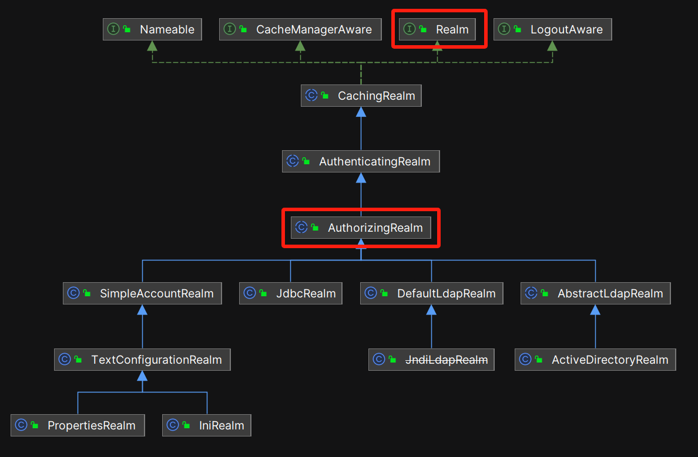
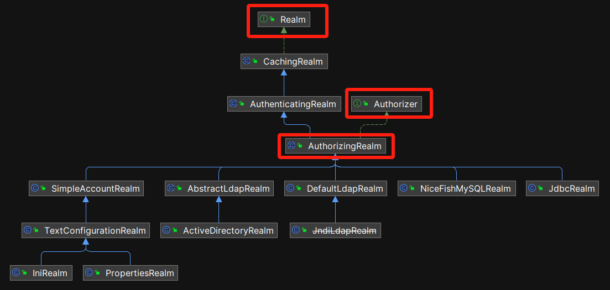
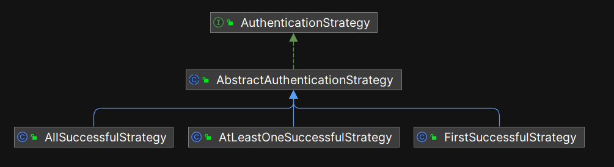
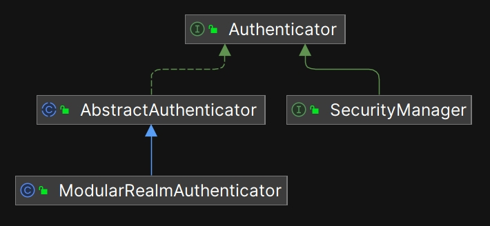

# 领域-Realm

## 4.1 什么是领域-Realm

在实际的业务系统中，通常存在一些需要被保护的数据源，例如：

- 关系型数据库（最常见）
- LDAP 目录
- 某些 API 服务的路径，如 `/user/photos/?`

显然，我们需要一个术语来准确描述这些数据源。在 Shiro 中，使用了 `Realm` 这一术语。`Realm` 的音标为 /rɛlm/，字面意思是“领地”、“领域”。在本书中，我们将其翻译为“领域”。这一词语不仅寓意深刻，而且避免了与任何现有类名的冲突。

**当某个数据源需要被保护时，可以将其定义为一个 `Realm`（领域）。任何试图访问该“领域”的主体，都必须通过身份验证并获得授权。`Realm` 充当了数据源与安全控制逻辑之间的桥梁，它的本质是一个 DAO（数据访问对象）。**

## 4.2 Realm 接口源代码解析

### 4.2.1 Realm 相关的继承结构

Shiro 中 Realm 相关的类继承结构如下图所示：


以下是各个类（接口）的功能（读者浏览即可，不需要记忆）：

| 类（接口）名 | 功能描述 |
| --- | --- |
| **Realm** | Shiro 的核心接口，定义从数据源获取身份验证和授权信息的基本操作。 |
| **CachingRealm** | 带有缓存支持的 `Realm` 实现，用于提升性能，减少数据源的访问。 |
| **AuthenticatingRealm** | 提供身份验证功能的 `Realm` 基类，通过 `doGetAuthenticationInfo` 方法执行身份验证。 |
| **AuthorizingRealm** | 在身份验证的基础上增加授权功能，通过 `doGetAuthorizationInfo` 获取授权信息（角色、权限）。 |
| **SimpleAccountRealm** | 简单的 `Realm` 实现，使用内存中的账户信息进行身份验证和授权，通常用于测试或简单场景。 |
| **TextConfigurationRealm** | 继承自 `SimpleAccountRealm`，支持通过文本配置定义主体及其权限信息，适用于简单的用户管理。 |
| **PropertiesRealm** | `TextConfigurationRealm` 的具体实现，从 `.properties` 文件中读取主体身份和权限信息。 |
| **IniRealm** | 从 `.ini` 文件中读取主体的身份和权限信息，适合较复杂的配置场景。 |
| **AbstractLdapRealm** | 基于 LDAP 的 `Realm` 抽象类，与 LDAP 服务器交互进行身份验证和授权，常用于企业内部。 |
| **ActiveDirectoryRealm** | 继承自 `AbstractLdapRealm`，用于与 Microsoft Active Directory 进行身份验证和授权。 |
| **JdbcRealm** | 基于 JDBC 的 `Realm`，从关系型数据库中获取主体信息进行身份验证和授权。 |
| **DefaultLdapRealm** | 继承自 `AbstractLdapRealm` 的默认实现，通常用于通用的 LDAP 服务器配置。 |
| **JndiLdapRealm** （已过期） | 继承自 `AbstractLdapRealm`，使用 JNDI 连接 LDAP 服务器，提供灵活的连接配置。 |

在上述类（接口）的继承结构中，大多数代码都相对简单。我们只需重点分析 Realm 和 `AuthorizingRealm` 这两个核心类型，即可完整理解该设计和实现的整体逻辑。

### 4.2.2 Realm 接口

Realm 是顶级接口，它的源代码非常简单，只规定了 3 个方法。

```java
package org.apache.shiro.realm;

import org.apache.shiro.authc.AuthenticationException;
import org.apache.shiro.authc.AuthenticationInfo;
import org.apache.shiro.authc.AuthenticationToken;

public interface Realm {
    String getName(); //很明显，Realm 的名字应该是全局唯一的，不可以重复。
    boolean supports(AuthenticationToken token);
    AuthenticationInfo getAuthenticationInfo(AuthenticationToken token) throws AuthenticationException;
}
```

- **`String getName()`**：该方法返回 `Realm` 的名字。`Realm` 的名字在全局范围内应该是唯一的，不能重复。它用于标识和区分不同的 `Realm` 实现。
- **`boolean supports(AuthenticationToken token)`**：该方法用于判断当前 `Realm` 是否支持处理传入的 `AuthenticationToken`。不同的 `Realm` 可能支持不同类型的令牌，这个方法根据令牌类型做出判断，返回 `true` 或 `false`。
- **`AuthenticationInfo getAuthenticationInfo(AuthenticationToken token) throws AuthenticationException`**：该方法根据传入的 `AuthenticationToken` 提供相应的 `AuthenticationInfo`，用于进行身份验证。如果认证失败，则抛出 `AuthenticationException` 异常。

这三个方法定义了 `Realm` 的基本功能，分别负责标识、支持性检查和获取验证信息。

### 4.2.3 AuthorizingRealm 源码解析

与验证和授权相关的两个子接口是： `AuthenticatingRealm` 和 `AuthorizingRealm` ，如下图所示：



其中 `AuthorizingRealm` 是 `AuthenticatingRealm` 的子接口，采用这种继承结构的意图很好理解：既然要进行授权，那必然先要进行身份验证。如果连身份验证都不需要，当然不需要进行授权管理，所以授权接口设计成验证接口的子类在逻辑上是一致的。

在日常开发中，业务代码都应该是 `AuthorizingRealm` 的子类型，开发者可以直接选用 Shiro 内置的实现类，也可以自己实现 `AuthorizingRealm` 接口。例如，在本书最后一章的例子中， NiceFish 项目自己定义了一个 `NiceFishMySQLRealm` ，代码如下：

```java
public class NiceFishMySQLRealm extends AuthorizingRealm
```

我们来看 `AuthorizingRealm` 的实现。



从继承结构图可以看出，`AuthorizingRealm` 同时实现了 `Realm` 和 `Authorizer` 接口，这一点也在它的类名中得到了体现。在 `AuthorizingRealm` 这一层级，主要关注的是授权功能的实现。该类重载了大量 `isPermitted` 方法，并提供了一系列用于角色和权限检测的功能方法。由于 `AuthorizingRealm` 的实现代码相对简单，这里不详细列举源码。

## 4.3 同时使用多个 Realm

对于大型的业务系统来说，可以同时定义多个 Realm ，用来保护不同的数据源。例如，除了 MySQL 数据库之外，客户还要求 `NiceFish` 支持 `Oracle` 数据库，那么我们可以编写一个新的 Realm ，叫做 `NiceFishOracleRealm` ，伪代码如下：

```java
public class NiceFishOracleRealm extends AuthorizingRealm
```

在实际业务中，通常需要处理多个认证源，最常见的业务场景是：主体可以通过当前系统的登录接口进行验证，也可以通过第三方认证（例如微信、QQ）登录系统。

如果开发者自己逐个编写代码尝试登录，那么业务代码会变得非常冗长， Shiro 在框架层面提供了多 Realm 支持，只要我们把所有需要“尝试登录”的 Realm 都配置给它， Shiro 就会按照指定的策略逐个进行尝试，这样就可大幅度简化上层业务代码。

### 4.3.1 多 Realm 用法示例

`DatabaseRealm` - 负责从本地数据库中认证主体。

```java
import org.apache.shiro.authc.AuthenticationException;
import org.apache.shiro.authc.AuthenticationInfo;
import org.apache.shiro.authc.AuthenticationToken;
import org.apache.shiro.authc.UsernamePasswordToken;
import org.apache.shiro.authc.SimpleAuthenticationInfo;
import org.apache.shiro.realm.Realm;

public class DatabaseRealm implements Realm {

    @Override
    public String getName() {
        return "DatabaseRealm";
    }

    @Override
    public boolean supports(AuthenticationToken token) {
        return token instanceof UsernamePasswordToken;
    }

    @Override
    public AuthenticationInfo getAuthenticationInfo(AuthenticationToken token) throws AuthenticationException {
        UsernamePasswordToken upToken = (UsernamePasswordToken) token;
        String username = upToken.getUsername();
        String password = new String(upToken.getPassword());

        // 假设 "user1" 的密码是 "password1"
        if ("user1".equals(username) && "password1".equals(password)) {
            return new SimpleAuthenticationInfo(username, password, getName());
        }
        throw new AuthenticationException("Invalid username or password.");
    }
}
```

`OAuthRealm` - 负责从第三方接口（如阿里云）进行 OAuth 认证。

```java
import org.apache.shiro.authc.AuthenticationException;
import org.apache.shiro.authc.AuthenticationInfo;
import org.apache.shiro.authc.AuthenticationToken;
import org.apache.shiro.authc.UsernamePasswordToken;
import org.apache.shiro.authc.SimpleAuthenticationInfo;
import org.apache.shiro.realm.Realm;

public class OAuthRealm implements Realm {

    @Override
    public String getName() {
        return "OAuthRealm";
    }

    @Override
    public boolean supports(AuthenticationToken token) {
        return token instanceof UsernamePasswordToken;
    }

    @Override
    public AuthenticationInfo getAuthenticationInfo(AuthenticationToken token) throws AuthenticationException {
        UsernamePasswordToken upToken = (UsernamePasswordToken) token;
        String username = upToken.getUsername();
        String password = new String(upToken.getPassword());

        // 假设 "user2" 的密码是 "password2"
        if ("user2".equals(username) && "password2".equals(password)) {
            return new SimpleAuthenticationInfo(username, password, getName());
        }
        throw new AuthenticationException("Invalid username or password.");
    }
}
```

`MultiRealmExample` - 入口代码。

```java
import org.apache.shiro.mgt.DefaultSecurityManager;
import org.apache.shiro.SecurityUtils;
import org.apache.shiro.subject.Subject;
import org.apache.shiro.authc.UsernamePasswordToken;
import org.apache.shiro.authc.AuthenticationException;

import java.util.Arrays;

public class MultiRealmExample {

    public static void main(String[] args) {
        // 创建两个 Realm
        DatabaseRealm databaseRealm = new DatabaseRealm();
        OAuthRealm oauthRealm = new OAuthRealm();

        // 配置 SecurityManager，设置多个 Realm
        DefaultSecurityManager securityManager = new DefaultSecurityManager();
        securityManager.setRealms(Arrays.asList(databaseRealm, oauthRealm));

        // 将 SecurityManager 设置到当前环境
        SecurityUtils.setSecurityManager(securityManager);

        // 获取当前主体
        Subject currentUser = SecurityUtils.getSubject();

        // 创建一个 Token 实例
        UsernamePasswordToken token = new UsernamePasswordToken("user1", "password1");

        try {
            // Shiro 会根据配置的 Realm 顺序进行认证
            currentUser.login(token);
            System.out.println("User authenticated successfully.");
        } catch (AuthenticationException e) {
            System.out.println("Authentication failed: " + e.getMessage());
        }
    }
}
```

在上述示例中，我们配置了两个 `Realm`：`DatabaseRealm` 和 `OAuthRealm`。Shiro 默认的认证策略是**第一个成功策略（First Successful Strategy）**，即依次尝试每个 `Realm`，只要有一个 `Realm` 成功认证，整个认证过程就算成功。

那么，如果我们希望“所有 Realm 都认证成功才能算整体认证成功”应该怎么办呢？我们可以让 Shiro 使用 `AllSuccessfulStrategy` 策略，修改代码如下：

```java
// 创建两个 Realm
DatabaseRealm databaseRealm = new DatabaseRealm();
OAuthRealm oauthRealm = new OAuthRealm();

// 创建 ModularRealmAuthenticator 验证器并设置认证策略
ModularRealmAuthenticator authenticator = new ModularRealmAuthenticator();
**authenticator.setAuthenticationStrategy(new AllSuccessfulStrategy());**

// 配置 SecurityManager，设置自定义的 Authenticator 和多个 Realm
DefaultSecurityManager securityManager = new DefaultSecurityManager();
securityManager.setAuthenticator(authenticator);
securityManager.setRealms(Arrays.asList(databaseRealm, oauthRealm));

// 将 SecurityManager 设置到当前环境
SecurityUtils.setSecurityManager(securityManager);
```

修改之后， Shiro 将会依次调用 `databaseRealm` 和 `oauthRealm` 进行验证，**只有两次全部验证成功，才算最终验证成功**。

从以上实例可以看到， Shiro 这种整合多个 Realm 的封装非常强大，而且可以大幅度简化上层的业务代码。

### 4.3.2 多 Realm 的身份验证策略

Shiro 封装了同时处理多个 `Realm` 的策略：



1. **First Successful Strategy（第一个成功策略）**： 这是默认的策略，尝试第一个 `Realm` 成功后，认证过程即算成功。
2. **All Successful Strategy（全部成功策略）**：所有 `Realm` 必须成功认证才能通过认证。
3. **At Least One Successful Strategy（至少一个成功策略）**：只要有一个 `Realm` 成功认证，认证就算成功，但它允许多个 `Realm` 认证成功。
4. **Custom Strategy（自定义策略）**：Shiro 允许开发者实现自定义的认证策略，可以继承 `AuthenticatingRealm` 并实现 `Authenticator` 接口，以创建适合特定应用场景的认证策略。这种策略非常灵活，可以根据业务需求进行定制。

Shiro 内置的认证策略能够覆盖大多数业务场景，自定义策略则适用于更复杂或特殊的需求。

### 4.3.3 多 Realm 机制源码解析

那么， Shiro 是如何实现多 Realm 机制的呢？



在 `ModularRealmAuthenticator` 中 `doAuthenticate` 方法会判断当前主体关联了多少个 Realm ，如果只关联了一个 Realm ，则调用 `doSingleRealmAuthentication` 完成验证；如果关联了多个 Realm ，则调用 `doMultiRealmAuthentication` 进行多 Realm 验证，关键代码如下（已省略无关代码）：

```java
protected AuthenticationInfo doAuthenticate(AuthenticationToken authenticationToken) throws AuthenticationException {
    assertRealmsConfigured();
    Collection<Realm> realms = getRealms();
    if (realms.size() == 1) {
        return doSingleRealmAuthentication(realms.iterator().next(), authenticationToken);
    } else {
        return doMultiRealmAuthentication(realms, authenticationToken);
    }
}
```

在 `doMultiRealmAuthentication` 方法中， Shiro 会遍历所有 Realm ，按照指定的策略逐个尝试验证，并且把最终结果整合起来返回：

```java
protected AuthenticationInfo doMultiRealmAuthentication(Collection<Realm> realms, AuthenticationToken token) {

      AuthenticationStrategy strategy = getAuthenticationStrategy();

      AuthenticationInfo aggregate = strategy.beforeAllAttempts(realms, token);

      if (log.isTraceEnabled()) {
          log.trace("Iterating through {} realms for PAM authentication", realms.size());
      }

      //注意这里， Shiro 会遍历开发者配置的所有 Realm ，逐个尝试验证。
      for (Realm realm : realms) {

          try {
              aggregate = strategy.beforeAttempt(realm, token, aggregate);
          } catch (ShortCircuitIterationException shortCircuitSignal) {
              // Break from continuing with subsequnet realms on receiving
              // short circuit signal from strategy
              break;
          }

          if (realm.supports(token)) {

              log.trace("Attempting to authenticate token [{}] using realm [{}]", token, realm);

              AuthenticationInfo info = null;
              Throwable t = null;
              try {
                  info = realm.getAuthenticationInfo(token);
              } catch (Throwable throwable) {
                  t = throwable;
                  if (log.isDebugEnabled()) {
                      String msg = "Realm [" + realm + "] threw an exception during a multi-realm authentication attempt:";
                      log.debug(msg, t);
                  }
              }

              aggregate = strategy.afterAttempt(realm, token, info, aggregate, t);

          } else {
              log.debug("Realm [{}] does not support token {}.  Skipping realm.", realm, token);
          }
      }

      //注意这里，整合所有 Realm 的验证结果
      aggregate = strategy.afterAllAttempts(token, aggregate);

      return aggregate;
  }
```

## 4.4 本章小结

在这一章中，我们详细分析了 Realm（领域）的架构与实现，包括同时支持多个 Realm 进行认证和授权的实现方式。
