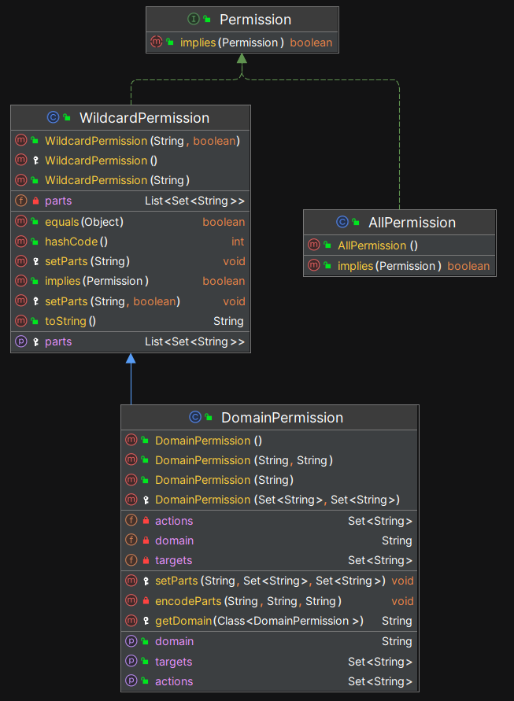

# 5.权限

本章讨论以下 5 个话题：

- 什么是权限？
- Shiro 中如何定义权限？
- WildcardPermission 源码解析
- 权限是如何与资源进行关联的？
- 权限是如何与主体进行关联的？

## 5.1 什么是权限？

在安全领域，权限指的是主体对资源进行访问或操作的权利。例如，用户可能被授权访问某个网页、编辑文档，或执行系统命令等操作。**这些场景可以抽象为三个关键要素：主体、操作、资源。**

显然，三要素缺一不可：如果没有主体，权限毫无意义；如果没有资源，就没有必要定义权限；如果不存在操作，则说明主体与资源之间不会发生关系，那么定义权限也是多此一举。

**也就是说，只有主体、资源、主体对资源存在某种操作，这 3 个要素同时存在的时候，我们才有必要定义权限。**

为了方便理解 3 个要素之间的关系，我们从数据库表的角度来观察，在 ER 图（Entity-Relationship Diagram，实体关系图）上，主体、权限、资源之间的关联关系如下：


**备注：在主体和权限之间实际上还有角色（Role）表，为了便于理解，这里先忽略角色，我们会在独立的章节中分析角色的设计和实现。**

## 5.2 Shiro 中如何定义权限？

### 5.2.1 基本用法

在 Shiro 中，是通过一组字符串来定义权限的。每一个权限字符串通常由一组单词构成，这些单词默认通过冒号分隔，形成权限表达式，例如：

- `user:create`：表示创建用户的权限
- `user:update`：表示更新用户的权限
- `user:delete`：表示删除用户的权限

当主体持有 `user:create` 和 `user:update` ，但是却试图执行 `user:delete` 相关的操作时， Shiro 将会拒绝操作。开发者可以使用 Shiro 提供的权限注解来控制某个方法的权限，例如使用 @RequiresPermissions 注解：

```java
@RequiresPermissions("user:delete")
public void doSomething() {
    //...
}
```

以上伪代码中的 doSomething() 方法被 @RequiresPermissions 注解进行了装饰，而且要求主体持有 "user:delete" ，Shiro 在执行这个方法之前会首先检查权限，如果权限不够，则不会执行方法。

那么， Shiro 是如何进行检查的，具体的运行机制和代码实现细节是什么？请读者翻阅第 3 章的 3.4.2 节，和第 11 章中的内容，这里我们聚焦权限表达式本身。

Shiro 没有限制权限表达式中需要含有几个单词，也没有限制这些单词的顺序，所以开发者把权限定义成 `create:user` 也是可以的。但是，权限字符串通常遵守`资源:操作`的格式，这种格式有以下优点：

- **逻辑清晰**：权限控制的核心是让某个主体（如用户）执行某种操作（如查看、编辑）在特定的资源（如文档、用户信息）上。将权限字符串分为 **资源** 和 **操作** 能够直接表达这两个关键元素，逻辑上更加清晰。
- **可读性强**：`资源:操作` 格式结构化地表达了权限的组成部分，开发者一眼就能看出权限所涉及的资源是什么，以及允许的操作是什么。例如，`user:create` 明确表明这条权限是允许创建用户。
- **可扩展性强**：这种格式允许轻松扩展权限控制系统。如果有新的资源或操作出现，只需添加新的权限字符串即可。例如，如果需要添加用户删除权限，可以很自然地定义 `user:delete`。
- **层次分明**：资源通常比操作范围更广泛。通过先定义资源，再规定具体操作，权限管理系统可以逐级处理不同类型的资源和操作，保持权限分配的层次性。
- **一致性**：`资源:操作` 格式已成为一种约定俗成的标准，很多权限管理系统、框架都采用类似的模式。这种一致性帮助开发者理解和维护权限配置，更方便在不同系统间迁移和集成。

尽管 Shiro 没有强制使用`资源:操作`这种格式，但由于其清晰和实用性，已经成为了一种最佳实践。

### 5.2.2 带有通配符的权限表达式-WildcardPermission

在前面的内容中，我们编写了以下权限表达式：

- `user:create`：表示创建用户的权限
- `user:update`：表示更新用户的权限
- `user:delete`：表示删除用户的权限

我们可以使用 @RequiresPermissions 注解来使用这些权限字符串：

```java
@RequiresPermissions("user:create")
@RequiresPermissions("user:update")
@RequiresPermissions("user:delete")
public void doSomething() {
    //...
}
```

代码没有任何问题，而且看起来很清晰，但是太啰嗦了，所以 Shiro 支持用逗号分隔的模式，我们可以写成这样：

```java
@RequiresPermissions("user:create,update,delete")
public void doSomething() {
    //...
}
```

用逗号分隔之后看起来简洁多了，对吧？但是，在实际的业务系统中，我们还会遇到更加麻烦的需求，比如：**允许对用户执行所有操作**。

对于这样的需求，如果我们把资源上的每一种操作都详细列举出来，那么代码就会非常啰嗦，而且可扩展性也很差（有经验的开发者都知道，如果把某个概念限定得太具体，以后就不好增加或者修改了）。所以，Shiro 引入了通配符 `*` 来进一步简化权限表达式，这种方式称为**通配符权限（WildcardPermission）**。

因此，对于**允许对用户执行所有操作**这样的需求，我们可以将权限表达式写成 `user:*`。显而易见，一旦主体拥有了 `user:*` 这一权限字符串，它就“覆盖”了所有与用户相关的具体权限，意味着主体可以对用户执行任何操作。而且，通配符权限还可以带来一个好处，如果以后新增了或者删除了某个操作，不必修改权限表达式。

例如，如果我们同时给某个主体赋予了以下权限：

- `user:create`：表示创建用户的权限
- `user:update`：表示更新用户的权限
- `user:delete`：表示删除用户的权限
- `user:*`：允许对用户执行所有操作

那么，最终起作用的就是 `user:*`，因为它的含义更广，会覆盖其它所有权限表达式。引入通配符之后，权限管理变得更加简洁和高效，而且人类也很容易理解，**通配符权限并非 Shiro 独创，在 Shiro 出现之前，类似的机制早已存在。但是 Shiro 用更加清晰的方式在 Java 语言中进行了实现，它是 Shiro 框架最精华的部分。**

但是，通配符同时也为权限定义带来了一些挑战。比方说，下面这个权限表达式的含义是什么呢：

`*:delete`

凭借人类的直觉，我们可以猜测到它的含义是：**可以对任何资源执行 delete 操作**。从纯技术的角度看，这样的权限定义没有任何问题，但是在实际的业务系统中，这样的权限定义方式很少出现，请问什么样的系统可以让使用者对任何资源都可以执行删除操作呢？而且通配符会覆盖所有其它类似的权限定义，这样定义权限太危险了！所以，很多在逻辑上成立的东西，在现实世界中可能并不成立。

### 5.2.3 权限的粒度

Shiro 中的权限表达式一般支持以下几种级别的粒度：

1. 资源级别（Resource Level）
1. 实例级别（Instance Level）
1. 属性级别（Attribute Level）

在资源级别上定义权限是最广泛的场景，在这个级别上，权限规定了对某种资源的操作。例如，可以对 user 表进行 CRUD 操作：

- `user:create`：表示创建用户的权限
- `user:update`：表示更新用户的权限
- `user:delete`：表示删除用户的权限

`user:delete` 这样的权限表达式表示可以对整个 user 表进行 delete 操作，但是，如果要求只能对 ID 为 66666 的那一行数据进行删除，应该如何定义呢？

`user:delete:66666`

这就是实例级别的权限定义方式，不仅仅指定了资源，还具体指定到了具体的实例。当然，这个权限表达式能约束的范围非常小，它只对 user 表中 ID 为 66666 的这行记录有效，对表中的其它记录都不起作用。

属性级别的权限更加细化，它指定了资源实例或属性的具体操作。例如：可以修改 ID 为 66666 的用户的 userName 属性。这种权限粒度提供了对资源更精细的控制。

`user:update:66666:userName`

**很明显，权限表达式的级别越深，权限的粒度越细；粒度越细，此表达式能约束的范围越小。**

从纯技术的角度，我们可以用冒号来分隔无限多字符串，形成非常深的层级结构。但是，在现实的业务开发中，没有人会定义超级长的权限字符串，假设我们定义了一个含有 99 个冒号的权限表达式，这个表达式能够表达什么样的含义呢？

所以，从最佳实践的角度看，Shiro 中的权限表达式一般定义 3 到 4 层就足够应对绝大多数业务场景了。

### 5.2.4 一些需要注意的写法

现在，我们有了通配符，有了层级结构，这两项特性混合使用的时候，就产生了一些很有意思的写法。比如，以下两种写法：

1. `user:delete`
1. `user:delete:*`

仔细思考之后，我们就会发现，这两种写法的含义是相同的。

再来看以下两种写法：

1. `user:*`
2. `user:*:*`

怎么样？含义依然是一样的，实际上，你可以在末尾补充更多 \* 号，含义依然是一样的。所以，通配符出现在权限表达式的末尾时，不会起任何作用，可以省略掉。

但是，当通配符出现在其它位置时，就不能省略了，因为省略掉之后权限表达式的含义会发生变化。比以下权限表达式：

1. `user:*:66666`

如果我们把中间的通配符省略掉，那就无法理解了。

## 5.3 WildcardPermission 源码解析

### 5.3.1 用面向对象的方式调用权限字符串

通过前面的内容，我们已经学会了如何定义权限字符串，在我们的代码中，应该如何使用这些权限字符串呢？ Shiro 封装了大量的 `isPermitted` 方法，让我们可以非常方便地进行调用。

```java
// 获取当前主体
Subject currentSubject = SecurityUtils.getSubject();

// 检查主体是否拥有某个权限
if (currentSubject.isPermitted("user:edit")) {
    System.out.println("当前主体拥有编辑用户的权限！");
} else {
    System.out.println("当前主体没有编辑用户的权限。");
}

// 检查多个权限
boolean[] permitted = currentSubject.isPermitted("user:delete", "user:view");
System.out.println("删除权限: " + (permitted[0] ? "拥有" : "没有"));
System.out.println("查看权限: " + (permitted[1] ? "拥有" : "没有"));
```

以上代码中，我们直接使用了权限字符串，但是 Java 是一门面向对象的语言，我们还可以使用强类型的方法进行调用，示例代码如下：

```java
// 获取当前主体
Subject currentSubject = SecurityUtils.getSubject();

// 创建 Permission 实例，注意这里可以显式地 new WildcardPermission
Permission permission = new WildcardPermission("user:edit");

// 检查主体是否拥有该权限
if (currentSubject.isPermitted(permission)) {
    System.out.println("当前主体拥有编辑用户的权限！");
} else {
    System.out.println("当前主体没有编辑用户的权限。");
}

// 创建多个权限实例进行检查
Permission deletePermission = new WildcardPermission("user:delete");
Permission viewPermission = new WildcardPermission("user:view");

// 使用 isPermittedAll 来检查主体是否拥有所有权限
boolean allPermitted = currentSubject.isPermittedAll(deletePermission, viewPermission);
if (allPermitted) {
    System.out.println("当前主体拥有删除和查看用户的权限！");
} else {
    System.out.println("当前主体不同时拥有删除和查看用户的权限。");
}
```

### 5.3.2 解析 Permission 相关的核心代码

接下来，我们来解析 Permission 相关的源代码，Permission 相关的继承结构如下图所示：



在以上继承结构中，各个类型的功能和主要方法描述如下（读者浏览即可，无需记忆）：

| 类名 | 功能描述 | 主要方法/字段 | 描述 |
| --- | --- | --- | --- |
| **Permission** | 权限接口，定义了基本权限的行为。 | `implies(Permission)` - boolean | 检查当前权限是否隐含指定权限。返回 `true` 表示当前权限涵盖了指定权限。 |
| **WildcardPermission** | 一个实现 `Permission` 接口的类，使用通配符语法表示权限，支持灵活的权限表达。 | `WildcardPermission(String, boolean)` | 构造方法，用于创建带有通配符权限的实例。第二个参数表示是否需要严格匹配。 |
|  |  | `WildcardPermission(String)` | 构造方法，创建一个简单的通配符权限实例。 |
|  |  | `implies(Permission)` - boolean | 判断当前权限是否隐含指定的权限，使用通配符进行匹配。 |
|  |  | `parts` - List\<Set\<String\>> | 权限表达式的组成部分，通常用于存储权限的具体结构（如资源、动作等）。 |
|  |  | `setParts(String)` - void | 设置权限的组成部分，解析权限字符串并存储为 `parts` 列表。 |
| **AllPermission** | 一个特殊权限类，表示拥有所有权限，实现 `Permission` 接口。 | `AllPermission()` | 构造方法，创建一个拥有所有权限的实例。 |
|  |  | `implies(Permission)` - boolean | 始终返回 `true`，因为 `AllPermission` 拥有所有权限。 |
| **DomainPermission** | 继承自 `WildcardPermission`，用于定义领域相关的权限。可以设置动作、目标和领域来表示复杂的权限结构。 | `DomainPermission(String, String)` | 构造方法，使用域名和操作字符串创建领域权限。 |
|  |  | `setParts(String, Set<String>, Set<String>)` - void | 设置领域、目标和动作的权限组成部分。 |
|  |  | `encodeParts(String, String, String)` - void | 编码领域、目标和操作部分为权限字符串形式。 |
|  |  | `getDomain(Class<DomainPermission>)` - String | 返回权限所属的领域。 |
|  |  | `domain` - String | 表示权限适用的领域，例如某个资源的类别或模块。 |
|  |  | `targets` - Set\<String\> | 目标，表示权限可以应用到的具体资源或对象。 |
|  |  | `actions` - Set\<String\> | 动作，表示可以对目标进行的具体操作，如“查看”、“编辑”等。 |

其中， WildcardPermission（通配符权限） 是一个非常重要的实现类，它实现了 Permission 接口规定的核心功能。我们先来看 WildcardPermission 的构造方法：

```java
protected WildcardPermission() {
}

public WildcardPermission(String wildcardString) {
    this(wildcardString, DEFAULT_CASE_SENSITIVE);
}

public WildcardPermission(String wildcardString, boolean caseSensitive) {
    setParts(wildcardString, caseSensitive);
}

protected void setParts(String wildcardString) {
    setParts(wildcardString, DEFAULT_CASE_SENSITIVE);
}
```

可以看到，Shiro 重载了 4 个 WildcardPermission 构造方法，而且在构造方法中，会立即调用 setParts 这个工具方法，把权限字符串解析成单词列表， setParts 方法的实现代码如下：

```java
protected void setParts(String wildcardString, boolean caseSensitive) {
    wildcardString = StringUtils.clean(wildcardString);

    if (wildcardString == null || wildcardString.isEmpty()) {
        throw new IllegalArgumentException("Wildcard string cannot be null or empty. Make sure permission strings are properly formatted.");
    }

    if (!caseSensitive) {
        wildcardString = wildcardString.toLowerCase();
    }

    //这里很关键，用冒号分隔的权限表达式会被 split 成单词列表
    List<String> parts = CollectionUtils.asList(wildcardString.split(PART_DIVIDER_TOKEN));

    this.parts = new ArrayList<Set<String>>();
    for (String part : parts) {
        Set<String> subparts = CollectionUtils.asSet(part.split(SUBPART_DIVIDER_TOKEN));

        if (subparts.isEmpty()) {
            throw new IllegalArgumentException("Wildcard string cannot contain parts with only dividers. Make sure permission strings are properly formatted.");
        }
        this.parts.add(subparts);
    }

    if (this.parts.isEmpty()) {
        throw new IllegalArgumentException("Wildcard string cannot contain only dividers. Make sure permission strings are properly formatted.");
    }
}
```

在以上代码中，我们可以看到：**权限字符串中的每一个部分都不可以为空格，也不可以为 null 。**

我们再来看 implies 方法，这是最最核心的方法，它负责比较两个通配符权限是否能够互相匹配：

```java
public boolean implies(Permission p) {
    if (!(p instanceof WildcardPermission)) {
        return false;
    }

    WildcardPermission wp = (WildcardPermission) p;

    List<Set<String>> otherParts = wp.getParts();

    //注意这里：遍历两个权限表达式中的单词列表，逐个测试这些单词之间的关系
    int i = 0;
    for (Set<String> otherPart : otherParts) {
        if (getParts().size() - 1 < i) {
            return true;
        } else {
            Set<String> part = getParts().get(i);
            if (!part.contains(WILDCARD_TOKEN) && !part.containsAll(otherPart)) {
                return false;
            }
            i++;
        }
    }

    //在完成了以上遍历和比较之后，如果发现当前权限字符串中没有通配符，直接返回 false
    for (; i < getParts().size(); i++) {
        Set<String> part = getParts().get(i);
        if (!part.contains(WILDCARD_TOKEN)) {
            return false;
        }
    }

    return true;
}
```

以上代码中的核心逻辑解析如下：

| 逻辑块 | 解释 |
| --- | --- |
| **类型检查** | `if (!(p instanceof WildcardPermission)) { return false; }`：检查传入的 `Permission` 是否是 `WildcardPermission` 类型，不是则返回 `false`。 |
| **提取比较对象的单词列表** | `List<Set<String>> otherParts = wp.getParts();`：从传入的权限对象中获取其权限的单词列表。 |
| **遍历两个权限表达式的单词列表** | `for (Set<String> otherPart : otherParts)`：遍历传入的 `Permission` 对象的单词列表，与当前权限字符串逐个进行比较。 |
| **自动蕴含逻辑** | `if (getParts().size() - 1 < i) { return true; }`：在遍历的过程中，如果发现当前权限的单词列表数量少于传入权限的单词列表数量，则视为当前权限蕴含了传入的权限。例如，当前权限字符串为 `user:update`，而被比较的权限字符串为 `user:update:66666`，当 for 循环执行到第 3 趟时，发现当前权限字符串已经没有后续单词了，很明显当前权限表达式已经蕴含了被比较的权限。 |
| **逐个比较每个单词** | `if (!part.contains(WILDCARD_TOKEN) && !part.containsAll(otherPart)) { return false; }`：若当前单词不含通配符，且字符串不存在包含关系，返回 `false`。 |
| **未比较单词列表处理** | `for (; i < getParts().size(); i++) { if (!part.contains(WILDCARD_TOKEN)) { return false; } }`：如果当前权限单词列表多于传入权限单词列表，且多出来的单词列表不含通配符，则返回 `false`。 |
| **返回结果** | 如果遍历完成之后，发现所有单词都完全相同，返回 `true`。 |

通过阅读 implies 的源代码我们可以看到，在对两个字符串列表进行比较的过程中，Shiro 采用的是**充分条件**（Implication）校验方式，而不是**完全相等**（Equality）校验。

### 5.3.2 性能问题

通过前面的内容，我们已经知道，可以使用 Shiro 内置的权限注解来限制某个方法的权限，例如使用 @RequiresPermissions ：

```java
@RequiresPermissions("user:delete")
public void doSomething() {
    //...
}
```

我们每次调用 doSomething() 方法的时候， Shiro 都会进行拦截，首先执行权限比较逻辑，也就是执行上面的 implies 方法。在大型的业务系统中，我们会大量使用 @RequiresPermissions 注解来进行权限控制，这就意味着 implies 方法的调用次数会非常多。假设在我们正在开发一个大型的业务系统，其中有 100 个方法使用了 @RequiresPermissions 注解，这些业务方法平均每秒会被调用 100 次，那么 implies 方法每秒会被调用 100\*100=10000 次。有经验的开发者都知道，一旦某个方法达到了这样的调用频率，非常容易成为性能瓶颈。那么， Shiro 在实现 WildcardPermission 这个类的时候，是如何保证 implies 方法的性能的呢？

通过仔细阅读 implies 方法的源代码，我们可以发现 Shiro 在这里花费了不少心思：在比较两个字符串列表的过程中，大量采用**短路运算**的方式，一旦某个条件被满足，会立即中断 for 循环并返回结果，而不再进行后续的运算。

除此之外， Shiro 还内置了对缓存的支持，可以将权限比较的结果放到缓存中。在特定时间段内，系统将使用缓中存的结果而不是每次都调用 implies 进行权限比较运算。关于缓存机制，我们在独立的章节中进行分析。

## 5.4 权限如何与资源进行关联？

我们已经学会了如何定义权限表达式，而且也理解了权限表达式之间是如何进行比较的，那么，在实际开发的过程中，开发者应该如何把这些权限表达式与具体要执行的方法进行关联呢？这个任务是由 Shiro 中的权限注解来完成的：

| 注解 | 功能描述 |
| --- | --- |
| `@RequiresPermissions` | 要求当前用户具备指定的权限才能访问方法或类。如果用户缺少指定权限，将抛出 `AuthorizationException`。 |
| `@RequiresRoles` | 要求当前用户具备指定的角色才能访问方法或类。如果用户没有该角色，将抛出 `AuthorizationException`。 |
| `@RequiresUser` | 要求当前用户是已知用户，换言之，用户必须已经登录过（包括“记住我”用户）才能访问资源。 |
| `@RequiresAuthentication` | 要求当前用户已通过身份验证（必须登录且未使用“记住我”功能），否则抛出 `AuthenticationException`。 |
| `@RequiresGuest` | 要求当前用户为访客，即用户未登录或者是匿名用户，已登录的用户将无法访问标注该注解的资源。 |

关于这些注解的用法和运行机制，在前面的内容中已经详细介绍过，示例如下：

```java
@RequiresPermissions("user:delete")
public void doSomething() {
    //...
}
```

由于权限表达式只是字符串而已，从更加良好的编程习惯角度出发，我们不应该把这些字符串散落得到处都是，更规范的使用方式是定义成常量，然后进行引用，示例如下：

```java
//定义成常量类，避免到处使用 magic string ，在大型团队中，容易导致字符串不一致的情况
public class PermissionsConstants {
    public static final String USER_CREATE = "user:create";
    public static final String USER_UPDATE = "user:update";
    public static final String USER_DELETE = "user:delete";
    //...
}

@RequiresPermissions(PermissionsConstants.USER_DELETE)
public void doSomething() {
    //...
}
```

## 5.5 权限如何与主体进行关联？

在 Shiro 中，我们可以直接给主体赋予权限，也可以通过角色机制来批量赋予权限。具体来说，由`Realm` 组件负责将用户与角色、权限关联起来。例如，在 `doGetAuthorizationInfo` 方法中，Shiro 会从数据源中获取用户的角色和权限，并返回相应的 `AuthorizationInfo` 对象。

```java
@Override
protected AuthorizationInfo doGetAuthorizationInfo(PrincipalCollection principals) {
    String username = (String) principals.getPrimaryPrincipal();
    SimpleAuthorizationInfo authorizationInfo = new SimpleAuthorizationInfo();

    // 从数据库中查询角色和权限
    Set<String> roles = getRolesByUsername(username);
    Set<String> permissions = getPermissionsByUsername(username);
    authorizationInfo.setRoles(roles);
    authorizationInfo.setStringPermissions(permissions);
    return authorizationInfo;
}
```

在这个示例中，`getRolesByUsername` 和 `getPermissionsByUsername` 方法负责从数据库中获取角色和权限信息，然后将它们设置到 `AuthorizationInfo` 类型的对象中， `AuthorizationInfo` 接口的定义如下：

```java
public interface AuthorizationInfo extends Serializable {
    Collection<String> getRoles();
    Collection<String> getStringPermissions();
    Collection<Permission> getObjectPermissions();
}
```

通过以上源代码我们可以看到， `AuthorizationInfo`中存储了字符串形式的权限表达式，也存储了面向对象形式的权限实例。

## 5.6 本章小结

Shiro 提供了一种灵活且高效的通配符权限定义模式，不仅支持细粒度的权限控制，还能处理大规模用户和权限数据的场景。通过短路运算和缓存优化，Shiro 的权限比较逻辑具有很好的性能表现，这一点对于大型业务系统很重要。

## 资源链接

- Apache Shiro 在 github 上的官方仓库： https://github.com/apache/shiro
- Apache Shiro 官方网站：https://shiro.apache.org/
- 本书实例项目：https://gitee.com/mumu-osc/nicefish-spring-boot
- 本书文字稿：https://gitee.com/mumu-osc/apache-shiro-source-code-explaination

## 版权声明

本书基于 [**CC BY-NC-ND 4.0 许可协议**](https://creativecommons.org/licenses/by-nc-nd/4.0/deed.en)发布，自由转载-非商用-非衍生-保持署名。

**版权归大漠穷秋所有 © 2024 ，侵权必究。**
