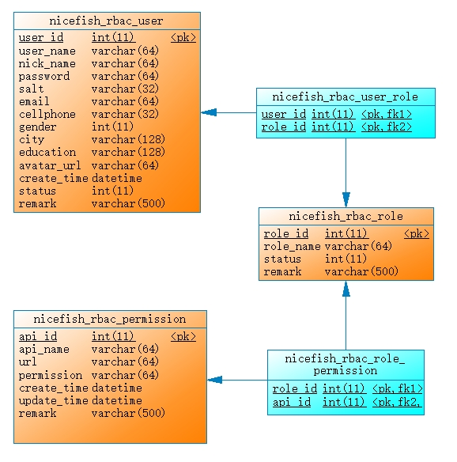
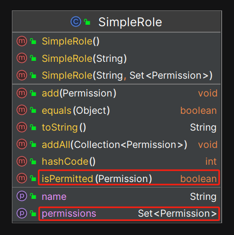
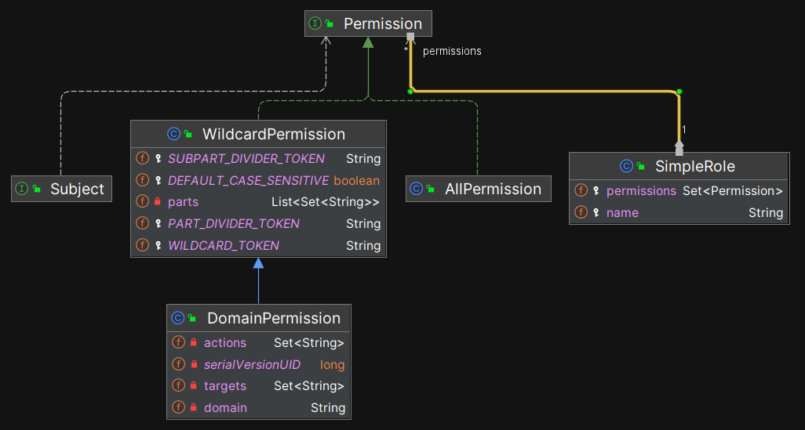
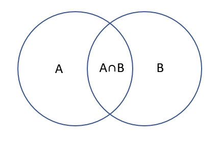

# 6.角色

本章将分析 Shiro 中 Role 的设计和源码，主要包含以下内容：

- 主体、角色与权限之间的关系
- SimpleRole 源码解析
- 权限集合的计算问题
- 角色检查

## 6.1 主体、角色与权限之间的关系

**简化地说：角色是权限的集合。**

直观地理解：

- 主体与角色之间是多对多的关系，即一个主体可以拥有多个角色，而一个角色也可以被多个主体拥有。
- 角色与权限之间也是多对多的关系，即一个角色可以拥有多个权限，而一个权限也可以被多个角色拥有。

我们通过一个具体的例子来说明，比如：我们正在构建一个控制用户权限的模块。在物理模型（数据库模型）层面， user, role, permission 这 3 张表之间的关系如下图所示：



其中，user、role、permission 是 3 张主表，user_role 和 role_permission 是两张关联表。

在 OO（Object-Oriented Model）层面，一般使用 JPA 来定义实体类，UserEntity 与 RoleEntity 之间的关系定义如下：

```java
@JoinTable(
    name="nicefish_rbac_user_role",
    joinColumns={@JoinColumn(name="user_id",referencedColumnName="user_id")},
    inverseJoinColumns={@JoinColumn(name="role_id",referencedColumnName="role_id")}
)
@ManyToMany(fetch = FetchType.LAZY)
private Set<RoleEntity> roleEntities;
```

可以看到， UserEntity 类中持有了 RoleEntity 集合， RoleEntity 与 PermissionEntity 之间的关系类似。

## 6.2 SimpleRole 源码解析

Shiro 只提供了唯一的一个角色实现类： SimpleRole ，完整的类型定义如下图所示：



SimpleRole 是一个非常简单的实现，就像它的名字暗示的那样。SimpleRole 与 Permission 之间的依赖关系，如下图所示：



在 SimpleRole 中，用 Set 类型，持有了一组 Permission 实例。

我们来分析 SimpleRole 的源代码，其中关键的代码如下：

```java
protected String name = null;           // 角色名称
protected Set<Permission> permissions;  // 权限集合

// ...
public boolean isPermitted(Permission p) {
    Collection<Permission> perms = getPermissions();
    if (perms != null && !perms.isEmpty()) {
        for (Permission perm : perms) {
            if (perm.implies(p)) { //权限比对，检测 perm 是否“蕴含”了 p
                return true;
            }
        }
    }
    return false;
}
```

在调用 `SimpleRole` 类的 `isPermitted` 方法来验证权限时，方法内部会遍历该角色所持有的权限集合，并依次调用 `Permission` 类的 `implies` 方法进行检测。

## 6.3 权限集合的计算问题


如上所述，Subject 与 Role 之间的关系是多对多，Role 与 Permission 之间的关系也是多对多。那么，当主体拥有多个角色时，就涉及到多个权限集合之间的运算问题。

从纯粹数学的角度看，集合之间可以进行：交、并、补运算。然而，在权限控制方面，集合的运算没有那么复杂。因为“授权”这个动作，本身是一个扩张性的动作，所以不需要考虑“补”运算。因为，当开发者给用户“授予”权限的时候，只要把权限字符串添加到权限集合中就可以了，如果要取消某个权限，开发者可以直接从集合中删除某个权限代码。



**我们也不用担心两个集合中存在含义相反的权限表达式，除非开发者故意这样做。**举例来说：某个 user 对象同时持有 2 个角色，分别为 role1 和 role2 ，role1 的权限集中带有 user:manage 权限，而 role2 中一般不可能出现 user:no-manage 这样的权限定义，除非开发者故意给自己找麻烦。所以，权限集合有自己的约束条件，而不是纯粹数学概念上的集合，它并不需要考虑“补”运算。

那么，我们来考虑两个权限集合的“交”和“并”。比方说，第一个角色 role1 的权限集合中包含了 user:view ，而第二个角色 role2 的权限集合中包含了 `user:*` ，那么，user 对象最终会获得怎样的权限呢？

很明显，最终起作用的是 `user:*`，`user:view`会被覆盖掉。

我们在“权限”这一章中已经详细解析了 `WildcardPermission` 权限表达式的计算过程，这里不再赘述。

## 6.4 角色检查

在 Shiro 中，开发者有两种方法可以检测 Subject 是否拥有某个角色：

- @RequiresRoles 注解
- hasRole\* 相关的一组方法：hasRole, hasRoles, hasAllRoles

@RequiresRoles 注解的用法示例如下：

```java
@RequiresRoles("admin");
public void doSomething() {
    //...
}
```

hasRole 方法的示例如下：

```java
Subject currentSubject = SecurityUtils.getSubject();

if (currentSubject.hasRole("admin")) {
    //...
} else {
    //...
}
```

一般来说，在业务开发的过程中，更多使用 @RequiresRoles 注解。

需要补充说明的是，由于角色具有哪些权限是可以配置的，基于角色的检查容易导致问题，所以，实际的业务系统尽量不要基于角色进行权限检测，而是直接检查权限表达式。

## 6.5 本章小结

本章深入探讨了 Shiro 中角色（Role）的设计和实现，包括主体、角色与权限之间的关系，角色的具体实现，权限表达式的运算，以及基于角色的访问控制。

首先，我们明确了主体、角色和权限之间的多对多关系。主体可以拥有多个角色，而角色则可以关联多个权限，这为灵活的权限管理奠定了基础。通过具体的数据库模型和 Java 实体类示例，清晰地展示了 user、role 和 permission 之间的联系。

在 Shiro 的实现中，`SimpleRole` 类是角色的唯一实现，具备简单明了的结构。我们分析了 `isPermitted` 方法的实现，了解其如何遍历权限集合并进行权限验证。这为理解角色与权限的操作提供了重要视角。

关于权限表达式的运算问题，我们讨论了如何在多个角色拥有的权限集合之间进行交集和并集运算。

在基于角色的访问控制方面，我们区分了隐式角色与显式角色的概念。隐式角色通过角色名称隐含赋予一组权限，虽然易于使用，但可能导致维护上的复杂性；而显式角色则通过明确的权限分配提升了管理灵活性，允许在运行时动态调整角色和权限。

通过本章的分析，我们对 Shiro 中的角色与权限机制有了更深入的理解。

## 资源链接

- Apache Shiro 在 github 上的官方仓库： https://github.com/apache/shiro
- Apache Shiro 官方网站：https://shiro.apache.org/
- 本书实例项目：https://gitee.com/mumu-osc/nicefish-spring-boot
- 本书文字稿：https://gitee.com/mumu-osc/apache-shiro-source-code-explaination

## 版权声明

本书基于 [**CC BY-NC-ND 4.0 许可协议**](https://creativecommons.org/licenses/by-nc-nd/4.0/deed.en)发布，自由转载-非商用-非衍生-保持署名。

**版权归大漠穷秋所有 © 2024 ，侵权必究。**
