# 7.会话

## 7.1 Session 的基本概念

### 7.1.1 什么是 Session

我们都知道，浏览器中的网络通讯功能大多数是基于 HTTP 协议来实现的。 HTTP 协议的第一个版本 v0.9 出现于 1991 年，这是一个非常粗糙的版本，v0.9 对很多机制没有做出明确的定义和描述，后来经过 30 多年的发展才逐步完善起来。以下是 HTTP 协议的演进历程：

| 版本     | 引入年份 | 当前状态 | 2024 年 8 月的使用率 | 2024 年 8 月的支持率 |
| -------- | -------- | -------- | -------------------- | -------------------- |
| HTTP/0.9 | 1991     | 废弃     | 0%                   | 100%                 |
| HTTP/1.0 | 1996     | 废弃     | 0%                   | 100%                 |
| HTTP/1.1 | 1997     | 标准     | 33.8%                | 100%                 |
| HTTP/2   | 2015     | 标准     | 35.3%                | 66.2%                |
| HTTP/3   | 2022     | 标准     | 30.9%                | 30.9%                |

(数据来源：wiki)

HTTP 被设计成了一种无状态的协议，所谓的**无状态**，具体的含义是：

- 每个请求都是独立的：每次浏览器向服务器发送请求时，服务器并不知道之前的请求或之后的请求。这意味着服务器无法记住用户的状态或之前的操作。
- 没有记忆：服务器不会自动记住用户的历史信息或操作，每次用户访问网站时，服务器都把它当作一个新的请求来处理。

在早期的 HTTP 协议(v0.9)中，完全没有 Session 的概念，只描述了一种叫做 Cookie 的机制，用来临时存储用户相关的信息。1994 年，Netscape（网景） 公司发布了人类历史上第一款商用浏览器 Navigator （领航者）。当时，网景公司的员工 Lou Montulli 和 John Giannandrea 想要实现“购物车”功能，显然，“购物车”必须能够“记住”用户的登录状态，否则服务端根本无法知道哪个请求(Requeset)是哪个用户发出的。于是，他们在 Navigator 浏览器中实现了一种叫做“Persistent Cookie（持久化 Cookie）”的机制，这一机制影响非常深远，直到今天依然没有本质性的变化。

早期，并没有一个正式的标准来规范 Cookie 的使用方式。数年之后，根据 Netscape 的提议，IETF 和其他标准组织才开始对 Cookie 进行标准化，这些标准化的细节描述请参见 RFC6265 和 RFC2965 等文件。

**开发者需要知道：Session 功能是依赖于 Cookie 实现的，如果浏览器禁用了 Cookie 功能，就无法维持用户的会话了。**

### 7.1.2 Session Cookie 与 Persistent Cookie 对比

| 特性 | **Session Cookie** | **Persistent Cookie** |
| --- | --- | --- |
| **存储时长** | 仅在当前浏览器会话期间有效，浏览器关闭后自动删除。Session Cookie 存储在内存中，不会写入硬盘。适用于需要临时存储的数据，如用户登录状态或购物车内容。 | 可以设置特定的过期时间（`Expires`）或生命周期（`Max-Age`）。`Expires` 是一个具体的日期和时间，`Max-Age` 是相对当前时间的秒数。普通 Cookie 存储在硬盘中，适用于长期保存的信息，如用户偏好设置或自动登录信息。 |
| **用途** | 用于跟踪短期的用户会话，如用户登录状态或临时数据。适合于需要在会话期间保持的数据，但不需要在会话结束后保留。 | 用于长期存储用户信息，确保在浏览器重启后信息仍然存在，例如用户设置、偏好或持久登录状态。 |
| **存储位置** | 存储在浏览器的内存中，不会被写入到硬盘。这个存储机制使得 Session Cookies 在浏览器会话期间有效，但在浏览器关闭后会被清除。例如，在 WebKit 浏览器内核中，Session Cookie 被存储在内存中的 Cookie Store 数据结构中。WebKit 通过内存中的哈希表或字典管理这些 Cookies，并在需要时读取和写入它们。 | 存储在浏览器的 Cookie 文件中，持久保存在硬盘。不同浏览器在 Windows 系统中的存储路径如下：<br>**Chrome**：`C:\Users\[用户名]\AppData\Local\Google\Chrome\User Data\Default\Cookies`<br>**Firefox**：`C:\Users\[用户名]\AppData\Roaming\Mozilla\Firefox\Profiles\[随机字符].default-release\cookies.sqlite`<br>**Edge**：`C:\Users\[用户名]\AppData\Local\Microsoft\Edge\User Data\Default\Cookies`<br>这些路径包含了浏览器的 Cookie 文件，其中存储了普通 Cookie 的数据。 |
| **过期方式** | 不需要显式设置过期时间。Session Cookie 在浏览器关闭后自动失效，因此其生命周期与会话时长相同。 | 可以通过 `Expires` 属性指定一个到期日期，或通过 `Max-Age` 属性设置一个相对的过期时间。浏览器会在过期后自动删除这些 Cookie。 |
| **安全性** | 相对安全，因为数据仅存储在内存中，不易被持久存储的恶意软件访问。但仍依赖于浏览器的内存管理，可能会受到浏览器崩溃等影响。 | 存储在硬盘上，可能会被恶意软件或攻击者访问。为了提高安全性，可使用 `Secure` 属性（仅通过 HTTPS 发送）和 `HttpOnly` 属性（防止 JavaScript 访问）。 |
| **设置方式** | 通过 HTTP 头部的 `Set-Cookie` 指令设置，不设置 `Expires` 或 `Max-Age` 属性。例如：<br>`http<br>Set-Cookie: session_id=abc123; Path=/; HttpOnly<br>`<br>也可通过 JavaScript 设置：<br>`javascript<br>document.cookie = "session_id=abc123";<br>` | 通过 HTTP 头部的 `Set-Cookie` 指令设置时，可以添加 `Expires` 或 `Max-Age` 属性，例如：<br>`http<br>Set-Cookie: user_id=12345; Expires=Wed, 01 Jan 2025 12:00:00 GMT; Path=/; HttpOnly<br>`<br>通过 JavaScript 设置：<br>`javascript<br>document.cookie = "user_id=12345; expires=Wed, 01 Jan 2025 12:00:00 GMT; Path=/";<br>` |
| **使用场景** | 适用于需要在用户会话期间临时存储的信息，如登录状态和购物车内容。会话结束后自动删除。 | 适用于需要长期保存的信息，如用户设置、登录状态和偏好配置。可以通过设置过期时间来管理数据的生命周期。 |
| **开发者操作方式** | 1. **设置**：<br>通过 HTTP 头部的 `Set-Cookie` 指令设置 Session Cookie，不设置 `Expires` 或 `Max-Age` 属性。例如：<br>`http<br>Set-Cookie: session_id=abc123; Path=/; HttpOnly<br>`<br>通过 JavaScript 设置：<br>`javascript<br>document.cookie = "session_id=abc123";<br>`<br>2. **访问**：<br>通过 JavaScript 访问：<br>`javascript<br>console.log(document.cookie);<br>`<br>Session Cookie 存储在内存中，会在浏览器关闭后丢失。<br>3. **管理**：<br>只能在当前会话中使用，浏览器关闭后会话结束，Session Cookie 会消失。 | 1. **设置**：<br>通过 HTTP 头部的 `Set-Cookie` 指令设置普通 Cookie 时，可以添加 `Expires` 或 `Max-Age` 属性。例如：<br>`http<br>Set-Cookie: user_id=12345; Expires=Wed, 01 Jan 2025 12:00:00 GMT; Path=/; HttpOnly<br>`<br>通过 JavaScript 设置：<br>`javascript<br>document.cookie = "user_id=12345; expires=Wed, 01 Jan 2025 12:00:00 GMT; Path=/";<br>`<br>2. **访问**：<br>通过 JavaScript 访问：<br>`javascript<br>console.log(document.cookie);<br>`<br>普通 Cookie 存储在硬盘中，即使浏览器关闭后也能保留。<br>3. **管理**：<br>可以设置过期时间和生命周期，浏览器会在到达指定时间后自动删除，或者由用户手动清除。 |

**本质上说， Session 机制是浏览器与服务端共同配合完成的，它们通过 SessionID 给每一个请求打上标记。**为了更好地理解 Session 机制，以下两个小节分别描述浏览器和服务端是如何实现 Session 的：

- 浏览器中的 Cookie 实现方式，以开源的浏览器引擎 webkit 为例说明。
- JDK 和 web 容器中的 Session 实现方式。

**提示：以下两个小节中引用的源代码只是为了探索 Session 机制在最底层的实现方式，读者只要大致理解其中的机制即可，无需记忆任何内容。对底层机制感兴趣的读者可以在 github 上或者 JDK 中找到源代码，它们都是开源的，非常适合用来学习和研究。**

## 7.2 webkit 引擎中的 Cookie 实现

我们先来看浏览器端是如何利用 Cookie 机制实现 Session（会话）的。

WebKit 是一个开源的浏览器内核，广泛用于浏览器如 Safari 和其他基于 WebKit 的浏览器中。WebKit 实现了 Session Cookie 的存储和管理机制。虽然 WebKit 的代码库非常庞大且复杂，以下是一个简化的概述以及关键代码片段来帮助你理解 Session Cookie 的实现。

在 WebKit 中，Session Cookie 是在浏览器内存中存储的，而不是持久化到磁盘上。WebKit 主要通过 `WebCore` 模块来处理 Cookie。以下是实现的关键步骤：

1. **设置 Cookie**：当服务器响应中包含 Cookie 时，WebKit 会将其解析并存储在内存中的 Cookie 管理器中。Session Cookie 没有设置过期时间，因此在浏览器会话结束后会被丢弃。

2. **存储和管理**：WebKit 使用 `CookieManager` 类来管理所有 Cookie，包括 Session Cookie。这个类负责处理 Cookie 的存储、更新和删除。

3. **发送 Cookie**：每当浏览器发起 HTTP 请求时，`CookieManager` 会自动检查请求的域名，并将相关的 Cookie（包括 Session Cookie）添加到请求头中。

以下是一个简化的代码片段，展示了 WebKit 中如何处理 Session Cookie 的设置。代码摘自 WebKit 的实现（注意，实际代码可能会有所不同，以下只是一个概念上的示例）：

设置 Session Cookie

```cpp
void CookieManager::setCookie(const String& cookieString, const URL& url)
{
    // 解析 Cookie 字符串
    RefPtr<Cookie> cookie = Cookie::create(cookieString, url);

    // 检查是否是 Session Cookie（没有设置 Expires 属性）
    if (cookie->expiresAt().isNull()) {
        // Session Cookie
        m_sessionCookies.append(cookie);
    } else {
        // 持久化 Cookie
        m_persistentCookies.append(cookie);
    }
}

```

发送 Cookie

```cpp
void CookieManager::addCookiesToRequest(WebCore::ResourceRequest& request)
{
    // 获取请求的 URL
    const URL& url = request.url();

    // 选择与请求 URL 匹配的 Cookie
    Vector<RefPtr<Cookie>> cookiesToSend;
    for (const auto& cookie : m_sessionCookies) {
        if (cookie->matches(url)) {
            cookiesToSend.append(cookie);
        }
    }

    // 将 Cookie 添加到请求头
    if (!cookiesToSend.isEmpty()) {
        String cookieHeader = "Cookie: ";
        for (const auto& cookie : cookiesToSend) {
            cookieHeader += cookie->name() + "=" + cookie->value() + "; ";
        }
        request.setHTTPHeaderField(HTTPHeaderName::Cookie, cookieHeader);
    }
}
```

Cookie 类的具体代码：

```cpp
#include <wtf/text/WTFString.h>
#include <wtf/RefCounted.h>
#include <wtf/URL.h>
#include <wtf/Time.h>

class Cookie : public RefCounted<Cookie> {
public:
    // 构造函数
    Cookie(const String& name, const String& value, const String& domain, const String& path, bool isSecure, bool isHttpOnly, WallTime expiry)
        : m_name(name)
        , m_value(value)
        , m_domain(domain)
        , m_path(path)
        , m_isSecure(isSecure)
        , m_isHttpOnly(isHttpOnly)
        , m_expiry(expiry)
    {
    }

    // 获取 cookie 的基本属性
    const String& name() const { return m_name; }
    const String& value() const { return m_value; }
    const String& domain() const { return m_domain; }
    const String& path() const { return m_path; }
    bool isSecure() const { return m_isSecure; }
    bool isHttpOnly() const { return m_isHttpOnly; }
    WallTime expiry() const { return m_expiry; }

    // 检查该 cookie 是否已过期
    bool isExpired() const {
        return WallTime::now() >= m_expiry;
    }

    // 检查该 cookie 是否与给定的 URL 匹配
    bool matches(const URL& url) const {
        if (isExpired())
            return false;

        // 检查域名是否匹配
        if (!url.host().endsWith(m_domain))
            return false;

        // 检查路径是否匹配
        if (!url.path().startsWith(m_path))
            return false;

        // 检查是否需要安全连接
        if (m_isSecure && !url.protocolIs("https"))
            return false;

        return true;
    }

private:
    String m_name;
    String m_value;
    String m_domain;
    String m_path;
    bool m_isSecure;
    bool m_isHttpOnly;
    WallTime m_expiry;
};
```

NetworkSession 类的具体代码：

```cpp
class NetworkSession {
  public:
      static Ref<NetworkSession> create(SessionID, const NetworkProcess&, PAL::SessionID);

      SessionID sessionID() const { return m_sessionID; }

      //注意这里，实际上在使用 Cookie
      CookieStorage& cookieStorage() { return m_cookieStorage; }

      void close();

  private:
      SessionID m_sessionID;
      Ref<CookieStorage> m_cookieStorage;
};
```

CookieStorage 的具体代码：

```cpp
class CookieStorage {
  public:
      void setCookie(const URL& url, const Cookie& cookie);
      Vector<Cookie> cookiesForURL(const URL& url) const;

  private:
      HashMap<String, Cookie> m_cookies;
};

```

1. **设置 Cookie** ：在 `setCookie` 方法中，首先解析传入的 Cookie 字符串。如果 Cookie 没有设置 `Expires` 属性，它被视为 Session Cookie，并存储在 `m_sessionCookies` 中。否则，它被视为持久化 Cookie，并存储在 `m_persistentCookies` 中。

2. **发送 Cookie** ：在 `addCookiesToRequest` 方法中，检查当前请求的 URL，并将与之匹配的 Session Cookie 添加到 HTTP 请求头中。
3. **Cookie 具体的定义** ：Cookie 类定义了具体的数据结构。
4. **NetworkSession** ：NetworkSession 是 WebKit 中会话的主要管理类。它处理会话期间的网络请求及相关数据，如 Cookies 和缓存信息。

WebKit 中的 NetworkSession 通过 `CookieManager` 类来存储和管理 Cookie，确保它们仅在浏览器会话期间有效。这个机制包括设置、存储和发送 Session Cookie 的全过程。

以下是浏览器发送 Session Cookie 的实例图：

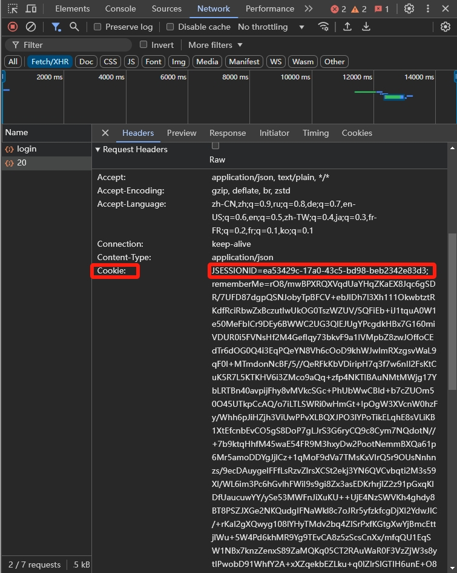

服务端开启 Session 后，会生成一个 SessionID ，然后通过响应头中的 Set-Cookie 将会话 SessionID 发送给浏览器，数据格式如下：

```java
Set-Cookie: JSESSIONID=abc123; Path=/; HttpOnly
```

浏览器接收到 Set-Cookie 响应后，会将 SessionID 保存为 Cookie ，在随后的请求中，浏览器会自动在请求头（Request Header）中附加 Cookie: JSESSIONID=abc123，将 SessionID 发送给服务器。默认情况下，JSESSIONID 存储在浏览器的内存中，也就是 Session Cookie （会话 Cookie ）。当浏览器关闭时，这个 Session Cookie 就会被删除， JSESSIONID 也会丢失。这个机制意味着在浏览器重新打开后，之前的会话信息不会被保留，用户需要重新登录或重新开始一个新的会话。如果希望 JSESSIONID 在浏览器关闭后仍然保留，可以将 JSESSIONID 设置为 Persistent Cookie （持久化 Cookie）。服务端代码需要设置 Set-Cookie 响应头中的 Expires 或 Max-Age 属性，使 JSESSIONID 在浏览器关闭后依然有效。例如：

```java
Set-Cookie: JSESSIONID=abc123; Path=/; HttpOnly; Max-Age=86400
```

**简而言之，在 HTTP 协议层面上，主要通过 Cookie 机制传递会话 ID，以实现服务器和客户端间的状态保持。客户端的每次请求都带上会 SessionID ，服务器通过 SessionID 来判断多次请求是否来自于同一个客户端。 Cookie 分两种， Session Cookie 和 Persistent Cookie ， Session Cookie 默认存放在浏览器运行时内存中，一旦浏览器关闭就会消失；Persistent Cookie 会保存到文件系统上，但是要求服务端要主动设置响应头中的 Max-Age 属性才会持久化。**

以上处理两种 Cookie 的过程是由服务端和浏览器内核配合完成的，存储和发送 Cookie 的流程在上面 webkit 的源代码中已经进行了解释。

## 7.3 JDK 与 web 容器的 Session 实现

我们再来看服务端是如何实现 Session 的。

实际上，市面上大多数编程语言都内置了对 Session 的支持，例如：Java、NodeJS、Python、C#、Ruby 等。在这一小节中，我们来看 Java 技术体系是如何支持 Session 机制的。

### 7.3.1 Java 语言层面对 Session 的支持

在 Java 语言层面， javax.servlet 包下，与 Session 相关的类引用关系如下图：

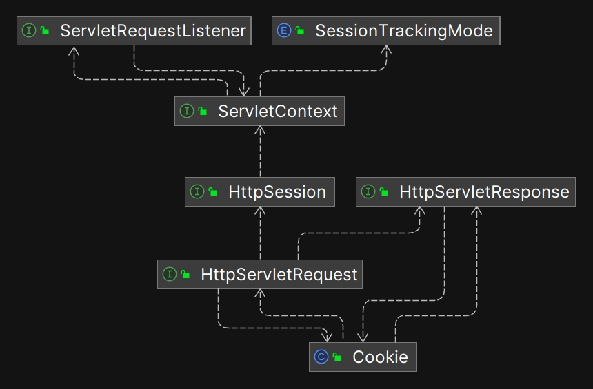

### 7.3.2 web 容器对 Session 的支持

主流的 web 容器，例如 Tomcat 和 Jetty 也内置了对 Session 的支持，在 Tomcat 中，与 Session 相关的类引用关系如下：

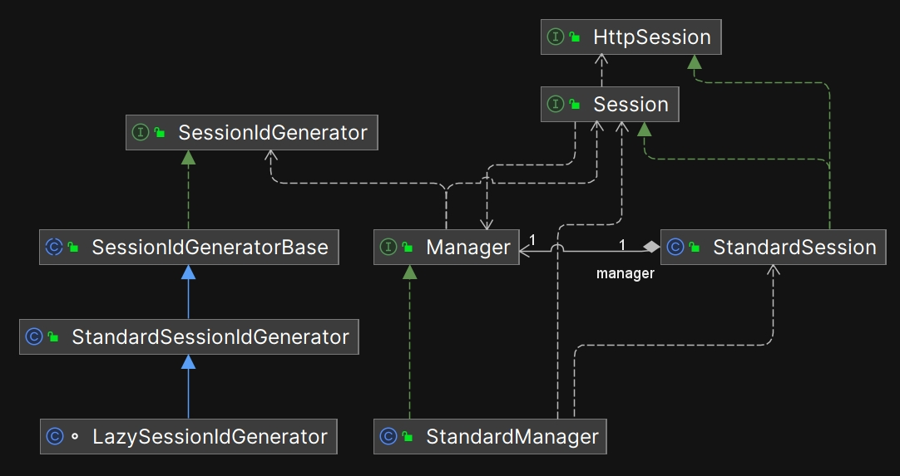

### 7.3.3 开发框架对 Session 的支持-Spring

主流的开发框架，如 Spring ，也内置了对 Session 的支持。

Spring 通过 `Spring Session` 框架为应用提供了对会话管理的支持，特别是在分布式环境中，这样可以更灵活地在不同的存储（如 Redis、JDBC、Hazelcast 等）之间管理会话。Spring Session 提供了几个关键的类和接口来支持会话的创建、存储、管理和过期控制。以下是 Spring Session 中支持会话的核心类和接口以及其主要机制：

| 类/接口 | 作用说明 |
| --- | --- |
| `Session` | 表示会话的抽象，提供获取和设置会话属性、会话 ID、创建时间和最后访问时间的方法。 |
| `SessionRepository` | 会话存储的核心接口，定义了创建、保存、查找和删除会话的方法。 |
| `HttpSession` 和 `HttpSessionWrapper` | 代理和管理会话的接口与实现，用于将自定义 `Session` 适配到标准的 `HttpSession`，实现与 Servlet API 的兼容。 |
| `SessionRepositoryFilter` | 核心过滤器，拦截 HTTP 请求，将标准 `HttpSession` 请求转换为 Spring Session 管理的会话。 |
| `FindByIndexNameSessionRepository` | `SessionRepository` 的扩展接口，支持根据索引（如用户 ID）查找会话，常用于单点登录和集中会话管理。 |
| `SpringSessionBackedSessionRegistry` | 帮助类，将 `SessionRegistry` 连接到 Spring Session，支持在 Spring Security 中的会话并发控制和会话失效管理。 |

Spring Session 的主要运行机制如下：

1. **会话管理**：`SessionRepository` 负责创建和持久化会话数据，配合 `SessionRepositoryFilter` 将会话请求代理到自定义的会话存储。这样，可以将会话存储在集中化的存储（如 Redis）中，从而实现分布式会话管理。

2. **Session ID 生成与验证**：Spring Session 使用 `SessionIdResolver` 来生成和解析会话 ID，通常以 cookie 或 HTTP 头的形式传递。默认的 `CookieHttpSessionIdResolver` 使用 Cookie 存储会话 ID，确保每个请求能正确关联会话。

3. **会话并发控制**：通过 `FindByIndexNameSessionRepository` 和 `SpringSessionBackedSessionRegistry`，Spring Session 可以与 Spring Security 集成，支持会话并发控制和会话失效策略。

4. **会话过期和清理**：`SessionRepository` 的实现类（如 Redis 和 JDBC 实现）支持会话过期策略。例如，Redis 的 TTL 可以用于会话的自动过期，确保会话在超时后自动清除。

## 7.4 Shiro 的 Session 架构

到这里为止，我们对 Session 机制有了基本的理解。但是，在谈论 Shiro 的 Session 架构之前，我们需要再次回顾 Shiro 框架的定位：**Shiro 是一个安全框架，它的核心功能是实现验证和授权，简单说就是为了权限控制**。所以， Shiro 定义的 Session 机制并不是为了取代 Java 标准的 HttpSession 。基于这样的设计目的，开发者在使用 Shiro 时需要注意：**不要在 Shiro 这一层级上操作普通的业务数据，因为 Shiro 是一个安全框架，它应该只处理与权限相关的数据。** 比较合理的用法是：

- **安全相关数据**：如用户角色（Roles）、权限列表（Permissions），应该基于 Shiro 的 Session 接口进行操作， Shiro 实现了一系列的工具方法来控制和监听 Session ，而标准的 `HttpSession` 并不具备这些功能。
- **普通的业务数据**：如购物车、用户偏好设置等，这些属于普通的业务数据，应该基于 Servlet 容器的 `HttpSession` 接口进行操作。

接下来，我们来分析 Shiro 的 Session 架构和源代码。

### 7.4.1 Shiro 自己定义的顶级 Session 接口

Shiro 自己设计了一个独立的顶级 Session 接口，如下图所示：

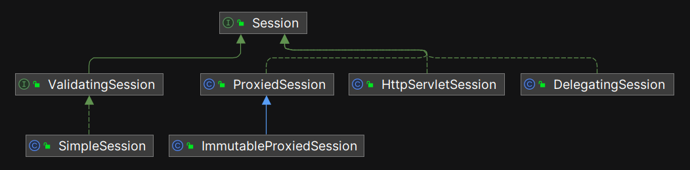

这样设计带来更好的灵活性： Shiro 可以在任意业务环境中使用，而不仅仅是 web 环境。为了方便使用，Shiro 内置了两个具体的实现类：HttpServletSession 和 SimpleSession 。

需要注意，在发布时， Shiro 把 SimpleSession 和 HttpServletSession 放到了不同的 jar 包中。 SimpleSession 在 **shiro-core-xxx.jar** 中，而 HttpServletSession 在 **shiro-web-xxx.jar** 中，这是非常贴心的处理，在非 web 应用中，可以不必导入 shiro-web-xxx.jar 包。

**另一个重要的注意点： Shiro 实现的 Session 机制并不是为了取代 Java 标准的 HttpSession ，因为 Shiro 的关注点是安全，而不是普通的业务数据。**

以下是 Shiro 的 Session 接口与 Java 标准的 HttpSession 接口对比：

| **Shiro's Session** | **Java's HttpSession** | **描述** |
| --- | --- | --- |
| `Serializable getId()` | `String getId()` | 会话 ID |
| `Date getStartTimestamp()` | `long getCreationTime()` | 会话创建时间 |
| `Date getLastAccessTime()` | `long getLastAccessedTime()` | 上次访问时间 |
| `long getTimeout()` | `int getMaxInactiveInterval()` | 最大不活动时间间隔 |
| `void setTimeout(long timeout)` | `void setMaxInactiveInterval(int interval)` | 设置最大不活动时间间隔 |
| `String getHost()` | **无** | 获取主机地址 |
| `void touch()` | **无** | 刷新会话的最后访问时间 |
| `void stop()` | **无** | 停止会话 |
| `Set<String> getAttributeKeys()` | `Enumeration<String> getAttributeNames()` | 获取会话中所有属性键 |
| `Object getAttribute(String name)` | `Object getAttribute(String name)` | 获取会话中属性 |
| `void setAttribute(String name, Object value)` | `void setAttribute(String name, Object value)` | 设置会话中属性 |
| `void removeAttribute(String name)` | `void removeAttribute(String name)` | 删除会话中属性 |
| **无** | `ServletContext getServletContext()` | 获取 Servlet 上下文 |
| **无** | `HttpSessionContext getSessionContext()` | 获取会话上下文 |
| **无** | `Object getValue(String name)` | 获取会话中值 |
| **无** | `String[] getValueNames()` | 获取会话中所有值的名称 |
| **无** | `void putValue(String name, Object value)` | 设置会话中值 |
| **无** | `void removeValue(String name)` | 删除会话中值 |
| **无** | `boolean isNew()` | 判断会话是否为新会话 |
| **无** | `void invalidate()` | 使会话失效 |

现在，我们知道 Shiro 内部有自己的 Session 机制， 对于 Java 标准的 HttpSession 接口，常见的 web 容器都提供了具体实现，例如 Tomcat 中提供的 StandardSession 。那么，问题就来了，如何集成在一起呢？因为双方都有自己的一套实现，而且接口存在差异，到底以谁的实现为准呢？很明显，这里需要一个桥梁进行“适配”：

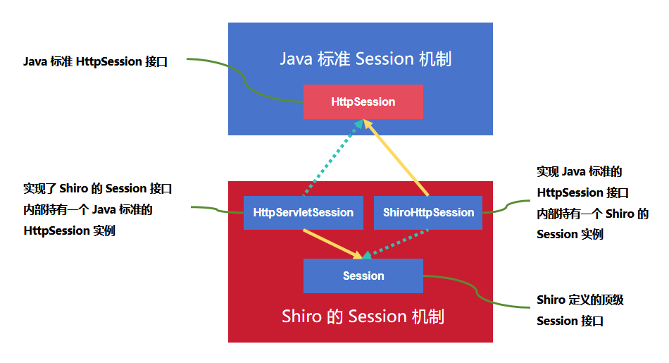

- HttpServletSession ：负责把 Java 标准的 HttpSession 类型**包装**成 Shiro 内部的 **org.apache.shiro.session**.Session 类型。因为 HttpServletSession 实现了 Shiro 自己定义的 Session 接口，所以 Shiro 内部的代码在拿到 HttpServletSession 的实例时，可以当成 Session 的实现类来操作。
- ShiroHttpSession ：它的设计目的刚好相反，它负责把 Shiro 内部的 **org.apache.shiro.session**.Session 类型**包装**成 Java 标准的 HttpSession 类型。因为 ShiroHttpSession 实现了 Java 标准的 HttpSession 接口，所以，当 Shiro 框架之外的代码接收到 ShiroHttpSession 类型的实例时，可以当成 Java 标准的 HttpSession 类型进行操作。

很明显，这是**装饰器模式**的一种典型使用方式。**简单地说：装饰器内部持有一个原始类型的实例，然后装饰器自己声明成目标接口类型，这样一来，调用方并不知道拿到的实例类型实际上是什么，因为对于 Java 语言来说，只要能通过类型检查就可以。这种“套壳”的方式带来的好处是：不用修改原始类型的代码，就可以修改或者新增一些额外的行为。**

知道了这两个类的设计目的之后，接下来我们开始详细阅读它们的代码。

### 7.4.2 HttpServletSession

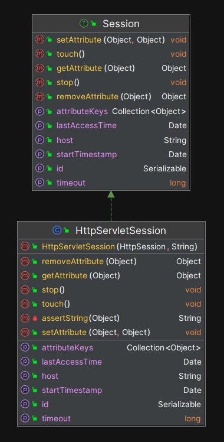

我们来对比一下 Shiro 的 HttpServletSession 和 Tomcat 中的 StandardSession 实现：

| **Shiro's HttpServletSession** | **Tomcat's StandardSession** | **描述** |
| --- | --- | --- |
| `Object getAttribute(String name)` | `Object getAttribute(String name)` | 获取指定名称的会话属性的值。 |
| `Enumeration<String> getAttributeNames()` | `Enumeration<String> getAttributeNames()` | 返回存储在会话中的所有属性名的枚举。 |
| `void setAttribute(String name, Object value)` | `void setAttribute(String name, Object value)` | 设置或替换会话中具有指定名称和值的属性。 |
| `void removeAttribute(String name)` | `void removeAttribute(String name)` | 删除指定名称的会话属性。 |
| `long getCreationTime()` | `long getCreationTime()` | 返回会话创建的时间（以毫秒为单位）。 |
| `String getId()` | `String getId()` | 返回会话的唯一标识符（ID）。 |
| `long getLastAccessedTime()` | `long getLastAccessedTime()` | 返回会话的上次访问时间。 |
| `int getMaxInactiveInterval()` | `int getMaxInactiveInterval()` | 获取会话在不访问的情况下保持活跃的最大时间间隔（以秒为单位）。 |
| `void setMaxInactiveInterval(int interval)` | `void setMaxInactiveInterval(int interval)` | 设置会话的最大不活动时间间隔，超过该时间会话将过期。 |
| `boolean isNew()` | `boolean isNew()` | 检查会话是否是新的（即在当前请求中创建）。 |
| `ServletContext getServletContext()` | `ServletContext getServletContext()` | 获取此会话所属的 `ServletContext`。 |
| `HttpSessionContext getSessionContext()` (已弃用) | `HttpSessionContext getSessionContext()` (已弃用) | 已弃用方法，用于检索会话上下文，现代应用程序中不再使用。 |
| `void invalidate()` | `void invalidate()` | 使会话无效，删除所有属性并将其标记为过期。 |

在 HttpServletSession 的构造方法中，调用者必须提供一个 Java 标准 HttpSession 类的实例，源代码如下：

```java
public class HttpServletSession implements Session {

    //...

    private HttpSession httpSession = null;

    public HttpServletSession(HttpSession httpSession, String host) {
        if (httpSession == null) {
            String msg = "HttpSession constructor argument cannot be null.";
            throw new IllegalArgumentException(msg);
        }
        if (httpSession instanceof ShiroHttpSession) {
            String msg = "HttpSession constructor argument cannot be an instance of ShiroHttpSession.  This " +
                    "is enforced to prevent circular dependencies and infinite loops.";
            throw new IllegalArgumentException(msg);
        }
        this.httpSession = httpSession;
        if (StringUtils.hasText(host)) {
            setHost(host);
        }
    }

    //...
}
```

很明显，Shiro 的 HttpServletSession 只是“装饰”了一下原始的 Java HttpSession 实例，把它“变成了” Shiro 自己定义的 Session 类型，因为 HttpServletSession 实现了 **org.apache.shiro.session**.Session 。这样一来， Shiro 的使用者在拿到会话的实例之后，可以完全当成 **org.apache.shiro.session**.Session 类型进行操作。

注意：Shiro 并没有提供方法把传进来的 Java HttpSession 实例再次暴露出来，从这一点我们能看出 Shiro 在架构上的意图：在 Shiro 内部，希望开发者都基于 **org.apache.shiro.session**.Session 类型去编写代码，而不要依赖 Java 标准的 HttpSession ，当然，最好也不要直接依赖 HttpServletSession 类型。

ServletContainerSessionManager 中创建 HttpServletSession 实例的源代码：

```java
protected Session createSession(SessionContext sessionContext) throws AuthorizationException {
    if (!WebUtils.isHttp(sessionContext)) {
        String msg = "SessionContext must be an HTTP compatible implementation.";
        throw new IllegalArgumentException(msg);
    }

    HttpServletRequest request = WebUtils.getHttpRequest(sessionContext);

    HttpSession httpSession = request.getSession();

    //SHIRO-240: DO NOT use the 'globalSessionTimeout' value here on the acquired session.
    //see: https://issues.apache.org/jira/browse/SHIRO-240

    String host = getHost(sessionContext);

    return createSession(httpSession, host);
}

protected Session createSession(HttpSession httpSession, String host) {
    return new HttpServletSession(httpSession, host);
}
```

### 7.4.3 ShiroHttpSession

反过来， `ShiroHttpSession` 的作用是把 **org.apache.shiro.session**.Session 类型包装成 Java 标准的 `HttpSession` ，这样外部的 web 应用拿到运行时实例后，可以当成标准的 `HttpSession` 来使用。

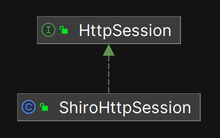

在 **org.apache.shiro.web.servlet** 包中， Shiro 还封装了一组适配器，用来适配标准 web 容器相关的接口。

在 ShiroHttpServletRequest 中创建 ShiroHttpSession 的源代码：

```java
package org.apache.shiro.web.servlet;

import org.apache.shiro.session.InvalidSessionException;
import org.apache.shiro.session.Session;
import org.apache.shiro.web.session.HttpServletSession;

import javax.servlet.ServletContext;
import javax.servlet.http.HttpServletRequest;
**import javax.servlet.http.HttpSession;**
import javax.servlet.http.HttpSessionBindingEvent;
import javax.servlet.http.HttpSessionBindingListener;
import java.util.*;

public HttpSession getSession(boolean create) {

    HttpSession httpSession;

    if (isHttpSessions()) {
        httpSession = super.getSession(false);
        if (httpSession == null && create) {
            //Shiro 1.2: assert that creation is enabled (SHIRO-266):
            if (WebUtils._isSessionCreationEnabled(this)) {
                httpSession = super.getSession(create);
            } else {
                throw newNoSessionCreationException();
            }
        }
    } else {
        boolean existing = getSubject().getSession(false) != null;

        if (this.session == null || !existing) {
            Session shiroSession = getSubject().getSession(create);
            if (shiroSession != null) {
                this.session = new ShiroHttpSession(shiroSession, this, this.servletContext);
                if (!existing) {
                    setAttribute(REFERENCED_SESSION_IS_NEW, Boolean.TRUE);
                }
            } else if (this.session != null) {
                this.session = null;
            }
        }
        httpSession = this.session;
    }

    return httpSession;
}
```

### 7.4.4 具体实现类-SimpleSession

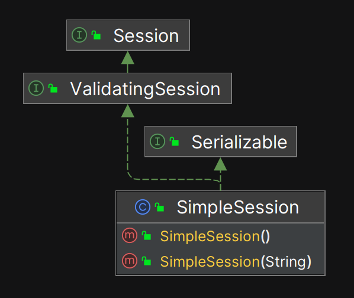

如上图所示，SimpleSession 是 Shiro 内置的唯一一个具体实现类，以下是 SimpleSession 这个类完整的属性和方法签名：

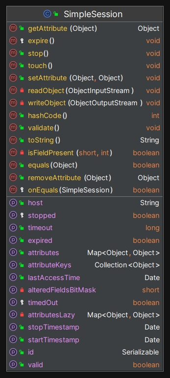

如前所述， Shiro 只关注安全方面的数据，所以 SimpleSession 并没有覆盖 HttpSession 的所有 API 。

SimpleSession 是简单的 POJO ，它可以满足大多数业务场景，以下是 SimpleSession 中关键的源代码：

```java
public class SimpleSession implements ValidatingSession, Serializable {
    //...

    private transient Serializable id;
    private transient Date startTimestamp;
    private transient Date stopTimestamp;
    private transient Date lastAccessTime;
    private transient long timeout;
    private transient boolean expired;
    private transient String host;

    //这是关键的一行代码，
    private transient Map<Object, Object> attributes;
}
```

在 `SimpleSession` 中，Shiro 设计了一个 `attributes` 属性，它的类型是 `Map<Object, Object>` ，用于存储会话中的具体数据。由于 `key` 和 `value` 的类型都是 `Object`，因此 `attributes` 可以容纳任意类型的 Java 对象。Shiro 让开发者自行决定存储哪些数据，从而灵活应对各种需求。

这种设计与 Tomcat 提供的 `StandardSession` 略有不同。Tomcat 使用的是 `ConcurrentMap<String, Object>` 类型，其中 `key` 只能是字符串，并且采用了支持并发的 Map 结构，目的是增强线程安全性，但是会牺牲一些性能。

另外，我们可以看到，`SimpleSession` 的许多私有属性都使用了 `transient` 修饰符。也就是说，在进行序列化时，这些属性不会被写入字节流。这种设计主要是出于安全考虑。例如，`SimpleSession` 实例中可能包含一些敏感数据，如果这些数据在序列化时被持久化到某个位置，可能会导致数据泄露。作为一个与安全密切相关的框架，Shiro 显然不希望发生这种情况。

因此，如果开发者需要将 `SimpleSession` 持久化存储（比如存储到 MySQL 数据库），就需要自行决定哪些数据应该被存储或读取。同时，还要仔细考虑如何保障敏感数据的安全性，比如可以先对数据进行加密处理。

**这个设计赋予了开发者更多的灵活性，同时确保了框架本身不会无意中暴露敏感信息。**

### 7.4.5 SessionDAO: 负责 Shiro Session 持久化

为了方便 Session 持久化处理， Shiro 设计了顶级 SessionDAO 接口， 这是 Shiro 中唯一一个直接带有 DAO 后缀的接口，从这一点我们可以理解 Shiro 在架构上的意图： **Session 是唯一需要开发者自己去实现如何存储和读取的内容。**

接下来我们来分析 SessionDAO 的源码，这是一个非常简单的接口，主要完成对 Session 的 CRUD 操作：

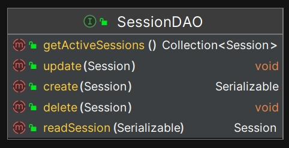

SessionDAO 相关的继承结构如下：

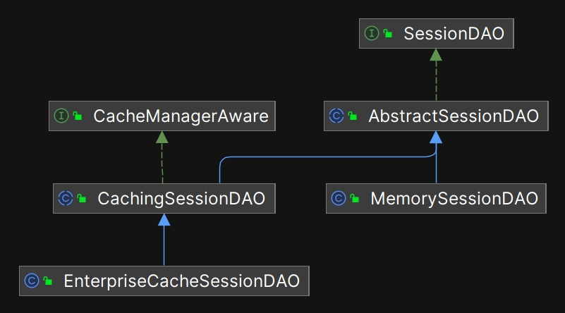

开发者可以自定义 SessionDAO 来处理 Session 的持久化相关的功能，示例代码如下：

```java
package com.nicefish.rbac.shiro.session;

import com.nicefish.rbac.jpa.entity.NiceFishSessionEntity;
import com.nicefish.rbac.service.INiceFishSessionService;
import org.apache.shiro.session.Session;
import org.apache.shiro.session.mgt.SimpleSession;
import org.apache.shiro.session.mgt.eis.EnterpriseCacheSessionDAO;
import org.slf4j.Logger;
import org.slf4j.LoggerFactory;
import org.springframework.beans.factory.annotation.Autowired;
import org.springframework.util.ObjectUtils;

import java.io.Serializable;
import java.util.Date;

/**
 * 扩展 Shiro 内置的 EnterpriseCacheSessionDAO ，操作 MySQL 中的 nicefish_rbac_session 表。
 *
 * 由于 EnterpriseCacheSessionDAO 实现了 CacheManagerAware 接口， Shiro 的 SecurityManager 会自动把
 * CacheManager 缓存实例注入到此类中，所以此类中可以直接操作 cacheManager 缓存实例。
 *
 * 此实现参考了 spring-session-jdbc 的实现，Session 中的所有 attributes 都会被提取出来并存储到 SESSION_DATA 列中，
 * 存储格式是 JSON 字符串。
 *
 * 此实现不会存储 Session 实例序列化之后的二进制数据，因为在跨业务模块共享 Session 时，如果 Session 中包含了
 * 某项目中特有的类，那么其它项目在反序列化时会因为找不到 Java 类而失败。
 *
 * @author 大漠穷秋
 */
public class NiceFishSessionDAO extends EnterpriseCacheSessionDAO {
    private static final Logger logger = LoggerFactory.getLogger(NiceFishSessionDAO.class);

    @Autowired
    private INiceFishSessionService sessionService;

    /**
     * 该方法参数中的 session 实例实际上是由 NiceFishSessionFactory.createSession 提供的。
     * 运行时调用轨迹：
     * SecurityManager -> SessionManager -> SessionFactory.createSession() -> EnterpriseCacheSessionDAO.doCreate(session)
     * @param session
     * @return
     */
    @Override
    protected Serializable doCreate(Session session) {
        Serializable sessionId = super.doCreate(session);

        NiceFishSessionEntity entity = new NiceFishSessionEntity();
        entity.setSessionId((String) sessionId);
        entity.setCreationTime(new Date());
        entity.setLastAccessTime(new Date());
        entity.setTimeout(session.getTimeout());

        //TODO:把用户对应的 Role 和 Permission 存储到 Session 中。

        this.sessionService.saveSession(entity);
        return sessionId;
    }

    /**
     * 从 MySQL 数据库中读取 Session ，父层实现会保证先读取缓存，然后再调用此方法。
     * @param sessionId
     * @return
     */
    @Override
    protected Session doReadSession(Serializable sessionId) {
        //把 entity 上的数据拷贝给 session 实例，TODO: 有更好的工具？
        NiceFishSessionEntity entity = sessionService.findDistinctBySessionId(sessionId.toString());
        if(ObjectUtils.isEmpty(entity)){
            return null;
        }

        SimpleSession session=new SimpleSession();
        session.setId(entity.getSessionId());
        session.setTimeout(entity.getTimeout());
        session.setStartTimestamp(entity.getCreationTime());
        session.setLastAccessTime(entity.getLastAccessTime());
        session.setHost(entity.getHost());
        session.setAttribute("appName",entity.getAppName());
        session.setAttribute("userId",entity.getUserId());
        session.setAttribute("userName",entity.getUserName());
        session.setAttribute("exprityTime",entity.getExpiryTime());
        session.setAttribute("maxInactiveInterval",entity.getMaxInactiveInteval());
        session.setExpired(entity.isExpired());
        session.setAttribute("os",entity.getOs());
        session.setAttribute("browser",entity.getBrowser());
        session.setAttribute("userAgent",entity.getUserAgent());
        session.setAttribute("sessionData",entity.getSessionData());
        return session;
    }

    /**
     * 把 Session 更新到 MySQL 数据库，父层实现会保证先更新缓存，然后再调用此方法。
     * 把 SimpleSession 上的数据拷贝给 entity ，然后借助于 entity 更新数据库记录。
     * TODO: 有更好的工具？
     * @param session 类型实际上是 Shiro 的 SimpleSession
     */
    @Override
    protected void doUpdate(Session session) {
        logger.debug("update session..."+session.toString());

        SimpleSession simpleSession=(SimpleSession)session;//Shiro 顶级 Session 接口中没有定义 isExpired() 方法，这里强转成 SimpleSession
        String sessionId=(String)simpleSession.getId();
        NiceFishSessionEntity entity=this.sessionService.findDistinctBySessionId(sessionId);
        if(ObjectUtils.isEmpty(entity)){
            entity=new NiceFishSessionEntity();
            entity.setSessionId((String)simpleSession.getId());
        }
        entity.setHost(simpleSession.getHost());
        entity.setCreationTime(simpleSession.getStartTimestamp());
        entity.setLastAccessTime(simpleSession.getLastAccessTime());
        entity.setTimeout(simpleSession.getTimeout());
        entity.setExpired(simpleSession.isExpired());
        entity.setAppName((String)simpleSession.getAttribute("appName"));
        entity.setUserId((Integer)simpleSession.getAttribute("userId"));
        entity.setUserName((String)simpleSession.getAttribute("userName"));
        entity.setExpiryTime((Date)simpleSession.getAttribute("exprityTime"));
        entity.setMaxInactiveInteval((Integer)simpleSession.getAttribute("maxInactiveInterval"));
        entity.setOs((String)simpleSession.getAttribute("os"));
        entity.setBrowser((String)simpleSession.getAttribute("browser"));
        entity.setUserAgent((String)simpleSession.getAttribute("userAgent"));
        entity.setSessionData((String)simpleSession.getAttribute("sessionData"));
        this.sessionService.saveSession(entity);
    }

    /**
     * 把 Session 从 MySQL 数据库中删除，父层实现会保证先删除缓存，然后再调用此方法。
     * NiceFish 不进行物理删除，仅仅把标志位设置成过期状态。
     * @param session 类型实际上是 Shiro 的 SimpleSession
     */
    @Override
    protected void doDelete(Session session) {
        logger.debug("delete session..."+session.toString());

        NiceFishSessionEntity entity=this.sessionService.findDistinctBySessionId((String)session.getId());
        entity.setExpired(true);
        this.sessionService.saveSession(entity);
    }
}
```

### 7.4.6 SessionManager

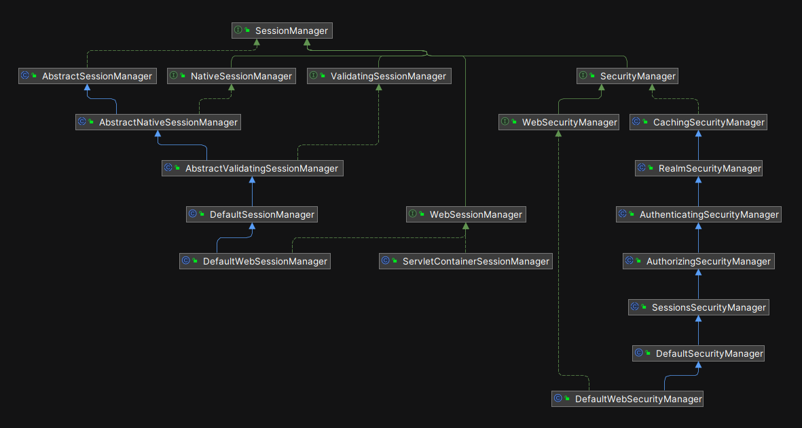

如前所述， SecurityManager 是整个领域（Realm）的安全主管， SessionManager 接口是它的手下（SecurityManager 中持有 SessionManager 的实例），会话相关的工作也由 SecurityManager 进行调度， SessionManager 的实现类负责执行会话相关的细节代码。

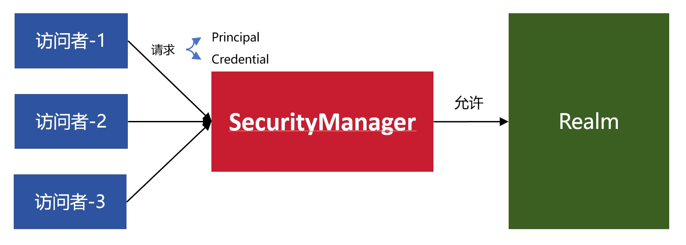

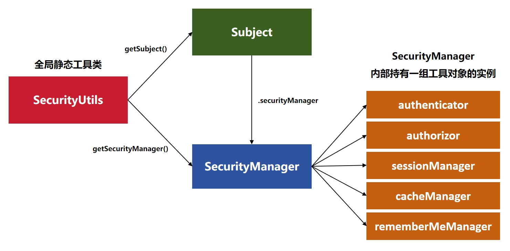

以下是 DefaultWebSecurityManager 中创建 SessionManager 实例的源代码：

```java
protected SessionManager createSessionManager(String sessionMode) {
    if (sessionMode == null || !sessionMode.equalsIgnoreCase(NATIVE_SESSION_MODE)) {
        log.info("{} mode - enabling ServletContainerSessionManager (HTTP-only Sessions)", HTTP_SESSION_MODE);
        return new ServletContainerSessionManager();
    } else {
        log.info("{} mode - enabling DefaultWebSessionManager (non-HTTP and HTTP Sessions)", NATIVE_SESSION_MODE);
        return new DefaultWebSessionManager();
    }
}
```

从以上代码可以看到，Shiro 实现了两个具体的 SessionManager 类：

- ServletContainerSessionManager ：从名称可以看出来，这是一个针对 web 项目设计的类型。如果使用了这个类，那么代码就只能运行在支持 HttpSession 接口的 web 容器中，如 Tomcat 和 Jetty 。
- DefaultWebSessionManager ：这个类不依赖 web 容器，即使不是 web 项目，也可以使用它。

另外，从以上代码中，我们还可以看到， Shiro 自己会检测运行时环境，如果发现是 web 环境，就会创建 ServletContainerSessionManager 的实例，否则创建 DefaultWebSessionManager 的实例。

### 7.4.7 Session 机制的运行时分析

```java
@Bean
public ShiroFilterFactoryBean shiroFilterFactoryBean(SecurityManager securityManager) {
    ShiroFilterFactoryBean shiroFilterFactoryBean = new ShiroFilterFactoryBean();
    shiroFilterFactoryBean.setSecurityManager(securityManager);
    shiroFilterFactoryBean.setLoginUrl(loginUrl);
    shiroFilterFactoryBean.setUnauthorizedUrl(unauthorizedUrl);

    Map<String, Filter> filters = new LinkedHashMap<String, Filter>();
    filters.put("captchaValidateFilter", captchaValidateFilter());
    shiroFilterFactoryBean.setFilters(filters);

    //所有静态资源交给Nginx管理，这里只配置与 shiro 相关的过滤器。
    LinkedHashMap<String, String> filterChainDefinitionMap = new LinkedHashMap<>();
    filterChainDefinitionMap.put("/nicefish/cms/post/write-post", "captchaValidateFilter");
    filterChainDefinitionMap.put("/nicefish/cms/post/update-post", "captchaValidateFilter");
    filterChainDefinitionMap.put("/nicefish/cms/comment/write-comment", "captchaValidateFilter");
    filterChainDefinitionMap.put("/nicefish/auth/user/register", "anon,captchaValidateFilter");
    filterChainDefinitionMap.put("/nicefish/auth/shiro/login", "anon,captchaValidateFilter");
    filterChainDefinitionMap.put("/**", "anon");

    shiroFilterFactoryBean.setFilterChainDefinitionMap(filterChainDefinitionMap);
    return shiroFilterFactoryBean;
}
```

可以看到，我们把带有 /nicefish/auth 和 /nicefish/cms 前缀的请求都交给了 Shiro 的过滤器进行处理。

以下是 ShiroFilterFactoryBean 的类声明代码：

```java
public class ShiroFilterFactoryBean implements FactoryBean<AbstractShiroFilter>, BeanPostProcessor
```

其中 FactoryBean 是 Spring 的工厂 Bean 接口， AbstractShiroFilter 是 Shiro 定义的过滤器接口。 AbstractShiroFilter 相关的类继承结构图如下：

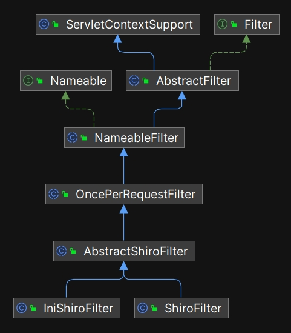

在 AbstractShiroFilter 中有两个关键的方法：

```java
protected ServletRequest wrapServletRequest(HttpServletRequest orig) {
    return new ShiroHttpServletRequest(orig, getServletContext(), isHttpSessions());
}

protected ServletResponse wrapServletResponse(HttpServletResponse orig, ShiroHttpServletRequest request) {
    return new ShiroHttpServletResponse(orig, getServletContext(), request);
}
```

这两个方法非常简单，分别把 Java 标准 HttpServletRequest 包装成 ShiroHttpServletRequest ，把 Java 标准的 HttpServletResponse 包装成 ShiroHttpServletResponse 。在 ShiroHttpServletRequest 内部有一个关键的 getSession 方法，我们来分析这个方法的源代码：

```java
public HttpSession getSession(boolean create) {
    HttpSession httpSession;
    if (this.isHttpSessions()) {
        httpSession = super.getSession(false);
        if (httpSession == null && create) {
            if (!WebUtils._isSessionCreationEnabled(this)) {
                throw this.newNoSessionCreationException();
            }

            httpSession = super.getSession(create);
        }
    } else {
        boolean existing = this.getSubject().getSession(false) != null;
        if (this.session == null || !existing) {
            Session shiroSession = this.getSubject().getSession(create);
            if (shiroSession != null) {
                this.session = new ShiroHttpSession(shiroSession, this, this.servletContext);
                if (!existing) {
                    this.setAttribute(REFERENCED_SESSION_IS_NEW, Boolean.TRUE);
                }
            } else if (this.session != null) {
                this.session = null;
            }
        }

        httpSession = this.session;
    }

    return httpSession;
}
```

这个 getSession 方法的目的是返回一个 Java 标准的 HttpSession 类型供外部调用。

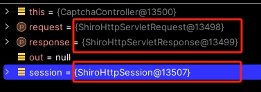

**简而言之：一旦项目中集成了 Shiro 框架，Shiro 将通过其自定义的 Filter 过滤所有请求。在 Shiro 的 Filter 机制内部，会将 `HttpServletRequest`、`HttpServletResponse` 和 `HttpSession` 分别包装为 `ShiroHttpServletRequest`、`ShiroHttpServletResponse` 和 `ShiroHttpSession`。这些包装类实现了 Java Servlet 的标准接口，因此外部调用者无需关心它们的实际类型，可以像使用原始类型一样使用它们，因为它们的接口是一致的。**

Shiro 对原始 Servlet 的包装类都位于 shiro-web-XXX-jakarta.jar 中，2017 年，Oracle 将 Java EE 的开发和管理转移给了 Eclipse 基金会，2020 年，Eclipse 把 javax 相关的包名都改成了 jakarta 。为了方便读者理解这些类的继承结构，我们把其中核心的类放在以下结构图中同时展示：

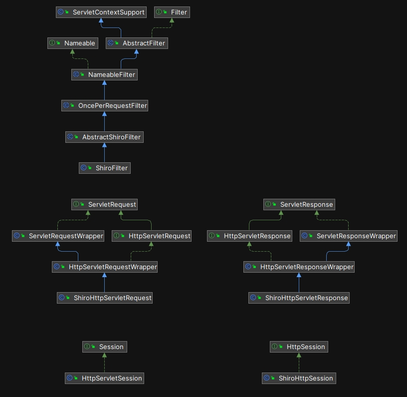

### 7.4.8 如何与 Spring 的 Session 机制整合

到此为止，我们已经理解了 Shiro 中的 Session 架构，并且理解了核心的实现代码。此时，Shiro 与 Spring 的集成已经水到渠成。

我们先在 ShiroCofig.java 配置类中编写 Filter 相关的代码，过滤所有请求，示例代码如下：

```java
@Bean
public ShiroFilterFactoryBean shiroFilterFactoryBean(SecurityManager securityManager) {
    ShiroFilterFactoryBean shiroFilterFactoryBean = new ShiroFilterFactoryBean();
    shiroFilterFactoryBean.setSecurityManager(securityManager);
    shiroFilterFactoryBean.setLoginUrl(loginUrl);
    shiroFilterFactoryBean.setUnauthorizedUrl(unauthorizedUrl);

    Map<String, Filter> filters = new LinkedHashMap<String, Filter>();
    filters.put("captchaValidateFilter", captchaValidateFilter());
    shiroFilterFactoryBean.setFilters(filters);

    //所有静态资源交给Nginx管理，这里只配置与 shiro 相关的过滤器。
    LinkedHashMap<String, String> filterChainDefinitionMap = new LinkedHashMap<>();
    filterChainDefinitionMap.put("/nicefish/cms/post/write-post", "captchaValidateFilter");
    filterChainDefinitionMap.put("/nicefish/cms/post/update-post", "captchaValidateFilter");
    filterChainDefinitionMap.put("/nicefish/cms/comment/write-comment", "captchaValidateFilter");
    filterChainDefinitionMap.put("/nicefish/auth/user/register", "anon,captchaValidateFilter");
    filterChainDefinitionMap.put("/nicefish/auth/shiro/login", "anon,captchaValidateFilter");
    filterChainDefinitionMap.put("/**", "anon");

    shiroFilterFactoryBean.setFilterChainDefinitionMap(filterChainDefinitionMap);
    return shiroFilterFactoryBean;
}
```

我们通过 @Bean 注解把 Shiro 封装的 Filter 暴露给 Spring 容器，从而把自定义的过滤器加入到 Spring 的 fitler chain 中。 Filter 会过滤所有请求，然后经过 Shiro 的层层包装，就进入了 Shiro 框架内部的处理逻辑。与过滤器相关的源码分析，放在“Shiro 对 SpringBoot 的支持”这一章中进行。

## 7.5 本章小结

在本章中，我们深入探讨了 Session 的基本概念及其在 Web 开发中的关键作用。首先，我们介绍了 Session 的核心功能，强调了它在用户状态管理和信息存储中的重要性。接着，我们分析了 WebKit 引擎中的 Cookie 实现，揭示了其在客户端数据存储中的应用及局限性。随后，我们对比了 JDK 与 Web 容器的 Session 实现，重点讨论了它们在会话管理和数据一致性方面的异同之处。最后，我们详细剖析了 Apache Shiro 的 Session 架构，展示了 Shiro 如何在安全框架中高效管理用户会话。通过本章的讨论，我们对 Session 的多样性以及它在现代 Web 应用中的角色有了更全面的理解。

## 资源链接

- Apache Shiro 在 github 上的官方仓库： https://github.com/apache/shiro
- Apache Shiro 官方网站：https://shiro.apache.org/
- 本书实例项目：https://gitee.com/mumu-osc/nicefish-spring-boot
- 本书文字稿：https://gitee.com/mumu-osc/apache-shiro-source-code-explaination

## 版权声明

本书基于 [**CC BY-NC-ND 4.0 许可协议**](https://creativecommons.org/licenses/by-nc-nd/4.0/deed.en)发布，自由转载-非商用-非衍生-保持署名。

**版权归大漠穷秋所有 © 2024 ，侵权必究。**
