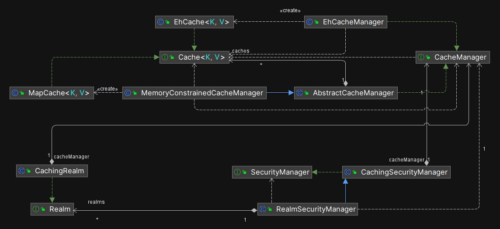
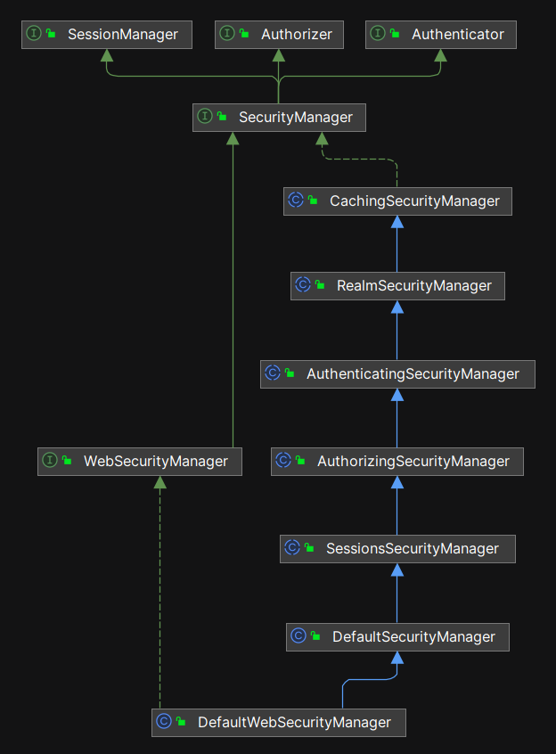
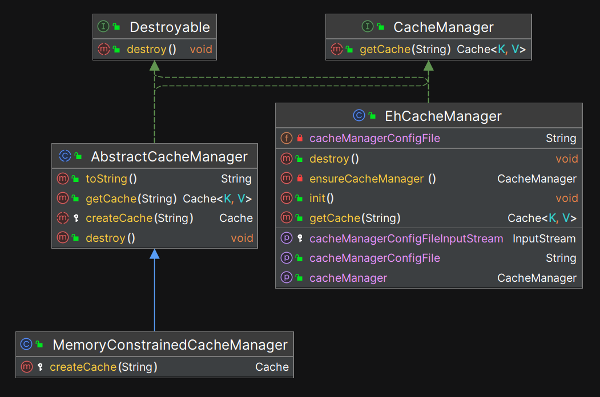
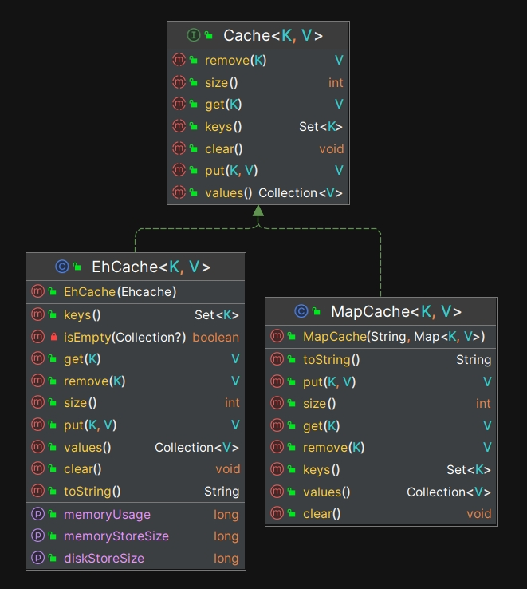
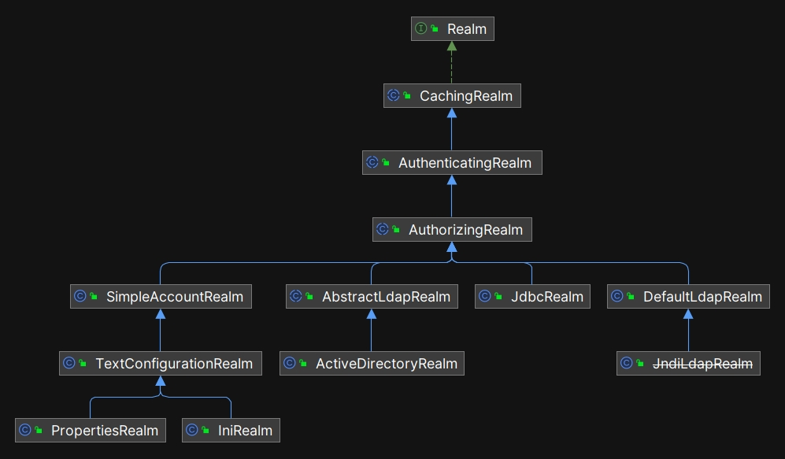
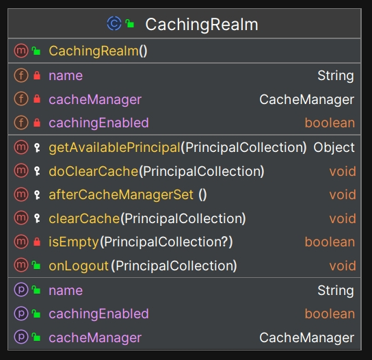

TODO:【题图-缓存】

# 缓存

本章将深入探讨 Shiro 的缓存架构，并对核心组件的源代码进行解析。

## 8.1 Shiro 为什么引入缓存机制

随着用户规模的不断扩大，认证、授权和加密等模块的调用次数会迅速增加。例如，当每秒有 100 万用户尝试登录系统时，认证模块也需要处理 100 万次请求。此时，性能问题将不可避免地浮现出来。

那么，如何在架构层面解决这些可能出现的性能瓶颈呢？最常见的解决方案就是引入缓存机制。对于某些功能，实际上并不需要在每次请求中都重新计算结果，我们可以将这些计算结果缓存，从而显著降低系统资源的消耗。

**提升性能正是 Shiro 框架引入缓存机制的一个重要原因。**

在 Shiro 中，缓存主要用于以下 3 个方面：

- **认证缓存**：存储用户的认证信息，避免每次请求都需要重新认证。
- **授权缓存**：存储用户的角色和权限信息，避免每次访问资源都去查询数据库获取权限。
- **Session 缓存**: 用来缓存会话信息，**默认不启用，需要手动配置**。

**注意：默认情况下，Shiro 并不会启用任何缓存，开发者需要在 `ShiroConfig.java` 中显式配置缓存管理器，指定 Shiro 应该使用哪种缓存机制。**

## 8.2 Shiro 的缓存架构

### 8.2.1 核心组件

Shiro 的缓存架构由 3 个核心接口组成： `CachingRealm`、`CacheManager`、和`Cache` 。

TODO:补充 HLD 示意图

这些类型的名称都带有 Cache 或者 Caching 前缀：

- CachingRealm：负责管理认证和授权数据的缓存。
- CacheManager：负责缓存的创建和管理。
- Cache：具体的缓存实现，存储键值对。

### 8.2.2 源码分析

我们先分析整体的运行机制，然后再逐步解析核心组件的源代码。

#### 8.2.2.1 整体运行机制



如上图所示，`CachingRealm` 中持有了一个 `CacheManager` 类型的实例，而 `CachingSecurityManager` 类中也持有了一个 `CacheManager` 类型的实例。那么，这两个 `CacheManager` 类型的实例之间是什么关系呢？是同一个实例吗？

我们来逐步分析源代码，我们从入口类 ShiroConfig.java 开始，在创建具体的 `SecurityManager` 实例时，开发者可以指定具体使用哪一种 `CacheManager` ，示例代码如下：

```java
@Bean
public EhCacheManager ehCacheManager(){
    EhCacheManager cacheManager = new EhCacheManager();
    cacheManager.setCacheManagerConfigFile("classpath:ehcache-shiro.xml");
    return cacheManager;
}

@Bean
public SecurityManager securityManager(){
    DefaultWebSecurityManager securityManager = new DefaultWebSecurityManager();
    securityManager.setRealm(nicefishRbacRealm());
    securityManager.setRememberMeManager(rememberMeManager());
    securityManager.setSessionManager(sessionManager());
    **securityManager.setCacheManager(ehCacheManager());**
    return securityManager;
}

//...
```

从以上代码可以看到，开发者只需要调用 securityManager.setCacheManager 方法设置缓存管理器就可以了，并不需要手动调用 `CachingRealm` 类型上定义的 setCacheManager 方法。那么，`CachingRealm` 类型上定义的 setCacheManager 方法是何时被自动调用的呢？我们再次回顾以下 `SecurityManager` 相关的继承结构：



在 `RealmSecurityManager` 这一层，我们可以看到如下代码：

```java

public void setRealms(Collection<Realm> realms) {
    if (realms == null) {
        throw new IllegalArgumentException("Realms collection argument cannot be null.");
    }
    if (realms.isEmpty()) {
        throw new IllegalArgumentException("Realms collection argument cannot be empty.");
    }
    this.realms = realms;
    afterRealmsSet();
}

protected void afterRealmsSet() {
    applyCacheManagerToRealms();
    applyEventBusToRealms();
}

protected void applyCacheManagerToRealms() {
    CacheManager cacheManager = getCacheManager();
    Collection<Realm> realms = getRealms();
    if (cacheManager != null && realms != null && !realms.isEmpty()) {
        for (Realm realm : realms) {
            if (realm instanceof CacheManagerAware) {
                ((CacheManagerAware) realm).setCacheManager(cacheManager);
            }
        }
    }
}
```

关键的方法调用轨迹是： setRealms->afterRealmsSet->applyCacheManagerToRealms 。在 applyCacheManagerToRealms 中，如果 Shiro 发现某个 Realm 的实例实现了 CacheManagerAware 接口，就会自动把 cacheManager 实例设置给它。

```java
// CachingRealm 的构造方法
public abstract class CachingRealm implements Realm, Nameable, **CacheManagerAware**, LogoutAware
```

如上所示，由于 CachingRealm 实现了 CacheManagerAware 接口，所以在运行时 CachingRealm 和 RealmSecurityManager 上的 cacheManager 是同一个实例。**这就意味着，开发者在配置缓存管理器时，应该调用 securityManager 对象上的 setCacheManager 方法，而不是调用 Realm 实例上的同名方法，否则在运行时 cacheManager 实例会被覆盖。**

#### 8.2.2.2 CacheManager 源码分析

`CacheManager` 是 Shiro 缓存系统的核心接口，它负责管理和提供缓存实例，以下是 `CacheManager` 相关的继承结构图：



- **`Destroyable` 接口**：定义了 `destroy()` 方法，用于在缓存管理器销毁时清理资源，确保缓存的数据和资源得以正确释放。
- **`CacheManager` 接口**：提供获取缓存的核心方法 `getCache(String name)`，是所有缓存管理器的顶层接口。通过实现 `CacheManager` 接口，开发者可以自定义缓存管理器以适应不同的缓存需求。
- **`AbstractCacheManager`**：作为抽象基类，它为 `CacheManager` 提供了 `createCache(String name)` 的基础实现，并实现了 `destroy()` 方法。这意味着它具备缓存管理器的基础功能，可以销毁缓存，同时允许子类根据需要创建特定类型的缓存。
- **`MemoryConstrainedCacheManager`**：Shiro 提供的轻量级缓存管理器，继承自 `AbstractCacheManager`。它将所有缓存数据保存在 JVM 内存中，适合小型应用或资源有限的环境。由于其缓存是基于内存的，一旦 JVM 重启，缓存数据将会丢失。这使得该缓存管理器在处理敏感数据时的持久化能力较差，因此主要适用于对数据持久性要求不高的场景。
- **`EhCacheManager`**：此缓存管理器继承自 `AbstractCacheManager`，并实现了 `CacheManager` 和 `Destroyable` 接口。`EhCacheManager` 集成了开源的 EhCache 框架。EhCache 支持磁盘持久化、多级缓存（内存+磁盘缓存）、集群部署等功能，适用于中大型应用。通过 `cacheManagerConfigFile` 配置文件，EhCacheManager 可以对缓存进行自定义配置，确保在高并发情况下提供更好的性能和可扩展性。

TODO:CacheManager 的实例化时机

#### 8.2.2.3 AbstractCacheManager 源码解析

AbstractCacheManager 是 Shiro 中缓存管理器的抽象基类，它提供了缓存管理的基本功能，包括：

- 缓存的惰性创建：只有在第一次访问某个缓存时，才会创建该缓存。
- 线程安全的缓存管理：通过使用 ConcurrentHashMap 确保缓存管理器在并发环境中的安全性。
- 缓存销毁机制：提供 destroy() 方法，用于清理资源并销毁所有缓存。

AbstractCacheManager 的源代码非常简单，去掉注释之后只有几十行。其中，createCache(String name) 是一个关键的抽象方法，具体的缓存创建逻辑由子类实现，例如 MemoryConstrainedCacheManager 和 EhCacheManager 会分别实现该方法，以创建特定类型的缓存实例。

#### 8.2.2.4 MemoryConstrainedCacheManager 源码解析

`MemoryConstrainedCacheManager` 是基于内存的缓存，它的实现方式非常简单，源代码全文引用如下：

```java
package org.apache.shiro.cache;

import org.apache.shiro.util.SoftHashMap;

public class MemoryConstrainedCacheManager extends AbstractCacheManager {
    @Override
    protected Cache createCache(String name) {
        //注意，这里创建的缓存实例类型是 MapCache
        return new MapCache<Object, Object>(name, new SoftHashMap<Object, Object>());
    }
}
```

MemoryConstrained 这个单词的字面意思是“内存受限” ，所以 `MemoryConstrainedCacheManager` 这个类名已经暗示了它的适用场景：

- **内存受限的环境**：适合内存有限的应用场景，比如嵌入式系统、移动设备或需要在服务器端进行精确内存控制的应用。
- **简单缓存管理**：不需要外部依赖（如 Redis）的简单缓存场景，能够快速使用内存缓存。

TODO:解释缓存的“线程安全”问题

#### 8.2.2.5 EhCacheManager 源码解析

EhCacheManager 的实现同样非常简单，就如同它的名字一样，主要负责创建并管理 EhCache 的实例。

#### 8.2.2.6 对接 Redis 缓存

当前，在分布式系统中，架构师一般会选择 Redis 作为缓存组件，但是，Shiro 并没有直接提供一个开箱即用的 RedisCacheManager （原因简单，因为当年 Redis 还没有出现。）。开发者可以自己实现 CacheManager 接口，也可以选择开源的实现，例如 shiro-redis ，它的主页在：https://github.com/alexxiyang/shiro-redis 。

### 8.2.3 Cache 源码分析

接下来我们分析缓存本身的实现，在 Shiro 中，`Cache` 接口相关的类继承结构如下图所示：



`MapCache`是 Shiro 自己提供的一个非常简单的缓存实现类，它的内部实际上使用了一个 `Map<K,V>` 结构来存储数据，以下是`MapCache`的关键源代码：

```java
public class MapCache<K, V> implements Cache<K, V> {

    private final Map<K, V> map;

    //缓存的名称
    private final String name;

    //构造方法要求外部传递一个具体的 Map 实例进来， Shiro 默认使用自己实现的 SoftHashMap 类。
    public MapCache(String name, Map<K, V> backingMap) {
        if (name == null) {
            throw new IllegalArgumentException("Cache name cannot be null.");
        }
        if (backingMap == null) {
            throw new IllegalArgumentException("Backing map cannot be null.");
        }
        this.name = name;
        this.map = backingMap;
    }

    //...
}
```

Shiro 自己实现了一个 `SoftHashMap` 来承担存储任务，这个类位于 shiro-core-xxx.jar 包中。`SoftHashMap` 基于软引用的哈希映射类实现，可以在内存不足时能够自动回收不再使用的缓存内容。以下是其核心功能：

1. **软引用存储**：使用 `SoftReference` 来存储值对象，这样在内存压力大的情况下，JVM 可以自动回收这些值，避免内存溢出。
2. **强引用管理**：维护一个强引用队列，允许开发者控制保留的强引用数量，以平衡内存使用和缓存命中率。
3. **自动清理**：在访问缓存时，会自动处理和清理已被回收的软引用，保持映射的有效性。
4. **线程安全**：使用 `ConcurrentHashMap` 和 `ReentrantLock` 确保在多线程环境下的安全性和一致性。
5. **接口实现**：实现了 `Map` 接口，提供标准的 Map 操作（如 `put`、`get`、`remove` 等）并支持批量操作。

也就是说，如果开发者指定 Shiro 使用 `MemoryConstrainedCacheManager` 作为缓存管理器，那么在运行时，最底层承担存储任务的是 `SoftHashMap` 类的实例。

### 8.2.4 CachingRealm 源码分析

由于 `Realm` 相关的继承结构比较深，我们需要再次回顾一下结构图：



`CachingRealm` 是 `Realm` 的实现类，它的类名带有 Caching 前缀，很明显它最大的特点就是带有缓存功能。由于 `CachingRealm` 在整个继承结构中位置非常高，所以在 Shiro 中，所有 Realm 都具备缓存功能，除非开发者自己编写一个全新的实现类直接实现最顶层的 `Realm` 接口。但是这种情况非常少见，因为 Shiro 在每一层 Realm 上都已经实现了很多功能，如果自己从头实现 `Realm` 接口，需要编写的代码太多了。



如上图所示，`CachingRealm`的功能非常简单，实际上它自己几乎没有实现任何功能，把所有具体工作都交给内部的 cacheManager 对象去处理了：

```java
public abstract class CachingRealm implements Realm, Nameable, CacheManagerAware, LogoutAware {
    //...

    private String name;
    private boolean cachingEnabled;
    private CacheManager cacheManager; //实际上是 cacheManager 在做事

    //...
}
```

## 8.3 Session 缓存

在 Shiro 中，`Session` 默认并不会自动走缓存，但 Shiro 设计了缓存会话的机制。

### 8.3.1 **启用 Session 缓存**

Shiro 的 `Session` 默认存储在内存中，如果没有明确配置缓存，Shiro 不会自动缓存 `Session` 数据。

如果希望将会话信息缓存起来，可以配只 `CacheManager` 配置项，通常会使用开源的 `EhCacheManager`或者`RedisCacheManager` ，以下是使用`EhCacheManager`作为 Session 缓存的关键代码（已省略无关代码）：

```java
EhCacheManager cacheManager = new EhCacheManager();
cacheManager.setCacheManagerConfigFile("classpath:shiro-ehcache.xml");

CachingSessionDAO sessionDAO = new EnterpriseCacheSessionDAO();
sessionDAO.setCacheManager(cacheManager); // 配置 cacheManager

DefaultWebSessionManager sessionManager = new DefaultWebSessionManager();
sessionManager.setSessionDAO(sessionDAO);

DefaultSecurityManager securityManager = new DefaultWebSecurityManager();
securityManager.setSessionManager(sessionManager);
SecurityUtils.setSecurityManager(securityManager);
```

### 8.3.2 CachingSessionDAO 源码分析


如上图所示， Shiro 内置的抽象类 `CachingSessionDAO` 支持缓存机制，`EnterpriseCacheSessionDAO` 是 `CachingSessionDAO` 的子类，在 `CachingSessionDAO`中，最关键的 4 个方法代码如下：

```java
public Serializable create(Session session) {
    Serializable sessionId = super.create(session);
    cache(session, sessionId);
    return sessionId;
}

public Session readSession(Serializable sessionId) throws UnknownSessionException {
    Session s = getCachedSession(sessionId);
    if (s == null) {
        s = super.readSession(sessionId);
    }
    return s;
}

public void update(Session session) throws UnknownSessionException {
    doUpdate(session);
    if (session instanceof ValidatingSession) {
        if (((ValidatingSession) session).isValid()) {
            cache(session, session.getId());
        } else {
            uncache(session);
        }
    } else {
        cache(session, session.getId());
    }
}

public void delete(Session session) {
    uncache(session);
    doDelete(session);
}
```

- create: 先写持久层，然后再写缓存。
- readSession: 先尝试从缓存中读取 Session ，如果结果为 null ，调用父层的 readSession 去访问持久层。
- update: 先更新持久层，然后更新缓存。
- delete: 先删缓存中的数据，然后再删持久层数据。

从以上代码我们可以看到，`CachingSessionDAO`对缓存的读写策略都非常简单，比如 readSession 方法，采用的是 Read-Through（读透）策略：如果没有能够从缓存中读取到数据，直接访问持久层，很容易形成系统瓶颈。

### 8.3.3 **注意**

在启用了 Session 缓存之后，系统的复杂度会显著增加。这是因为缓存中的数据与数据库中的数据可能会存在不一致的情况，容易导致潜在的逻辑错误。因此，开发者在设计系统时，需要谨慎处理 Session 缓存，以确保数据的一致性。

Shiro 内置的 `CachingSessionDAO` 提供了一种简单的实现方式，方便开发者快速集成缓存功能。然而， Shiro 毕竟是一个安全框架，并不是专业的缓存框架，开发者在面对更复杂的业务需求时，可能需要设计自己的缓存 DAO。这种自定义的缓存 DAO 可以提供对 Session 的缓存进行更细粒度的控制，从而优化系统性能，减少对数据库的压力，并提高响应速度。

在设计自己的缓存 DAO 时，开发者可以考虑以下几个方面：

1. **缓存策略选择**：根据业务场景选择合适的缓存策略，例如读透、写穿或写后失效等，以确保在性能和一致性之间找到平衡。
2. **过期与失效管理**：设置合理的缓存过期时间，以避免缓存中存储过期数据。同时，设计手动失效机制，以确保重要数据的实时更新。
3. **监控与调优**：通过监控缓存的使用情况，分析命中率和访问模式，从而不断调整和优化缓存策略，确保系统的高效运行。

在分布式系统中，推荐使用 Redis 作为 Session 的缓存解决方案。Redis 具有高性能、支持持久化和跨模块、跨系统共享数据的能力，能够有效地管理会话数据。在这种架构下，各个模块和系统之间可以复用会话信息，提升用户体验并简化系统管理。

综上所述，虽然 Session 缓存可以带来性能提升，但也引入了额外的复杂性。开发者应仔细权衡利弊，并在必要时实施更灵活和高效的缓存管理策略，以实现更高效、可靠的系统架构。

## 8.4 本章小结

TODO:完成这段内容

## 版权声明

本书基于 [**CC BY-NC-ND 4.0 许可协议**](https://creativecommons.org/licenses/by-nc-nd/4.0/deed.en)发布，自由转载-非商用-非衍生-保持署名。

**版权归大漠穷秋所有 © 2024 ，侵权必究。**
