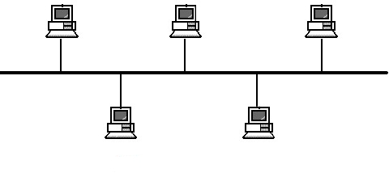
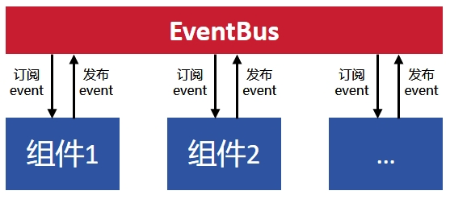
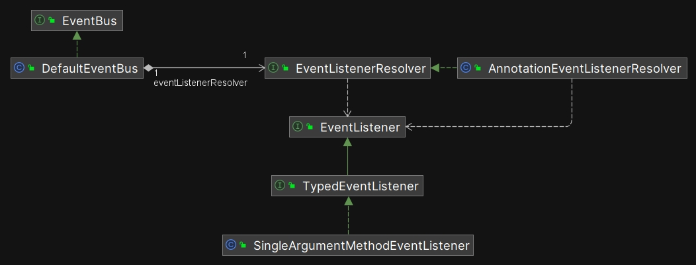
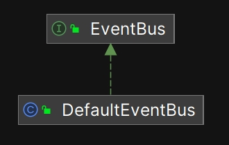
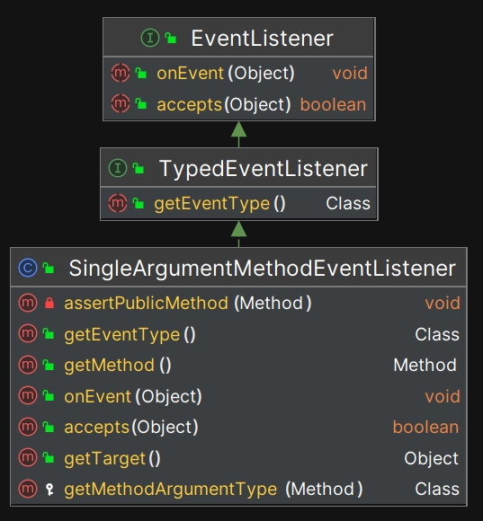
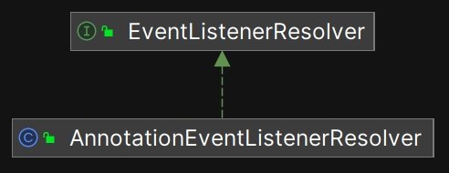
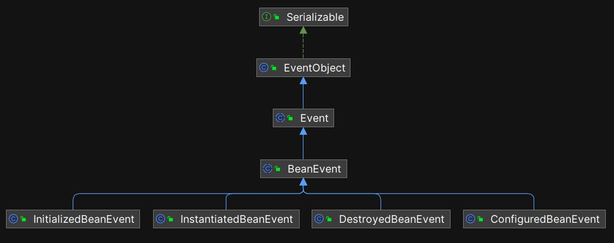

# 事件总线

在日常的业务开发中，开发者很少直接使用 `EventBus` 相关的接口，但是在 Shiro 框架内部， `EventBus` 是一个核心组件。本书旨在解析 Shiro 的架构和源代码，那么 `EventBus` 是一个绕不开的话题，这一章主要包含以下内容：

1. 什么是 EventBus？
2. 如何使用 Shiro EventBus
3. Shiro EventBus 源码解析
4. 多线程并发处理
5. EventBus 在 Shiro 框架内部起什么作用？

## 9.1 什么是 EventBus？

**EventBus** 是一种事件机制，事件的发布者把事件发送到总线上，所有对事件感兴趣的组件都可以订阅总线上的事件，整体运行机制如下图所示：



**EventBus 是一种通用的设计思想，并非 Shiro 独有，在各种语言、各种框架（前端、服务端、移动端），甚至网络硬件架构中都会出现它的身影。从设计模式的角度看， EventBus 最经典的“观察者模式”。**

## 9.2 如何使用 Shiro EventBus

在日常的业务开发中，开发者很少直接调用 Shiro 中 EventBus 相关的接口，原因是：**在现代的系统架构中，一般会部署独立的消息中间件（如 RocketMQ），而不需要开发者在业务代码中自己处理消息。**

但是，本书的主旨是解析 Shiro ，所以这里给出一段示例代码，展示如何使用 Shiro 中的 EventBus 发布和处理事件：

```java
import org.apache.shiro.event.Event;

/**
 * 自定义事件类
 */
public class CustomEvent extends Event {
    private final String message;

    public CustomEvent(String message) {
        super(new Object()); // source 是事件的触发对象
        this.message = message;
    }

    public String getMessage() {
        return message;
    }
}

/**
 * 实现事件监听器
 */
public class CustomEventListener implements SingleArgumentMethodEventListener<CustomEvent> {
    @Override
    public void onEvent(CustomEvent event) {
        System.out.println("Received event: " + event.getMessage());
    }

    @Override
    public boolean accepts(Event event) {
        return event instanceof CustomEvent;
    }
}

/**
 * 使用 EventBus 发布事件
 */
public class EventBusExample {
    public static void main(String[] args) {
        EventBus eventBus = new EventBus();

        // 注册事件监听器
        eventBus.register(new CustomEventListener());

        // 发布事件
        eventBus.publish(new CustomEvent("Hello, Shiro EventBus!"));
    }
}
```

在以上例子中，`CustomEvent` 是一个自定义事件类， `CustomEventListener` 是对应的事件监听器。当 `EventBus` 派发 `CustomEvent`事件时 ，事件监听器会接收到事件，然后执行对应的处理逻辑。

为了方便开发者使用， Shiro 定义了一个 @Subscribe 注解，以上 `CustomEventListener` 还可以这样编写：

```java
import org.apache.shiro.event.Subscribe;

public class CustomEventListener  {
    @Subscribe
    public void onCustomEvent(CustomEvent event) {
        System.out.println("Received event: " + event.getMessage());
    }
}
```

采用 @Subscribe 注解不需要继承 Shiro 内部的事件监听器类型，从而让代码更加灵活。

## 9.3 Shiro EventBus 源码解析

### 9.3.1 整体运行机制

Shiro 没有引用第三方 `EventBus` 组件，而是自己提供了一套轻量级的实现， 与 `EventBus` 有关的实现独立发布在 `shiro-event-XXX.jar` 这个 jar 包中，整个 jar 包中只有 12 个 Class 和 Interface ，其中主要的依赖关系如下图所示：



主要的类（接口）有如下几个：

1. **EventObject（事件对象）：** 封装具体的事件信息，所有事件都需要继承自 `EventObject` 类。
2. **EventBus（事件总线）：** 维护一个订阅者列表，主要负责两个功能：一是把订阅者注册到列表中；二是当事件发生的时候，遍历所有订阅者对象，并调用上面的 onEvent 方法（广播）。
3. **EventListener（事件监听器）：** 会根据事件的类型选择性处理事件，每个 `EventListener` 都必须实现 `accepts(Object event)` 方法，以确定该监听器是否支持某类事件。
4. **EventListenerResolver（事件监听器解析器）：** 它的功能是获取实例上的所有事件监听器。 `AnnotationEventListenerResolver` 是它的唯一具体实现类，当开发者采用 @Subscribe 注解编写事件监听器时，`AnnotationEventListenerResolver`就会自动解析注解，并在事件总线上注册事件监听器。

接下来，我们详细解析源代码。

### 9.3.2 源码解析

**EventBus（事件总线）** 是整个事件机制中最核心的类，我们就从它开始分析。 `EventBus` 相关的继承结构如下图所示：



EventBus 是一个简单的接口，它只定义了 3 个方法：

```java
public interface EventBus {
   /**
    * 该方法用于发布事件，事件会被广播给所有订阅者。
    */
    void publish(Object event);
    /**
     * 该方法用于注册一个订阅者对象。
     */
    void register(Object subscriber);
    /**
     * 该方法用于取消一个订阅者对象的注册，从而停止接收事件。如果该对象之前未被注册，则调用此方法无效果。
     */
    void unregister(Object subscriber);
}
```

`DefaultEventBus`是 EventBus 接口的实现类，它负责具体实现 `EventBus` 定义的功能。 `DefaultEventBus` 中最核心的代码如下（这里先解释最核心的部分，然后单独解释线程安全的问题）：

```java
public class DefaultEventBus implements EventBus {
    //...
    private EventListenerResolver eventListenerResolver;

    //这是一个“注册表”，所有订阅者都会被保存到这个数据结构中。
    private final Map<Object, Subscription> registry;

    /**
     * 构造方法
     */
    public DefaultEventBus() {
        // 创建“注册表”实例
        this.registry = new LinkedHashMap<Object, Subscription>();

        //...
        this.eventListenerResolver = new AnnotationEventListenerResolver();
    }

    /**
     * 发布事件
     */
    public void publish(Object event) {
        if (event == null) {
            log.info("Received null event for publishing.  Ignoring and returning.");
            return;
        }

        //...
        try {
            //注意这里：当事件发生的时候，会遍历所有订阅者，调用上面的 onEvent 方法，并且把事件对象传递进去（广播）。
            for (Subscription subscription : this.registry.values()) {
                subscription.onEvent(event);
            }
        } finally {
            registryReadLock.unlock();
        }
    }

    /**
     * 把事件订阅者注册到“注册表”中
     */
    public void register(Object instance) {
        if (instance == null) {
            log.info("Received null instance for event listener registration.  Ignoring registration request.");
            return;
        }

        //注意这里的细节，先尝试取消注册，防止同一个订阅者被重复注册多次。
        unregister(instance);

        List<EventListener> listeners = getEventListenerResolver().getEventListeners(instance);

        if (listeners == null || listeners.isEmpty()) {
            log.warn("Unable to resolve event listeners for subscriber instance [{}]. Ignoring registration request.",
                    instance);
            return;
        }

        Subscription subscription = new Subscription(listeners);

        //...
        try {
          //把订阅者实例 put 到 Map 中
          this.registry.put(instance, subscription);
        } finally {
          //...
        }
    }

    /**
     * 取消订阅
     */
    public void unregister(Object instance) {
        if (instance == null) {
            return;
        }

        //...

        try {
            //从“注册表”中删除，这样就收不到事件了。
            this.registry.remove(instance);
        } finally {
            //...
        }
    }
}
```

为了更好地封装事件的处理过程， `DefaultEventBus` 实现了一个私有的内部类叫做 `Subscription` ，这个内部类的代码非常简单，这里进行全文解释（关键的操作已在代码中进行了注释）：

```java
private class Subscription {
    //维护一个事件监听器列表
    private final List<EventListener> listeners;

    /**
     * 构造方法
     */
    public Subscription(List<EventListener> listeners) {
        List<EventListener> toSort = new ArrayList<EventListener>(listeners);
        //排序
        Collections.sort(toSort, EVENT_LISTENER_COMPARATOR);
        this.listeners = toSort;
    }

    /**
     * 当事件发生的时候，会调用此方法
     */
    public void onEvent(Object event) {

        //保存已经发布过事件的对象，防止在同一个对象上重复派发事件。
        Set<Object> delivered = new HashSet<Object>();

        //遍历所有事件监听器，开始给它们派发事件。
        for (EventListener listener : this.listeners) {
            Object target = listener;
            if (listener instanceof SingleArgumentMethodEventListener) {
                SingleArgumentMethodEventListener singleArgListener = (SingleArgumentMethodEventListener) listener;
                target = singleArgListener.getTarget();
            }

            //先判断监听器是否能接受当前的事件对象（这里的本质是单播，避免把不相关的事件派发给监听器）
            if (listener.accepts(event) && !delivered.contains(target)) {
                try {
                    //关键：调用事件监听器上的 onEvent 方法。
                    listener.onEvent(event);
                } catch (Throwable t) {
                    log.warn(EVENT_LISTENER_ERROR_MSG, t);
                }
                delivered.add(target);
            }
        }
    }
}
```

从`Subscription`的源代码我们可以看到，最关键的部分是遍历所有 `EventListener` ，然后依次调用它们的 `onEvent` 方法，也就是把事件“派发”给它们。那么，我们就来看看 `EventListener` 相关的具体实现，`EventListener` 相关的继承结构如下图所示：



以下是这些类型的功能说明（读者无需记忆，浏览即可）：

| 类名 | 功能描述 |
| --- | --- |
| `EventListener` | 事件监听器的基础接口，用于定义所有事件监听器的通用功能。 |
| `TypedEventListener` | 类型化事件监听器接口，获取事件对象的真实类型（Class），以便于处理特定类型的事件。 |
| `SingleArgumentMethodEventListener` | 只接受单一参数的事件方法监听器，实现对特定类型且只有一个参数的方法的事件监听功能。它是 Shiro 中唯一的一个具体实现类，在运行时，所有事件监听器的真实类型都是 `SingleArgumentMethodEventListener` 。 |

`SingleArgumentMethodEventListener`是 Shiro 中唯一的一个具体实现类，我们来看最核心的 onEvent 方法：

```java
public void onEvent(Object event) {
    Method method = getMethod();
    try {
        //这里借助于 Java 的反射机制，进行方法调用
        method.invoke(getTarget(), event);
    } catch (Exception e) {
        throw new IllegalStateException("Unable to invoke event handler method [" + method + "].", e);
    }
}
```

在 `DefaultEventBus` 的 `register`方法中，还有一行关键的代码：

```java
List<EventListener> listeners = getEventListenerResolver().getEventListeners(instance);
```

其中 `getEventListenerResolver()`会获得一个**EventListenerResolver（事件监听器解析器）**类型的实例，这个“解析器”的功能是获取 instance 上的所有事件监听器，`EventListenerResolver`相关的继承结构如下图所示：



`AnnotationEventListenerResolver`是唯一的具体实现类，其中核心的代码如下：

```java
public List<EventListener> getEventListeners(Object instance) {
    if (instance == null) {
        return Collections.emptyList();
    }

    //利用 Java 的反射机制，获取所有添加了事件注解的方法。
    List<Method> methods = ClassUtils.getAnnotatedMethods(instance.getClass(), getAnnotationClass());
    if (methods == null || methods.isEmpty()) {
        return Collections.emptyList();
    }

    List<EventListener> listeners = new ArrayList<EventListener>(methods.size());

    for (Method m : methods) {
        listeners.add(new SingleArgumentMethodEventListener(instance, m));
    }

    return listeners;
}
```

当开发者采用 @Subscribe 注解编写事件监听器时，`AnnotationEventListenerResolver`就会自动解析注解，并在事件总线上注册事件监听器，@Subscribe 的源代码如下：

```java
@Retention(value = RetentionPolicy.RUNTIME) //运行时注解
@Target(value = ElementType.METHOD)         //只能装饰方法
@Documented
public @interface Subscribe {
}
```

所以，我们总结一下整体的运行机制：

- 订阅者告诉事件总线，它对哪些事件感兴趣（把自己注册到事件总线上），同一个订阅者可以对多个事件感兴趣。
- 当事件发生的时候，事件总线会把事件对象派发给所有订阅者（广播），也就是调用订阅者的 onEvent 方法。
- 订阅者内部维护了一个事件监听器列表，当接受到事件总线派发过来的事件之后，订阅者会遍历内部的事件监听器列表，然后调用监听器上的 onEvent 方法。当然，在调用之前，会首先判断监听器是否对当前的事件感兴趣（这里是单播，不是广播）。
- 在事件监听器的 onEvent 内部，会借助于 Java 的反射机制，调用用户编写的事件处理方法，并且把事件对象传递过去。

## 9.4 多线程并发处理

在实际的应用系统中，事件总是不断地在发生，而且事件监听器的数量也比较多。所以，对于处理事件（或者消息）的组件来说，如何处理多线程并发是一个绕不开的话题，否则很容易出现线程安全问题。作为一款运行在系统底层的安全框架， Shiro 有很大的可能性会被用在多线程系统中， 所以， Shiro 在实现 EventBus 的时候对线程安全进行了基本的处理。在 `DefaultEventBus` 中，我们可以看到以下关键代码（已省略无关代码）：

```java
public class DefaultEventBus implements EventBus {
    //...

    private final Map<Object, Subscription> registry;
    //读取锁
    private final Lock registryReadLock;
    //写入锁
    private final Lock registryWriteLock;

    public DefaultEventBus() {
        //注意， LinkedHashMap 不是一个线程安全的类型
        //也就是说，如果多个线程同时操作 LinkedHashMap ，不能保证数据的一致性，也不能保证不出现数据竞争的情况
        this.registry = new LinkedHashMap<Object, Subscription>();

        //读写锁
        ReentrantReadWriteLock rwl = new ReentrantReadWriteLock();
        this.registryReadLock = rwl.readLock();
        this.registryWriteLock = rwl.writeLock();
    }

    public void publish(Object event) {
        //...

        //注意这里，先加读取锁
        registryReadLock.lock();

        try {
            //...
        } finally {
            //释放读取锁
            registryReadLock.unlock();
        }
    }

    public void register(Object instance) {
        //...

        //注意这里，先加上写入锁
        this.registryWriteLock.lock();
        try {
            //...
        } finally {
            //释放写入锁
            this.registryWriteLock.unlock();
        }
    }

    public void unregister(Object instance) {
        //...

        //注意这里，先加写入锁
        this.registryWriteLock.lock();
        try {
            //...
        } finally {
            //释放写入锁
            this.registryWriteLock.unlock();
        }
    }

    //...
}
```

从以上关键代码可以看到， Shiro 为了让 `DefaultEventBus` 能够支持多线程并发，自己进行了加锁操作，使用的是 JDK 内置的 `ReentrantReadWriteLock` `读写锁。ReentrantReadWriteLock` 是一种支持读写分离的锁，它的基本运行机制可以概述为：允许多个线程并发地获取“读锁”（共享锁），但只允许一个线程获取“写锁”（独占锁），并且写锁与读锁之间是互斥的。其设计目的是提高多线程环境下的性能，特别是在读多写少的场景中。

对于 JDK 是如何实现 `ReentrantReadWriteLock` 的？在实现过程中是如何保证性能的（加锁一定会降低性能，这一点是确定的）？这些话题已经超越了本书的主旨，有兴趣的读者请自行研究，这里不再继续向下解释。

## 9.5 EventBus 在 Shiro 框架内部起什么作用？

到此为止，我们已经理解了事件总线的概念，并且理解了 Shiro 是如何实现事件总线的。接下来，我们需要知道事件总线在 Shiro 内部到底起什么作用。如前所述， `EventBus` 是 Shiro 的核心组件，可以用来为其它组件增加事件机制。在 Shiro 内部， `EventBus` 的作用如下表所示：

| 类名 | 描述 |
| --- | --- |
| `ReflectionBuilder` | 主要用于将 Shiro 的配置文件（如 shiro.ini，ShiroConfig.java）解析为相应的对象结构。通过使用 `ReflectionBuilder` ， Shiro 可以根据配置文件快速构建 `SecurityManager` 、 `Realm` 、 `SessionManager` 等核心组件，无需硬编码配置逻辑。这使得 Shiro 的配置更加灵活，也更容易与不同的环境集成。在创建对象实例的过程中，会通过内部的 EventBus 实例触发事件，开发者可以监听这些事件添加自己的处理逻辑。 |
| `CachingSecurityManager` | 带缓存的安全管理器，它实现了 `EventBusAware` 接口，所以内部也会持有一个 EventBus 的实例。这样做的目的是，让缓存操作也可以获得事件功能。例如，在写入缓存之前、之后，都可以在事件总线上触发事件，从而让开发者可以编写自己的事件监听器，实现自己的事件处理逻辑。 |
| `AbstractNativeSessionManager` | 会话管理器。同样地，它也实现了 `EventBusAware` 接口，在处理会话的过程中，也可以触发事件。 |
| `ShiroEventBusBeanPostProcessor` | 用于在 Spring 容器中自动将 Spring Bean 注册到 Shiro 的事件总线（EventBus）上。可以让 Shiro 和 Spring 事件机制无缝集成，使得 Spring Bean 能够轻松订阅和处理 Shiro 事件，而无需手动注册。 |

以 ReflectionBuilder 为例，来说明 EventBus 的功能。在 ReflectionBuilder 中有一个 execute 方法，Shiro 在解析自己的配置文件时，会调用此方法，其中关键的代码如下：

```java
public void execute() {

    for( Statement statement : statements) {

        statement.execute();

        BeanConfiguration bd = statement.getBeanConfiguration();

        if (bd.isExecuted()) {
            if (bd.getBeanName().equals(EVENT_BUS_NAME)) {
                EventBus eventBus = (EventBus)bd.getBean();
                enableEvents(eventBus);
            }

            if (!bd.isGlobalConfig()) {
                BeanEvent event = new ConfiguredBeanEvent(bd.getBeanName(), bd.getBean(),
                        Collections.unmodifiableMap(objects));

                //注意这里，在事件总线上派发了一个事件
                eventBus.publish(event);
            }

            LifecycleUtils.init(bd.getBean());

            if (!bd.isGlobalConfig()) {
                BeanEvent event = new InitializedBeanEvent(bd.getBeanName(), bd.getBean(),
                        Collections.unmodifiableMap(objects));

                //注意这里，在事件总线上派发了一个事件
                eventBus.publish(event);
            }
        }
    }
}
```

从以上代码可以看到， Shiro 在解析自己的配置文件的过程中，暴露了 2 个事件，ConfiguredBeanEvent 和 InitializedBeanEvent ，如果开发者需要在解析配置文件的过程中增加自己特有的处理逻辑，可以监听它们。

Shiro 中与 Bean 相关的事件一共有 4 个，在这里 Shiro 采用了强类型的设计（其它地方的事件对象都定义成了 Object 类型，只有 ReflectionBuilder 中使用的事件采用了强类型），它们都继承了 BeanEvent 类，继承结构如下图所示：



以下是这些类型的功能说明（读者无需记忆，浏览即可）：

| 类型 | 作用描述 |
| --- | --- |
| `Serializable` | JDK 内置类型，使对象可以被序列化，以便在网络中传输或存储。 |
| `EventObject` | JDK 内置类型，事件模型中的基础事件类，所有事件对象的父类。 |
| `Event` | Shiro 定义的抽象类，定义一个通用事件类型，用于表示特定的动作或状态变化。 |
| `BeanEvent` | Shiro 定义的抽象类，表示 Bean 生命周期中的事件，所有具体的 Bean 事件的基类。 |
| `InitializedBeanEvent` | Shiro 定义的具体实现类，表示 Bean 已完成初始化的事件。 Shiro 在解析配置类结束之后会触发此事件，代码位于 `ReflectionBuilder` 类的 `execute` 方法中。除了 `ReflectionBuilder` 之外，`InitializedBeanEvent` 这个类没有在其它任何地方使用。 |
| `InstantiatedBeanEvent` | Shiro 定义的具体实现类，表示 Bean 已被实例化的事件。 Shiro 在解析配置类结束之后会触发此事件，代码位于 `ReflectionBuilder` 类的 `doExecute` 方法中。除了 `ReflectionBuilder` 之外，`InstantiatedBeanEvent` 这个类没有在其它任何地方使用。 |
| `DestroyedBeanEvent` | Shiro 定义的具体实现类，表示 Bean 被销毁的事件。 Shiro 在解析配置类结束之后会触发此事件，代码位于 `ReflectionBuilder` 类的 `destroy` 方法中。除了 `ReflectionBuilder` 之外，`DestroyedBeanEvent` 这个类没有在其它任何地方使用。 |
| `ConfiguredBeanEvent` | Shiro 定义的具体实现类，表示 Bean 已被配置完成的事件。 Shiro 在解析配置类结束之后会触发此事件，代码位于 `ReflectionBuilder` 类的 `execute` 方法中。除了 `ReflectionBuilder` 之外，`ConfiguredBeanEvent` 这个类没有在其它任何地方使用。 |

可以看到， Shiro 自己定义的 4 个具体实现类都用在 `ReflectionBuilder` 中，基本的功能都与解析配置相关，这 4 个实现类主要是用来支持与外部框架的对接，例如 Spring 。

在具体的代码实现层面，大多数逻辑都放在 EventObject 和 BeanEvent 这两个类中，其它类更多起到标识作用，里面几乎没有什么代码。我们来解释 EventObject 和 BeanEvent 这两个类：

```java
public class EventObject implements java.io.Serializable {
    //...

    protected transient Object source;

    public EventObject(Object source) {
        if (source == null)
            throw new IllegalArgumentException("null source");

        //注意这里，EventObject 的实现非常简单，只持有了一个事件源对象的实例。
        this.source = source;
    }

    //...
}
```

EventObject 的实现非常简单，只持有了一个事件源对象的实例，几乎没有什么逻辑。 EventObject 是 Shiro 中事件类型的根类，它没有继承 JDK 中的事件类，也没有基于其它第三方组件，而是一个独立的根类，这就意味着， Shiro 中的事件对象是可以独立运行的。

我们再来分析 `BeanEvent` 的代码：

```java
public abstract class BeanEvent extends Event {

    private String beanName;
    private Object bean;
    private final Map<String, Object> beanContext;

    public BeanEvent(final String beanName, final Object bean, final Map<String, Object> beanContext) {
        super(bean);
        this.beanName = beanName;
        this.bean = bean;
        this.beanContext = beanContext;
    }

    //...
}
```

BeanEvent 的实现稍微复杂一点点，它不仅持有事件源对象的实例，而且会记录 beanName 和 beanContext 。

最后，我们来分析具体实现类的代码，以 `InitializedBeanEvent` 为例：

```java
public class InitializedBeanEvent extends BeanEvent {
    public InitializedBeanEvent(String beanName, Object bean, Map<String, Object> beanContext) {
        super(beanName, bean, beanContext);
    }
}
```

非常简单，几乎没有逻辑，这里不再解释。

**有一个注意点需要特别提出来： Shiro 实现的 EventBus 是非常轻量（简单）的，这一点与专业的消息中间件不同，比如：专业的消息中间件会带有持久化功能，当消息过多造成积压的时候，消息中间件会把数据持久化到磁盘中，防止造成消息的丢失。另外，专业的消息中间件一般还会支持分布式部署。这些功能 EventBus 都没有，所以 Shiro 的 EventBus 只能作为框架内部的消息机制而存在，并不能当成消息中间件来使用，虽然它们在某些设计思想上是相通的。**

## 9.6 本章小结

Shiro 的 EventBus 机制为开发者提供了一个轻量级的事件处理框架，这个机制没有专业的消息中间件那么强大，但是它的优点在于轻量。理解 Shiro 中 EventBus 的实现不仅有助于开发更加健壮的安全系统，也为开发者在其他领域中应用事件驱动架构提供了参考。

为了更深入理解事件驱动架构和 EventBus 的应用，推荐进一步阅读设计模式中的观察者模式、消息驱动架构（MDA）以及事件流处理（ESP）等相关内容。

## 资源链接

- Apache Shiro 在 github 上的官方仓库： https://github.com/apache/shiro
- Apache Shiro 官方网站：https://shiro.apache.org/
- 本书实例项目：https://gitee.com/mumu-osc/nicefish-spring-boot
- 本书文字稿：https://gitee.com/mumu-osc/apache-shiro-source-code-explaination

## 版权声明

本书基于 [**CC BY-NC-ND 4.0 许可协议**](https://creativecommons.org/licenses/by-nc-nd/4.0/deed.en)发布，自由转载-非商用-非衍生-保持署名。

**版权归大漠穷秋所有 © 2024 ，侵权必究。**
